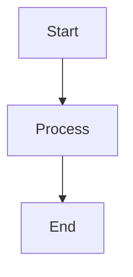

# n8n Workflow Management Documentation

Next.js 15 기반 n8n 워크플로우 관리 플랫폼의 공식 문서입니다.

## 📚 문서 구조

이 문서 사이트는 다음과 같은 섹션으로 구성되어 있습니다:

### 1. [시작하기](./getting-started/introduction.md)

프로젝트를 처음 시작하는 개발자를 위한 가이드입니다.

- **Introduction**: 프로젝트 개요 및 주요 기능
- **Docker Setup**: Docker 기반 개발 환경 구성
- **n8n Connection**: n8n 서버 연결 설정
- **Environment Variables**: 환경 변수 설정
- **First Workflow**: 첫 워크플로우 생성 및 실행

### 2. [API 문서](./api/overview.md)

REST API 레퍼런스와 사용 예제입니다.

- **Overview**: API 개요 및 기본 사용법
- **Authentication**: JWT 및 Webhook 인증
- **Workflows**: 워크플로우 CRUD API
- **Executions**: 실행 내역 조회 및 관리
- **Webhooks**: Webhook 이벤트 처리
- **Error Codes**: 에러 코드 레퍼런스

### 3. [n8n 통합](./n8n-integration/overview.md)

n8n과의 통합 방법과 고급 사용법입니다.

- **Overview**: n8n 통합 아키텍처
- **Workflow Creation**: 워크플로우 생성 패턴
- **AI Nodes**: OpenAI/Claude 통합
- **Custom Nodes**: 커스텀 노드 개발
- **Performance Optimization**: 성능 최적화 전략
- **Best Practices**: 프로덕션 배포 가이드

### 4. [운영 가이드](./operations/monitoring.md)

프로덕션 환경에서의 운영 방법입니다.

- **Monitoring**: Prometheus/Grafana 모니터링
- **Backup & Recovery**: 백업 및 복구 전략
- **Scaling**: 수평/수직 확장 방법
- **Troubleshooting**: 문제 진단 및 해결
- **Security**: 보안 설정 및 모범 사례

### 5. [개발자 문서](./developers/architecture.md)

코드베이스 아키텍처와 개발 가이드입니다.

- **Architecture**: 시스템 아키텍처 개요
- **API Wrapper**: N8nApiClient 사용법
- **Error Handling**: 에러 처리 패턴
- **Testing**: 테스트 전략 및 실습
- **Contribution**: 기여 가이드라인

### 6. [아키텍처 다이어그램](./architecture/diagrams.md)

시스템의 주요 아키텍처를 시각화한 다이어그램입니다.

- 전체 시스템 아키텍처
- 애플리케이션 레이어
- n8n 통합 아키텍처
- 데이터 흐름
- 인증 흐름
- 실시간 업데이트
- 캐싱 전략
- 배포 아키텍처

## 🚀 빠른 시작

### 문서 사이트 로컬 실행

```bash
# 의존성 설치
npm install

# 개발 서버 시작
npm run docs:dev

# 브라우저에서 http://localhost:3000 접속
```

### 문서 빌드

```bash
# 프로덕션 빌드
npm run docs:build

# 빌드된 문서 서빙
npm run docs:serve
```

## 📖 문서 작성 가이드

### 새 문서 추가

1. `docs/` 디렉토리에 Markdown 파일 생성
2. `sidebars.js`에 문서 경로 추가
3. Front matter 작성:

```markdown
---
id: my-doc
title: My Document
sidebar_label: My Doc
---

# My Document

Content here...
```

### Mermaid 다이어그램

문서에 Mermaid 다이어그램을 포함할 수 있습니다:

````markdown

````

### 코드 블록

코드 블록에는 언어와 제목을 지정할 수 있습니다:

````markdown
```typescript title="example.ts"
function hello(name: string): string {
  return `Hello, ${name}!`;
}
```
````

### Admonitions

주의사항, 팁 등을 강조할 수 있습니다:

```markdown
:::note
This is a note
:::

:::tip
This is a tip
:::

:::warning
This is a warning
:::

:::danger
This is a danger alert
:::
```

## 🛠️ 기술 스택

- **Docusaurus**: v3.x - 문서 사이트 생성기
- **React**: v19.x - UI 라이브러리
- **TypeScript**: v5.x - 타입 안전성
- **Mermaid**: 다이어그램 생성
- **Algolia DocSearch**: 문서 검색
- **OpenAPI**: API 문서 자동 생성

## 📝 문서 기여

문서 개선에 기여하고 싶으시다면:

1. 이 저장소를 Fork
2. 새 브랜치 생성 (`git checkout -b docs/improve-section`)
3. 변경사항 커밋 (`git commit -m 'docs: improve API documentation'`)
4. 브랜치 푸시 (`git push origin docs/improve-section`)
5. Pull Request 생성

### 문서 작성 가이드라인

- **명확성**: 간결하고 이해하기 쉽게 작성
- **예제**: 실용적인 코드 예제 포함
- **일관성**: 기존 문서의 스타일 유지
- **정확성**: 최신 정보 반영 및 검증

## 🔍 검색

문서 사이트는 Algolia DocSearch를 사용하여 빠르고 정확한 검색을 제공합니다.

검색 단축키:
- **macOS**: `⌘ + K`
- **Windows/Linux**: `Ctrl + K`

## 🌐 배포

### Vercel 배포

```bash
# Vercel CLI 설치
npm install -g vercel

# 배포
vercel --prod
```

### GitHub Pages 배포

```bash
# GitHub Pages로 배포
npm run docs:deploy
```

### Docker 배포

```dockerfile
FROM node:20-alpine

WORKDIR /app

COPY package*.json ./
RUN npm ci --only=production

COPY . .
RUN npm run docs:build

FROM nginx:alpine
COPY --from=0 /app/build /usr/share/nginx/html
EXPOSE 80
CMD ["nginx", "-g", "daemon off;"]
```

## 📊 문서 통계

- **총 페이지**: 23개
- **카테고리**: 6개
- **코드 예제**: 100+ 개
- **다이어그램**: 20+ 개

## 🔗 유용한 링크

- [프로젝트 GitHub](https://github.com/your-org/your-repo)
- [n8n 공식 문서](https://docs.n8n.io/)
- [Next.js 문서](https://nextjs.org/docs)
- [Docusaurus 문서](https://docusaurus.io/docs)

## 📧 문의

문서에 대한 질문이나 제안사항이 있으시면:

- **GitHub Issues**: [이슈 등록](https://github.com/your-org/your-repo/issues)
- **Email**: dev@example.com

## 📄 라이선스

이 문서는 [MIT 라이선스](../LICENSE)로 배포됩니다.

---

**마지막 업데이트**: 2024-01-01

**버전**: 1.0.0
