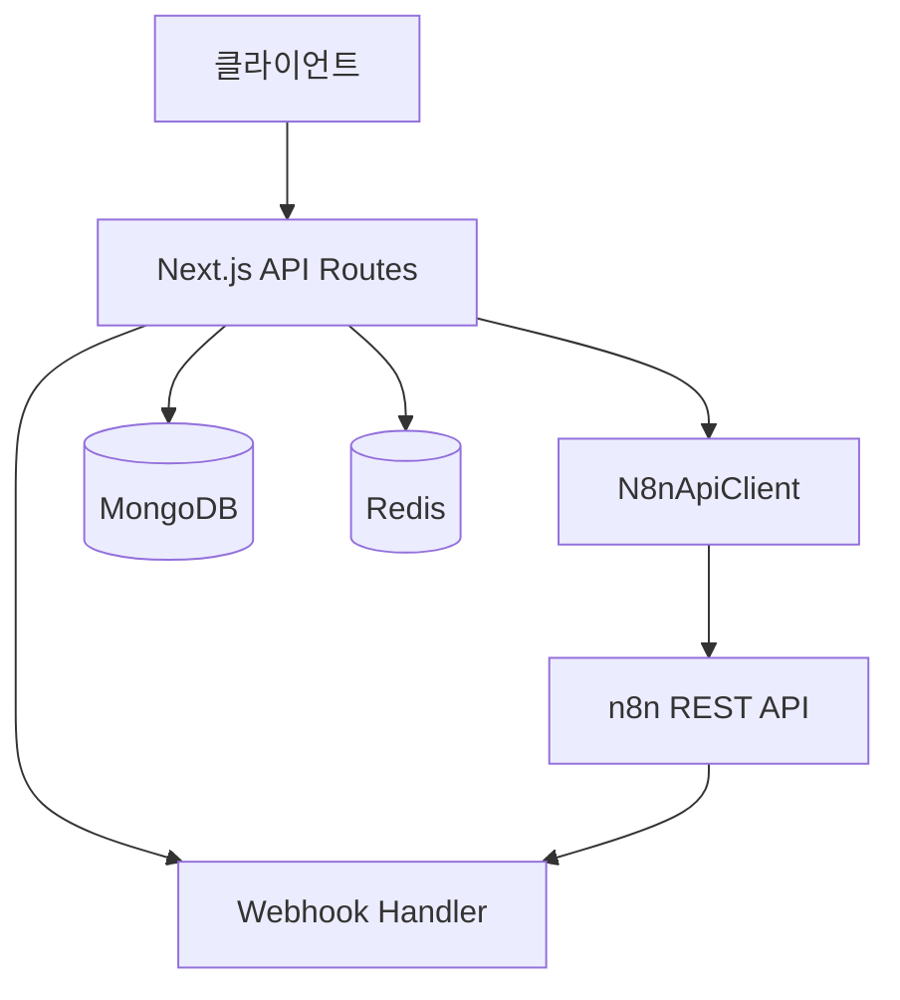

# API 개요

Frontend 애플리케이션에서 제공하는 REST API 및 n8n 통합 API에 대한 개요입니다.

## API 아키텍처



## API 버전

현재 API 버전: **v1**

- **Base URL (Production)**: `https://yourdomain.com/api`
- **Base URL (Development)**: `http://localhost:3000/api`
- **n8n API Base URL**: `http://localhost:5678/api/v1`

## 인증 방식

### 1. n8n API 키 인증

n8n API에 접근하기 위해 API 키를 사용합니다:

```http
X-N8N-API-KEY: your-api-key-here
```

### 2. JWT 인증 (선택)

Frontend API에서 사용자 인증이 필요한 경우:

```http
Authorization: Bearer <jwt-token>
```

### 3. Webhook 시크릿

Webhook 엔드포인트 보안:

```http
X-Webhook-Secret: your-webhook-secret
```

## API 엔드포인트 카테고리

### 1. 워크플로우 API (`/api/workflows`)

워크플로우 CRUD 및 실행 관리:

- `GET /api/workflows` - 워크플로우 목록 조회
- `GET /api/workflows/:id` - 워크플로우 상세 조회
- `POST /api/workflows` - 워크플로우 생성
- `PUT /api/workflows/:id` - 워크플로우 수정
- `DELETE /api/workflows/:id` - 워크플로우 삭제
- `POST /api/workflows/:id/execute` - 워크플로우 실행
- `POST /api/workflows/:id/activate` - 워크플로우 활성화
- `POST /api/workflows/:id/deactivate` - 워크플로우 비활성화

### 2. 실행 API (`/api/executions`)

워크플로우 실행 이력 및 상태 조회:

- `GET /api/executions` - 실행 목록 조회
- `GET /api/executions/:id` - 실행 상세 조회
- `DELETE /api/executions/:id` - 실행 이력 삭제
- `POST /api/executions/:id/retry` - 실패한 실행 재시도

### 3. Webhook API (`/api/webhooks`)

n8n 워크플로우로부터 데이터 수신:

- `POST /api/webhooks/n8n` - n8n webhook 수신
- `GET /api/webhooks/n8n` - Webhook 인증 확인

### 4. 통계 API (`/api/stats`)

워크플로우 및 실행 통계:

- `GET /api/stats/dashboard` - 대시보드 통계
- `GET /api/stats/workflows/:id` - 워크플로우별 통계
- `GET /api/stats/executions` - 실행 통계

### 5. 헬스 체크 API (`/api/health`)

시스템 상태 확인:

- `GET /api/health` - 전체 시스템 헬스 체크
- `GET /api/health/n8n` - n8n 연결 상태
- `GET /api/health/mongodb` - MongoDB 연결 상태
- `GET /api/health/redis` - Redis 연결 상태

## 요청 형식

### Content-Type

모든 API 요청은 JSON 형식을 사용합니다:

```http
Content-Type: application/json
```

### 페이지네이션

목록 조회 API는 페이지네이션을 지원합니다:

**쿼리 파라미터:**
- `page`: 페이지 번호 (기본값: 1)
- `limit`: 페이지당 항목 수 (기본값: 20, 최대: 100)
- `sort`: 정렬 필드 (예: `createdAt`, `-createdAt`)
- `filter`: 필터 조건 (JSON 문자열)

**예시:**
```http
GET /api/workflows?page=1&limit=20&sort=-createdAt&filter={"active":true}
```

### 필터링

복잡한 필터링을 위한 쿼리 구문:

```json
{
  "filter": {
    "name": { "$regex": "test", "$options": "i" },
    "active": true,
    "createdAt": { "$gte": "2024-01-01T00:00:00Z" }
  }
}
```

## 응답 형식

### 성공 응답

**단일 리소스:**
```json
{
  "success": true,
  "data": {
    "id": "workflow-id",
    "name": "My Workflow",
    "active": true
  }
}
```

**목록 응답:**
```json
{
  "success": true,
  "data": [
    { "id": "1", "name": "Workflow 1" },
    { "id": "2", "name": "Workflow 2" }
  ],
  "pagination": {
    "page": 1,
    "limit": 20,
    "total": 50,
    "totalPages": 3
  }
}
```

### 오류 응답

**일반 오류:**
```json
{
  "success": false,
  "error": {
    "code": "WORKFLOW_NOT_FOUND",
    "message": "Workflow with ID 'abc123' not found",
    "details": {
      "workflowId": "abc123"
    }
  }
}
```

**유효성 검사 오류:**
```json
{
  "success": false,
  "error": {
    "code": "VALIDATION_ERROR",
    "message": "Validation failed",
    "details": {
      "fields": {
        "name": "Name is required",
        "nodes": "At least one node is required"
      }
    }
  }
}
```

## HTTP 상태 코드

| 코드 | 의미 | 설명 |
|------|------|------|
| 200 | OK | 요청 성공 |
| 201 | Created | 리소스 생성 성공 |
| 204 | No Content | 요청 성공 (응답 본문 없음) |
| 400 | Bad Request | 잘못된 요청 |
| 401 | Unauthorized | 인증 실패 |
| 403 | Forbidden | 권한 없음 |
| 404 | Not Found | 리소스를 찾을 수 없음 |
| 409 | Conflict | 리소스 충돌 |
| 422 | Unprocessable Entity | 유효성 검사 실패 |
| 429 | Too Many Requests | Rate limit 초과 |
| 500 | Internal Server Error | 서버 오류 |
| 502 | Bad Gateway | n8n 연결 실패 |
| 503 | Service Unavailable | 서비스 이용 불가 |
| 504 | Gateway Timeout | n8n 응답 시간 초과 |

## Rate Limiting

API 호출 제한:

- **제한**: 분당 60회
- **헤더**:
  - `X-RateLimit-Limit`: 제한 값
  - `X-RateLimit-Remaining`: 남은 횟수
  - `X-RateLimit-Reset`: 리셋 시간 (Unix timestamp)

**Rate limit 초과 시:**
```json
{
  "success": false,
  "error": {
    "code": "RATE_LIMIT_EXCEEDED",
    "message": "Too many requests. Please try again later.",
    "details": {
      "retryAfter": 60
    }
  }
}
```

## CORS 설정

허용된 도메인:
- `http://localhost:3000` (개발)
- `https://yourdomain.com` (프로덕션)

**허용된 메서드:**
- GET, POST, PUT, PATCH, DELETE, OPTIONS

**허용된 헤더:**
- Content-Type, Authorization, X-N8N-API-KEY, X-Webhook-Secret

## Webhook 이벤트

n8n 워크플로우에서 Frontend로 전송되는 이벤트:

### 1. 워크플로우 실행 완료

```json
{
  "event": "workflow.execution.completed",
  "workflowId": "workflow-id",
  "executionId": "execution-id",
  "status": "success",
  "data": {
    "result": "execution result"
  },
  "timestamp": "2024-01-01T00:00:00Z"
}
```

### 2. 워크플로우 실행 실패

```json
{
  "event": "workflow.execution.failed",
  "workflowId": "workflow-id",
  "executionId": "execution-id",
  "status": "error",
  "error": {
    "message": "Error message",
    "stack": "Error stack trace"
  },
  "timestamp": "2024-01-01T00:00:00Z"
}
```

### 3. 커스텀 이벤트

```json
{
  "event": "custom.event.name",
  "workflowId": "workflow-id",
  "data": {
    "customField1": "value1",
    "customField2": "value2"
  },
  "timestamp": "2024-01-01T00:00:00Z"
}
```

## 에러 코드

자세한 내용은 [에러 코드 문서](./error-codes)를 참조하세요.

**주요 에러 코드:**
- `AUTHENTICATION_FAILED` - 인증 실패
- `WORKFLOW_NOT_FOUND` - 워크플로우를 찾을 수 없음
- `EXECUTION_FAILED` - 워크플로우 실행 실패
- `INVALID_REQUEST` - 잘못된 요청
- `N8N_CONNECTION_ERROR` - n8n 연결 오류
- `DATABASE_ERROR` - 데이터베이스 오류

## SDK 및 클라이언트

### TypeScript/JavaScript

```typescript
import { N8nApiClient } from '@/lib/n8n/client';

const client = new N8nApiClient({
  baseUrl: 'http://localhost:5678/api/v1',
  apiKey: 'your-api-key',
});

const workflows = await client.getWorkflows();
```

### React Query Hooks

```typescript
import { useWorkflows, useExecuteWorkflow } from '@/hooks/useN8nWorkflows';

function MyComponent() {
  const { data, isLoading } = useWorkflows();
  const execute = useExecuteWorkflow();

  // ...
}
```

## API 테스트

### cURL 예시

```bash
# 워크플로우 목록 조회
curl -X GET \
  -H "X-N8N-API-KEY: your-api-key" \
  http://localhost:5678/api/v1/workflows

# 워크플로우 실행
curl -X POST \
  -H "X-N8N-API-KEY: your-api-key" \
  -H "Content-Type: application/json" \
  http://localhost:5678/api/v1/workflows/workflow-id/execute
```

### Postman 컬렉션

Postman 컬렉션 다운로드: [n8n-frontend-api.postman_collection.json](../assets/postman-collection.json)

### OpenAPI/Swagger

대화형 API 문서: [Swagger UI](/api-docs)

## 다음 단계

1. [인증 가이드](./authentication) - API 인증 상세 가이드
2. [워크플로우 API](./workflows) - 워크플로우 API 상세 문서
3. [실행 API](./executions) - 실행 API 상세 문서
4. [Webhook 가이드](./webhooks) - Webhook 설정 및 사용법
5. [에러 코드](./error-codes) - 전체 에러 코드 목록

## 참고 자료

- [n8n API 공식 문서](https://docs.n8n.io/api/)
- [OpenAPI 명세](./openapi.yaml)
- [API 변경 이력](./changelog)
- [API 베스트 프랙티스](./best-practices)
