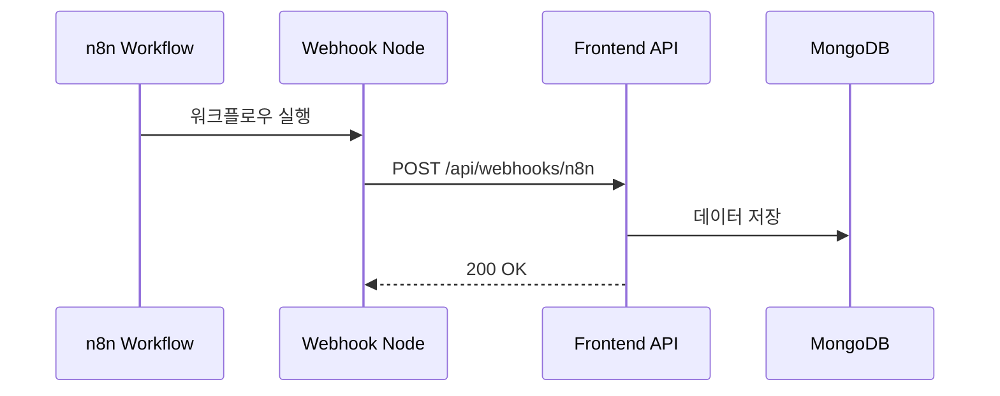

# Webhook API

n8n 워크플로우로부터 이벤트를 수신하는 Webhook 설정 및 사용 방법입니다.

## Webhook 개요

Webhook은 n8n 워크플로우가 Frontend 애플리케이션으로 데이터를 전송하는 방식입니다.



## Webhook 엔드포인트

### POST /api/webhooks/n8n

n8n 워크플로우로부터 데이터를 수신합니다.

**URL:**
```
https://yourdomain.com/api/webhooks/n8n
```

**메서드:** `POST`

**헤더:**
```http
Content-Type: application/json
X-Webhook-Secret: your-webhook-secret (선택)
```

**요청 본문:**

```json
{
  "event": "workflow.execution.completed",
  "workflowId": "1",
  "executionId": "exec-123",
  "status": "success",
  "data": {
    "result": "execution result data"
  },
  "timestamp": "2024-01-01T00:00:00Z"
}
```

**응답:**

```json
{
  "success": true,
  "receivedAt": "2024-01-01T00:00:00Z"
}
```

## Frontend API Route 구현

### 기본 Webhook Handler

`app/api/webhooks/n8n/route.ts`:

```typescript
import { NextRequest, NextResponse } from 'next/server';
import { db } from '@/lib/mongodb';

export async function POST(request: NextRequest) {
  try {
    // 1. Webhook 시크릿 검증 (선택)
    const secret = request.headers.get('X-Webhook-Secret');

    if (process.env.WEBHOOK_SECRET && secret !== process.env.WEBHOOK_SECRET) {
      return NextResponse.json(
        { error: 'Unauthorized' },
        { status: 401 }
      );
    }

    // 2. 요청 본문 파싱
    const payload = await request.json();

    console.log('Webhook received:', payload);

    // 3. 데이터 검증
    if (!payload.workflowId || !payload.executionId) {
      return NextResponse.json(
        { error: 'Missing required fields' },
        { status: 400 }
      );
    }

    // 4. MongoDB에 저장
    await db.collection('webhook_events').insertOne({
      ...payload,
      receivedAt: new Date(),
    });

    // 5. 성공 응답
    return NextResponse.json({
      success: true,
      receivedAt: new Date().toISOString(),
    });
  } catch (error: any) {
    console.error('Webhook error:', error);

    return NextResponse.json(
      { error: 'Internal server error' },
      { status: 500 }
    );
  }
}

// Webhook 인증 테스트용 GET 엔드포인트
export async function GET(request: NextRequest) {
  const token = request.nextUrl.searchParams.get('token');

  if (token === process.env.WEBHOOK_SECRET) {
    return NextResponse.json({
      message: 'Webhook endpoint active',
      timestamp: new Date().toISOString(),
    });
  }

  return NextResponse.json({ error: 'Unauthorized' }, { status: 401 });
}
```

### HMAC 서명 검증

보안을 강화하기 위해 HMAC 서명을 검증합니다:

```typescript
import crypto from 'crypto';
import { NextRequest, NextResponse } from 'next/server';

export async function POST(request: NextRequest) {
  try {
    // 1. 원본 본문 읽기
    const body = await request.text();

    // 2. 서명 헤더 확인
    const receivedSignature = request.headers.get('X-Webhook-Signature');

    if (!receivedSignature) {
      return NextResponse.json(
        { error: 'Missing signature' },
        { status: 401 }
      );
    }

    // 3. 서명 생성
    const expectedSignature = crypto
      .createHmac('sha256', process.env.WEBHOOK_SECRET!)
      .update(body)
      .digest('hex');

    // 4. 서명 비교 (타이밍 공격 방지)
    if (!crypto.timingSafeEqual(
      Buffer.from(receivedSignature),
      Buffer.from(expectedSignature)
    )) {
      return NextResponse.json(
        { error: 'Invalid signature' },
        { status: 401 }
      );
    }

    // 5. 검증 통과 - 데이터 처리
    const payload = JSON.parse(body);

    // ... 나머지 처리

    return NextResponse.json({ success: true });
  } catch (error: any) {
    console.error('Webhook error:', error);
    return NextResponse.json(
      { error: 'Internal server error' },
      { status: 500 }
    );
  }
}
```

## n8n 워크플로우 설정

### Webhook 노드 추가

1. n8n 워크플로우 에디터에서 **Webhook** 노드 추가
2. 노드 설정:

**HTTP Method:** POST

**Path:** `n8n` (선택)

**Response Mode:** Using 'Respond to Webhook' Node

**Options:**
- **Response Headers**: `Content-Type: application/json`
- **Response Body**: `{ "success": true }`

### Webhook URL 설정

**Production URL:**
```
https://yourdomain.com/api/webhooks/n8n
```

**Development URL (ngrok 사용):**
```
https://abc123.ngrok.io/api/webhooks/n8n
```

### 커스텀 헤더 추가

Webhook 노드에서 **Options** → **Header Parameters**:

```json
{
  "X-Webhook-Secret": "your-webhook-secret",
  "X-Workflow-Id": "={{ $workflow.id }}",
  "X-Execution-Id": "={{ $execution.id }}"
}
```

### 페이로드 구성

**Function 노드** 또는 **Set 노드**를 사용하여 페이로드 구성:

```javascript
// Function 노드
return {
  json: {
    event: 'workflow.execution.completed',
    workflowId: $workflow.id,
    executionId: $execution.id,
    status: 'success',
    data: $input.all(),
    timestamp: new Date().toISOString(),
  },
};
```

## Webhook 이벤트 타입

### 1. 워크플로우 실행 완료

```json
{
  "event": "workflow.execution.completed",
  "workflowId": "1",
  "executionId": "exec-123",
  "status": "success",
  "data": {
    "result": "data from workflow"
  },
  "timestamp": "2024-01-01T00:00:00Z"
}
```

### 2. 워크플로우 실행 실패

```json
{
  "event": "workflow.execution.failed",
  "workflowId": "1",
  "executionId": "exec-123",
  "status": "error",
  "error": {
    "message": "Connection timeout",
    "node": "HTTP Request",
    "stack": "Error stack trace"
  },
  "timestamp": "2024-01-01T00:00:00Z"
}
```

### 3. 데이터 업데이트

```json
{
  "event": "data.updated",
  "workflowId": "1",
  "data": {
    "entity": "user",
    "action": "created",
    "payload": {
      "id": "123",
      "name": "John Doe"
    }
  },
  "timestamp": "2024-01-01T00:00:00Z"
}
```

### 4. 커스텀 이벤트

```json
{
  "event": "custom.notification",
  "workflowId": "1",
  "data": {
    "type": "email",
    "recipient": "user@example.com",
    "subject": "Alert",
    "body": "Message body"
  },
  "timestamp": "2024-01-01T00:00:00Z"
}
```

## Webhook 처리 패턴

### 이벤트 라우팅

이벤트 타입에 따라 다른 처리:

```typescript
async function handleWebhookEvent(payload: any) {
  switch (payload.event) {
    case 'workflow.execution.completed':
      await handleExecutionCompleted(payload);
      break;

    case 'workflow.execution.failed':
      await handleExecutionFailed(payload);
      break;

    case 'data.updated':
      await handleDataUpdate(payload);
      break;

    default:
      console.warn(`Unknown event type: ${payload.event}`);
  }
}

async function handleExecutionCompleted(payload: any) {
  // 실행 완료 처리
  await db.collection('executions').updateOne(
    { executionId: payload.executionId },
    {
      $set: {
        status: 'completed',
        result: payload.data,
        completedAt: new Date(),
      },
    }
  );

  // 알림 전송
  await sendNotification({
    type: 'success',
    message: `Workflow ${payload.workflowId} completed`,
  });
}

async function handleExecutionFailed(payload: any) {
  // 실패 처리
  await db.collection('executions').updateOne(
    { executionId: payload.executionId },
    {
      $set: {
        status: 'failed',
        error: payload.error,
        failedAt: new Date(),
      },
    }
  );

  // 에러 알림
  await sendNotification({
    type: 'error',
    message: `Workflow ${payload.workflowId} failed: ${payload.error.message}`,
  });
}
```

### 비동기 처리

큐를 사용한 비동기 처리:

```typescript
import { Queue } from 'bull';

const webhookQueue = new Queue('webhooks', {
  redis: {
    host: process.env.REDIS_HOST,
    port: parseInt(process.env.REDIS_PORT!),
  },
});

export async function POST(request: NextRequest) {
  try {
    const payload = await request.json();

    // 큐에 작업 추가
    await webhookQueue.add('process-webhook', payload, {
      attempts: 3,
      backoff: {
        type: 'exponential',
        delay: 2000,
      },
    });

    // 즉시 응답
    return NextResponse.json({
      success: true,
      queued: true,
    });
  } catch (error: any) {
    console.error('Webhook error:', error);
    return NextResponse.json(
      { error: 'Internal server error' },
      { status: 500 }
    );
  }
}

// Worker 프로세스
webhookQueue.process('process-webhook', async (job) => {
  await handleWebhookEvent(job.data);
});
```

### 재시도 로직

```typescript
async function processWebhookWithRetry(
  payload: any,
  maxRetries = 3
): Promise<void> {
  for (let attempt = 1; attempt <= maxRetries; attempt++) {
    try {
      await handleWebhookEvent(payload);
      return; // 성공
    } catch (error: any) {
      console.error(`Attempt ${attempt} failed:`, error);

      if (attempt === maxRetries) {
        // 최종 실패 - Dead Letter Queue로 이동
        await saveToDeadLetterQueue(payload, error);
        throw error;
      }

      // 지수 백오프
      const delay = Math.pow(2, attempt) * 1000;
      await new Promise(resolve => setTimeout(resolve, delay));
    }
  }
}

async function saveToDeadLetterQueue(payload: any, error: any) {
  await db.collection('webhook_failures').insertOne({
    payload,
    error: {
      message: error.message,
      stack: error.stack,
    },
    failedAt: new Date(),
    retries: 3,
  });
}
```

## 실시간 업데이트

### WebSocket으로 브로드캐스트

```typescript
import { Server } from 'socket.io';

let io: Server;

export function initWebSocket(server: any) {
  io = new Server(server);

  io.on('connection', (socket) => {
    console.log('Client connected:', socket.id);

    socket.on('subscribe:workflow', (workflowId) => {
      socket.join(`workflow:${workflowId}`);
    });
  });
}

// Webhook 핸들러에서 사용
export async function POST(request: NextRequest) {
  const payload = await request.json();

  // 데이터 저장
  await db.collection('webhook_events').insertOne(payload);

  // WebSocket으로 브로드캐스트
  if (io) {
    io.to(`workflow:${payload.workflowId}`).emit('execution:update', payload);
  }

  return NextResponse.json({ success: true });
}
```

### 클라이언트에서 실시간 수신

```typescript
'use client';

import { useEffect, useState } from 'react';
import { io, Socket } from 'socket.io-client';

export function useWorkflowUpdates(workflowId: string) {
  const [updates, setUpdates] = useState<any[]>([]);
  const [socket, setSocket] = useState<Socket | null>(null);

  useEffect(() => {
    const newSocket = io(process.env.NEXT_PUBLIC_WEBSOCKET_URL!);

    newSocket.on('connect', () => {
      console.log('Connected to WebSocket');
      newSocket.emit('subscribe:workflow', workflowId);
    });

    newSocket.on('execution:update', (data) => {
      setUpdates(prev => [...prev, data]);
    });

    setSocket(newSocket);

    return () => {
      newSocket.close();
    };
  }, [workflowId]);

  return { updates, socket };
}

// 컴포넌트에서 사용
function WorkflowMonitor({ workflowId }: { workflowId: string }) {
  const { updates } = useWorkflowUpdates(workflowId);

  return (
    <div>
      <h3>실시간 업데이트</h3>
      <ul>
        {updates.map((update, index) => (
          <li key={index}>
            {update.event} - {update.status}
          </li>
        ))}
      </ul>
    </div>
  );
}
```

## 테스트

### Webhook 테스트 스크립트

```bash
#!/bin/bash

WEBHOOK_URL="http://localhost:3000/api/webhooks/n8n"
WEBHOOK_SECRET="your-webhook-secret"

# 테스트 페이로드
payload='{
  "event": "workflow.execution.completed",
  "workflowId": "test-1",
  "executionId": "exec-test-123",
  "status": "success",
  "data": {
    "result": "test data"
  },
  "timestamp": "'$(date -u +"%Y-%m-%dT%H:%M:%SZ")'"
}'

# Webhook 호출
response=$(curl -s -w "\n%{http_code}" \
  -X POST \
  -H "Content-Type: application/json" \
  -H "X-Webhook-Secret: $WEBHOOK_SECRET" \
  -d "$payload" \
  "$WEBHOOK_URL")

http_code=$(echo "$response" | tail -n 1)
body=$(echo "$response" | head -n -1)

echo "HTTP Code: $http_code"
echo "Response: $body"

if [ "$http_code" = "200" ]; then
  echo "✅ Webhook test successful"
else
  echo "❌ Webhook test failed"
fi
```

### Postman 컬렉션

```json
{
  "info": {
    "name": "n8n Webhook Tests",
    "schema": "https://schema.getpostman.com/json/collection/v2.1.0/collection.json"
  },
  "item": [
    {
      "name": "Execution Completed",
      "request": {
        "method": "POST",
        "header": [
          {
            "key": "Content-Type",
            "value": "application/json"
          },
          {
            "key": "X-Webhook-Secret",
            "value": "{{webhookSecret}}"
          }
        ],
        "body": {
          "mode": "raw",
          "raw": "{\n  \"event\": \"workflow.execution.completed\",\n  \"workflowId\": \"1\",\n  \"executionId\": \"exec-123\",\n  \"status\": \"success\",\n  \"timestamp\": \"{{$timestamp}}\"\n}"
        },
        "url": {
          "raw": "{{baseUrl}}/api/webhooks/n8n",
          "host": ["{{baseUrl}}"],
          "path": ["api", "webhooks", "n8n"]
        }
      }
    }
  ]
}
```

## 보안 모범 사례

### 1. Webhook 시크릿 사용

```bash
# .env.local
WEBHOOK_SECRET=your-very-long-random-secret-string
```

### 2. HTTPS 사용

프로덕션에서는 항상 HTTPS를 사용하세요:

```
✅ https://yourdomain.com/api/webhooks/n8n
❌ http://yourdomain.com/api/webhooks/n8n
```

### 3. Rate Limiting

```typescript
import rateLimit from '@/lib/rate-limit';

const limiter = rateLimit({
  interval: 60 * 1000, // 1분
  uniqueTokenPerInterval: 500,
});

export async function POST(request: NextRequest) {
  try {
    await limiter.check(request, 10); // 분당 10회 제한
  } catch {
    return NextResponse.json(
      { error: 'Rate limit exceeded' },
      { status: 429 }
    );
  }

  // ... 나머지 처리
}
```

### 4. IP 화이트리스트

```typescript
const ALLOWED_IPS = process.env.ALLOWED_IPS?.split(',') || [];

export async function POST(request: NextRequest) {
  const ip = request.ip || request.headers.get('x-forwarded-for');

  if (ALLOWED_IPS.length > 0 && !ALLOWED_IPS.includes(ip!)) {
    return NextResponse.json(
      { error: 'Forbidden' },
      { status: 403 }
    );
  }

  // ... 나머지 처리
}
```

## 트러블슈팅

### Webhook이 수신되지 않음

1. **URL 확인**: n8n Webhook 노드의 URL이 올바른지 확인
2. **방화벽**: 방화벽이 인바운드 요청을 차단하지 않는지 확인
3. **로그 확인**: Frontend API 로그에서 요청이 도착하는지 확인

```bash
# 로그 확인
tail -f logs/webhook.log
```

### 인증 실패

```typescript
// 디버깅을 위한 로깅 추가
console.log('Received secret:', secret);
console.log('Expected secret:', process.env.WEBHOOK_SECRET);
```

### 타임아웃

```typescript
// n8n Webhook 노드에서 타임아웃 설정 증가
// Options → Timeout: 30000 (30초)
```

## 다음 단계

1. [에러 코드](./error-codes) - Webhook 관련 에러 코드
2. [n8n 통합 가이드](/n8n-integration/workflow-creation) - 워크플로우 작성
3. [모니터링 설정](/operations/monitoring) - Webhook 모니터링

## 참고 자료

- [n8n Webhook 노드](https://docs.n8n.io/integrations/core-nodes/n8n-nodes-base.webhook/)
- [Webhook 보안](https://docs.github.com/en/developers/webhooks-and-events/webhooks/securing-your-webhooks)
- [HMAC 서명](https://en.wikipedia.org/wiki/HMAC)
