# Architecture Diagrams

이 페이지는 시스템의 주요 아키텍처 다이어그램을 제공합니다. 각 다이어그램은 시스템의 다른 측면을 시각화합니다.

## 목차

- [전체 시스템 아키텍처](#전체-시스템-아키텍처)
- [애플리케이션 레이어](#애플리케이션-레이어)
- [n8n 통합 아키텍처](#n8n-통합-아키텍처)
- [데이터 흐름](#데이터-흐름)
- [인증 흐름](#인증-흐름)
- [실시간 업데이트](#실시간-업데이트)
- [캐싱 전략](#캐싱-전략)
- [배포 아키텍처](#배포-아키텍처)

---

## 전체 시스템 아키텍처

전체 시스템의 high-level 아키텍처를 보여줍니다.

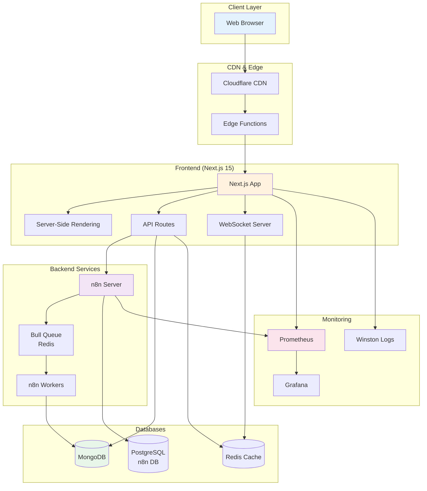

---

## 애플리케이션 레이어

Next.js 애플리케이션의 계층 구조를 보여줍니다.

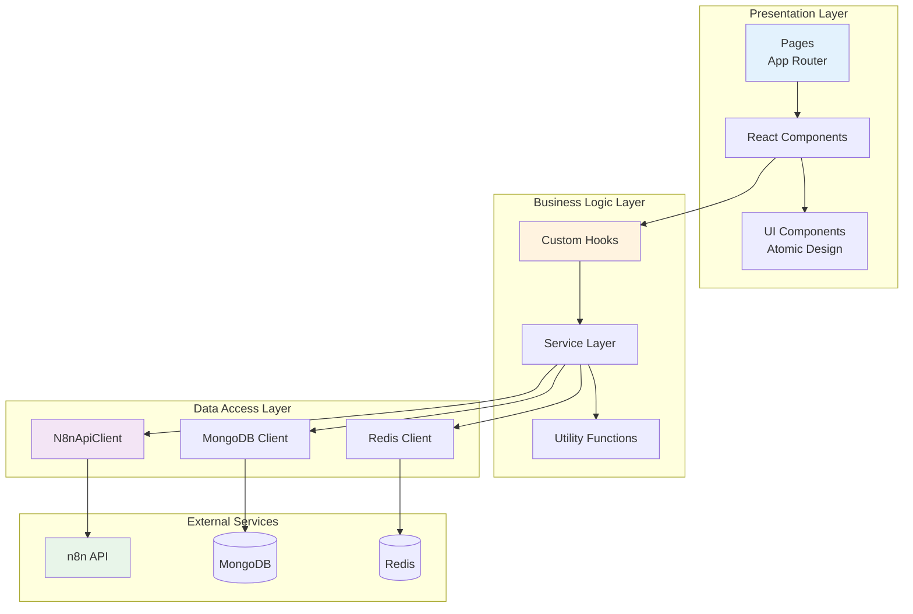

---

## n8n 통합 아키텍처

n8n과의 통합 구조를 상세히 보여줍니다.

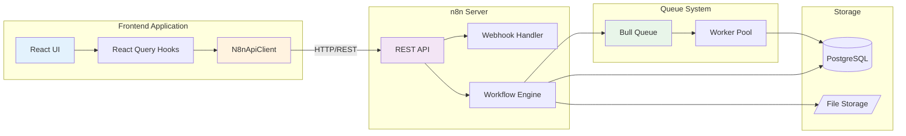

---

## 데이터 흐름

워크플로우 실행 데이터의 흐름을 보여줍니다.

### 워크플로우 생성 흐름

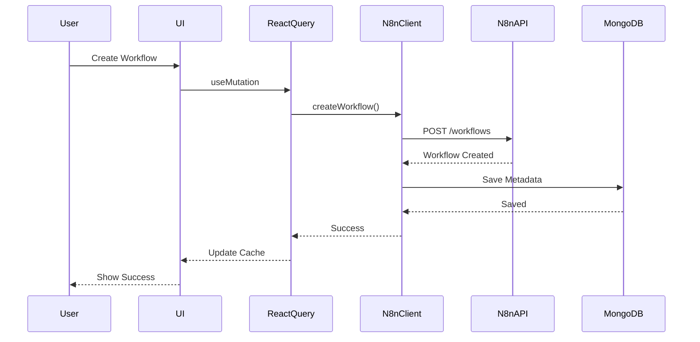

### 워크플로우 실행 흐름

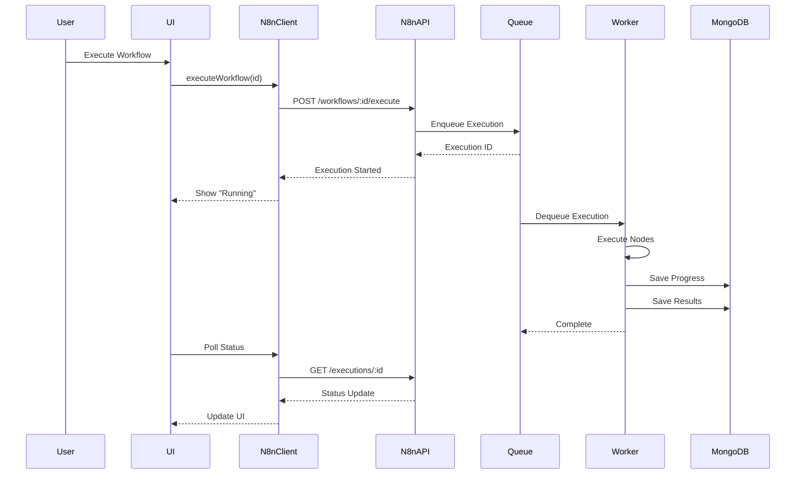

---

## 인증 흐름

JWT 기반 인증 시스템의 흐름입니다.

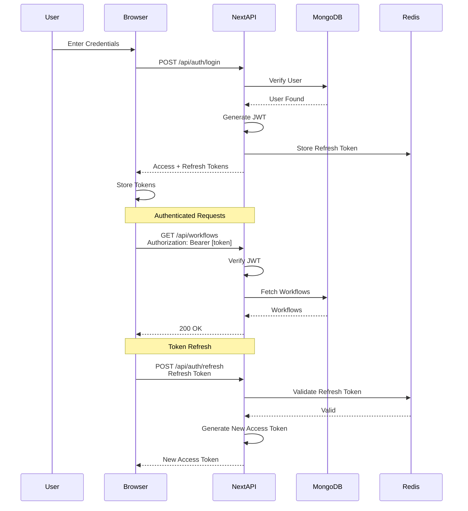

---

## 실시간 업데이트

WebSocket을 통한 실시간 데이터 동기화입니다.

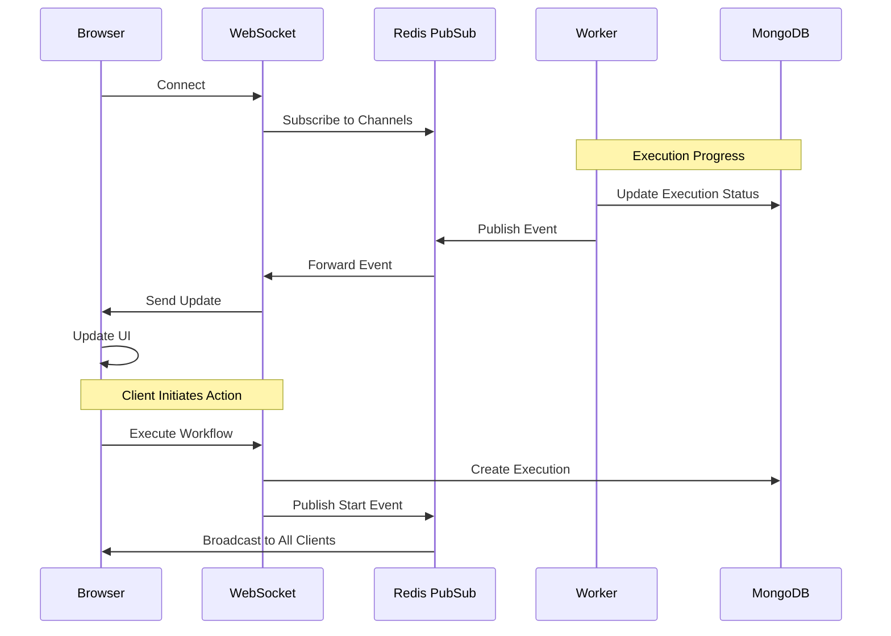

---

## 캐싱 전략

다층 캐싱 시스템의 구조입니다.

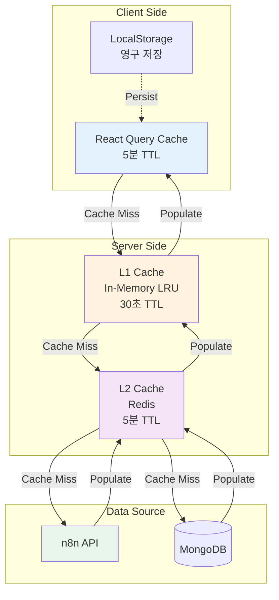

### 캐시 무효화 전략

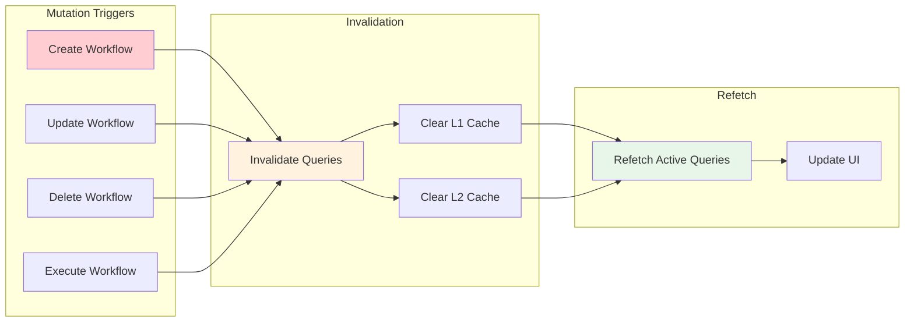

---

## 배포 아키텍처

Kubernetes 기반 배포 구조입니다.

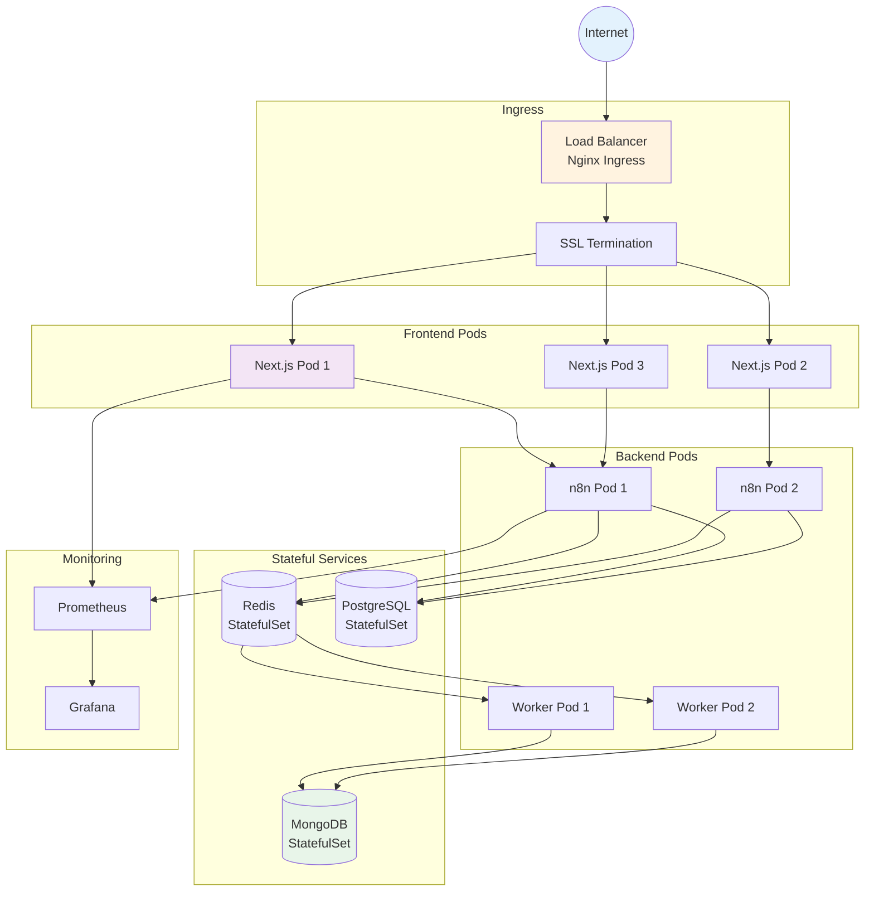

### Horizontal Pod Autoscaling (HPA)

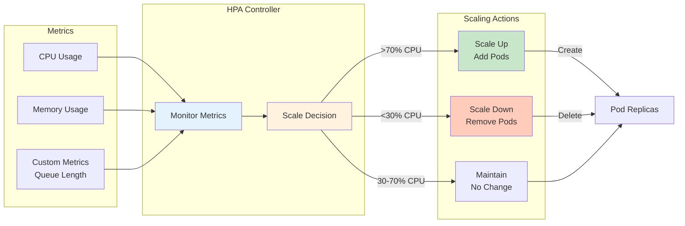

---

## 에러 처리 흐름

시스템 전반의 에러 처리 패턴입니다.

```mermaid
graph TB
    Error[Error Occurs]

    Error --> Type{Error Type?}

    Type -->|Network Error| Retry[Exponential Backoff Retry]
    Type -->|Validation Error| UserMessage[Show User-Friendly Message]
    Type -->|Auth Error| Redirect[Redirect to Login]
    Type -->|Rate Limit| Wait[Wait for Reset]
    Type -->|Server Error| Log[Log & Report]

    Retry --> Success{Success?}
    Success -->|Yes| Complete[Complete Request]
    Success -->|No| MaxRetries{Max Retries?}
    MaxRetries -->|Yes| Fail[Show Error]
    MaxRetries -->|No| Retry

    UserMessage --> Toast[Toast Notification]
    Redirect --> LoginPage[/login]
    Wait --> Schedule[Schedule Retry]
    Log --> Sentry[Send to Sentry]

    Fail --> Log

    Schedule --> Retry

    style Error fill:#ffcdd2
    style Complete fill:#c8e6c9
    style Sentry fill:#fff3e0
```

---

## 성능 최적화

성능 최적화 전략의 구조입니다.

```mermaid
graph TB
    subgraph "Frontend Optimization"
        CodeSplit[Code Splitting]
        LazyLoad[Lazy Loading]
        ImageOpt[Image Optimization]
        Prefetch[Prefetch/Preload]
    end

    subgraph "API Optimization"
        Batching[Request Batching]
        Debounce[Debouncing]
        Throttle[Throttling]
    end

    subgraph "Caching Strategy"
        Browser[Browser Cache]
        CDN[CDN Cache]
        Server[Server Cache]
    end

    subgraph "Database Optimization"
        Indexes[Compound Indexes]
        ConnectionPool[Connection Pooling]
        QueryOpt[Query Optimization]
    end

    subgraph "Result"
        FasterLoad[Faster Page Load]
        LessRequests[Fewer Requests]
        BetterUX[Better User Experience]
    end

    CodeSplit --> FasterLoad
    LazyLoad --> FasterLoad
    ImageOpt --> FasterLoad
    Prefetch --> FasterLoad

    Batching --> LessRequests
    Debounce --> LessRequests
    Throttle --> LessRequests

    Browser --> BetterUX
    CDN --> BetterUX
    Server --> BetterUX

    Indexes --> BetterUX
    ConnectionPool --> BetterUX
    QueryOpt --> BetterUX

    style FasterLoad fill:#c8e6c9
    style LessRequests fill:#c8e6c9
    style BetterUX fill:#c8e6c9
```

---

## 보안 아키텍처

시스템 보안 계층의 구조입니다.

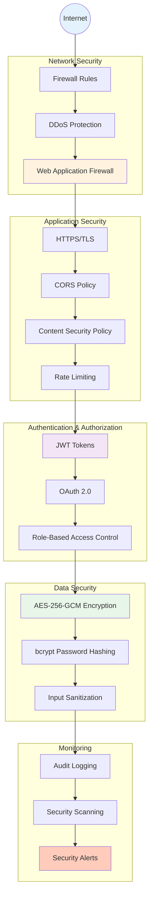

---

## 데이터베이스 스키마

MongoDB 컬렉션 관계도입니다.

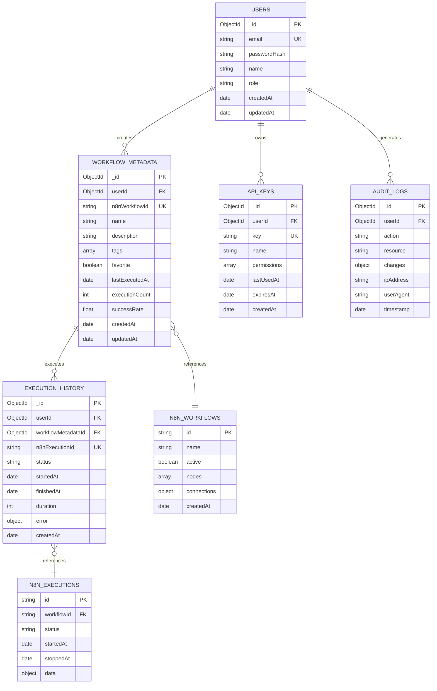

---

## 배포 파이프라인

CI/CD 파이프라인 구조입니다.

```mermaid
graph LR
    subgraph "Source Control"
        Git[Git Push]
    end

    subgraph "CI Pipeline"
        Lint[Lint & Type Check]
        Test[Run Tests]
        Build[Build Application]
        Security[Security Scan]
    end

    subgraph "CD Pipeline"
        BuildImage[Build Docker Image]
        PushRegistry[Push to Registry]
        Deploy[Deploy to K8s]
    end

    subgraph "Verification"
        HealthCheck[Health Checks]
        SmokeTest[Smoke Tests]
        Monitor[Monitor Metrics]
    end

    Git --> Lint
    Lint --> Test
    Test --> Build
    Build --> Security

    Security -->|Pass| BuildImage
    Security -->|Fail| Alert[Alert Team]

    BuildImage --> PushRegistry
    PushRegistry --> Deploy

    Deploy --> HealthCheck
    HealthCheck --> SmokeTest
    SmokeTest --> Monitor

    Monitor -->|Issues| Rollback[Rollback]
    Monitor -->|Success| Complete[Deployment Complete]

    style Git fill:#e3f2fd
    style Test fill:#fff3e0
    style Deploy fill:#f3e5f5
    style Complete fill:#c8e6c9
    style Alert fill:#ffcdd2
    style Rollback fill:#ffccbc
```

---

## 다음 단계

- [Architecture Documentation](../developers/architecture.md) - 상세한 아키텍처 설명
- [API Documentation](../api/overview.md) - API 레퍼런스
- [Operations Guide](../operations/monitoring.md) - 운영 가이드

---

## 참고 자료

- [Mermaid Documentation](https://mermaid.js.org/)
- [C4 Model](https://c4model.com/)
- [System Design Primer](https://github.com/donnemartin/system-design-primer)
