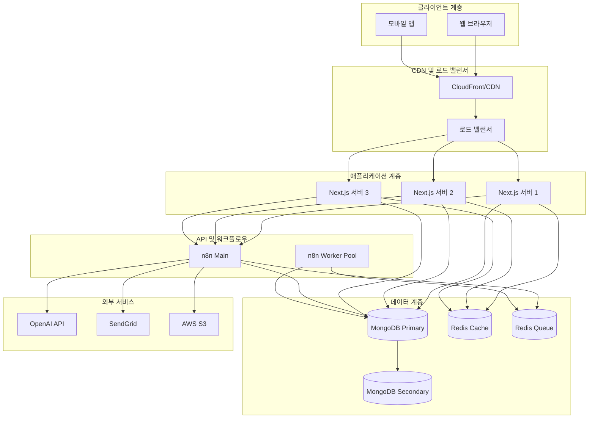
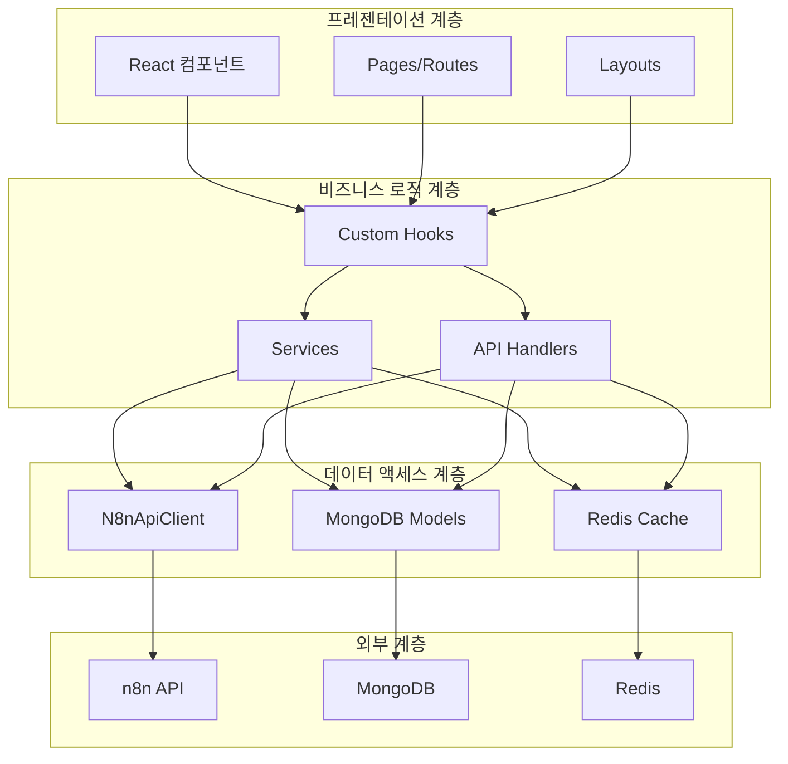
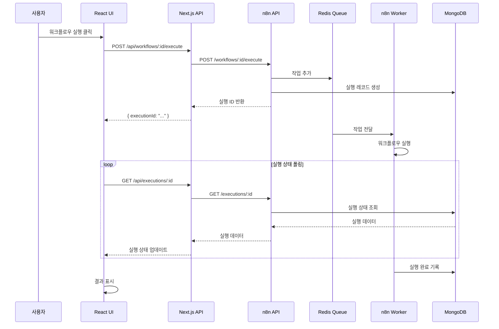
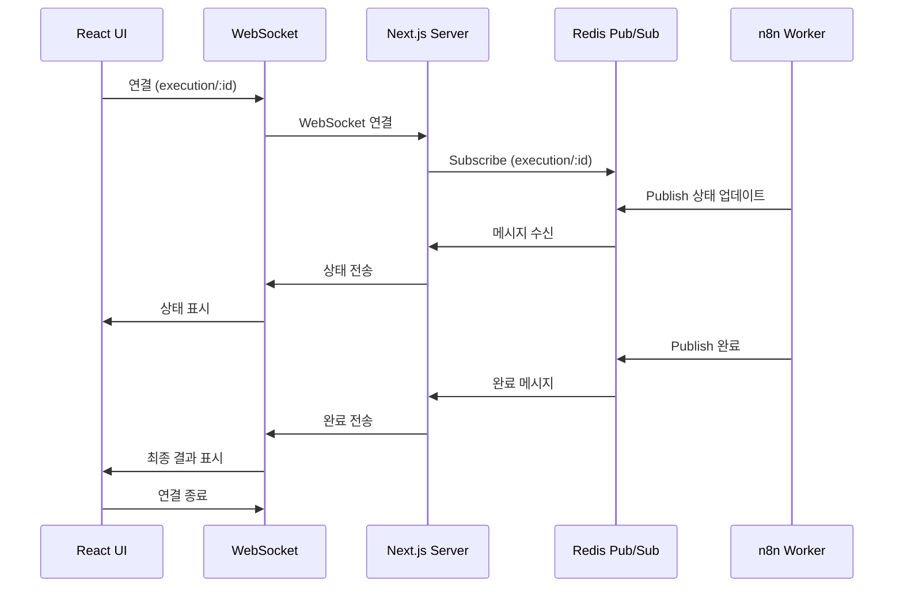
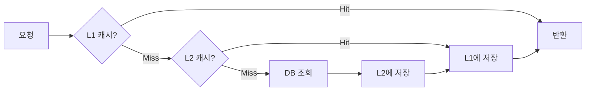
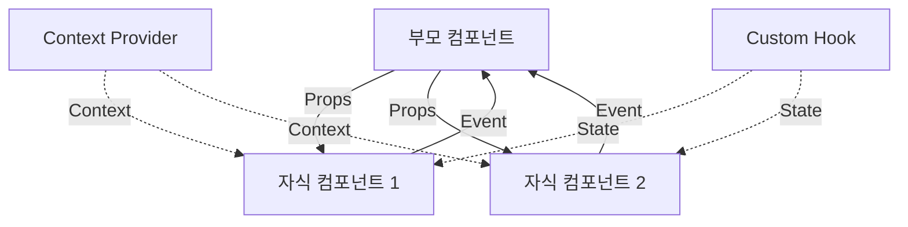
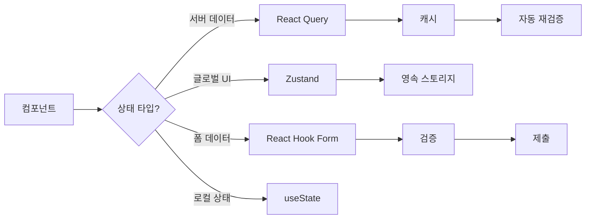
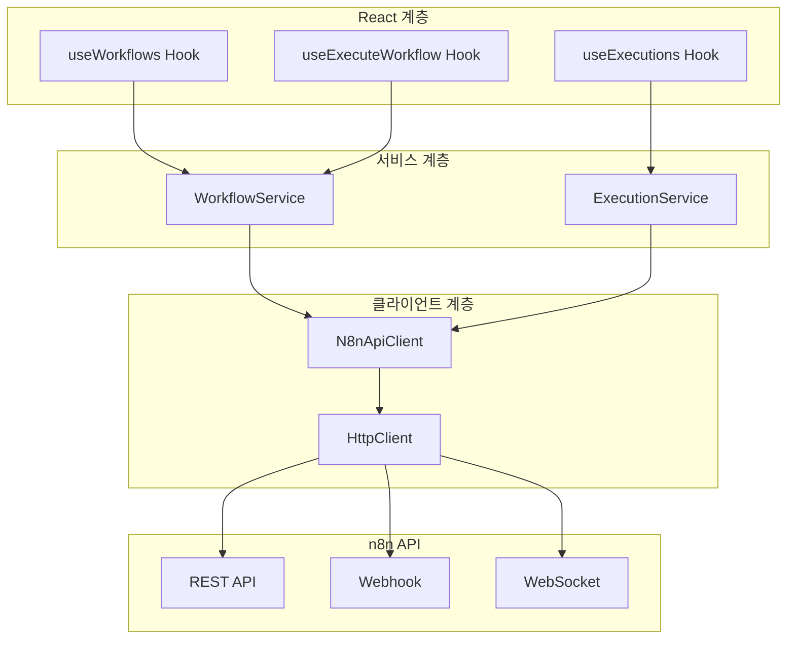
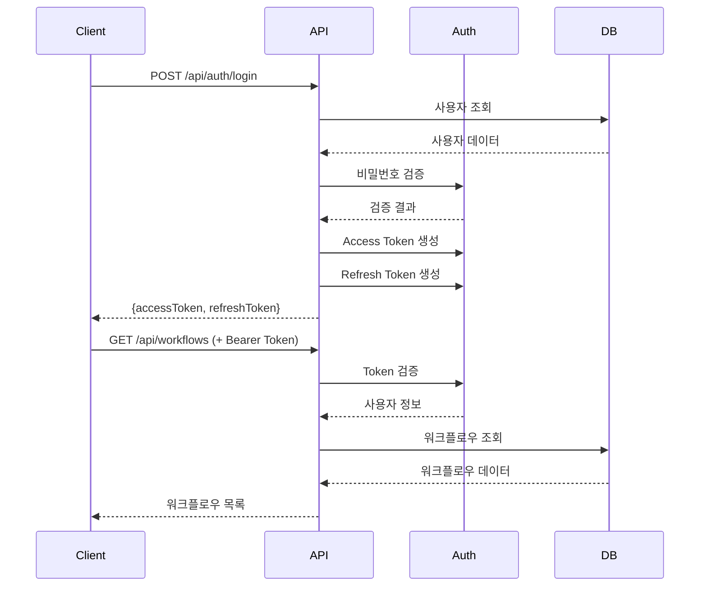

# 시스템 아키텍처

Frontend 애플리케이션의 전체 아키텍처와 각 구성 요소의 역할을 설명합니다.

## 전체 시스템 아키텍처



## 애플리케이션 아키텍처 (Next.js)

### 디렉토리 구조

```
apps/frontend/
├── app/                          # Next.js 15 App Router
│   ├── (auth)/                   # 인증 그룹
│   │   ├── login/
│   │   └── register/
│   ├── (dashboard)/              # 대시보드 그룹
│   │   ├── workflows/
│   │   ├── executions/
│   │   └── settings/
│   ├── api/                      # API Routes
│   │   ├── auth/
│   │   ├── workflows/
│   │   ├── executions/
│   │   └── webhooks/
│   ├── layout.tsx                # 루트 레이아웃
│   └── page.tsx                  # 홈 페이지
│
├── components/                   # React 컴포넌트
│   ├── ui/                       # UI 컴포넌트 (shadcn/ui)
│   │   ├── button.tsx
│   │   ├── card.tsx
│   │   └── dialog.tsx
│   ├── workflows/                # 워크플로우 컴포넌트
│   │   ├── WorkflowList.tsx
│   │   ├── WorkflowCard.tsx
│   │   └── WorkflowExecute.tsx
│   └── shared/                   # 공통 컴포넌트
│       ├── Header.tsx
│       ├── Sidebar.tsx
│       └── Footer.tsx
│
├── lib/                          # 유틸리티 및 라이브러리
│   ├── n8n/                      # n8n 통합
│   │   ├── client.ts
│   │   └── types.ts
│   ├── db/                       # 데이터베이스
│   │   ├── mongodb.ts
│   │   └── models/
│   ├── auth/                     # 인증
│   │   ├── jwt.ts
│   │   └── session.ts
│   ├── cache/                    # 캐싱
│   │   ├── redis.ts
│   │   └── strategies.ts
│   ├── logging/                  # 로깅
│   │   └── logger.ts
│   ├── monitoring/               # 모니터링
│   │   ├── prometheus.ts
│   │   └── sentry.ts
│   └── utils/                    # 헬퍼 함수
│       ├── validation.ts
│       └── formatting.ts
│
├── hooks/                        # Custom React Hooks
│   ├── useWorkflows.ts
│   ├── useExecutions.ts
│   └── useAuth.ts
│
├── middleware/                   # Next.js Middleware
│   ├── auth.ts
│   ├── logging.ts
│   └── rate-limit.ts
│
├── types/                        # TypeScript 타입
│   ├── workflow.ts
│   ├── execution.ts
│   └── user.ts
│
├── styles/                       # 스타일시트
│   └── globals.css
│
├── public/                       # 정적 파일
│   ├── images/
│   └── fonts/
│
├── tests/                        # 테스트
│   ├── unit/
│   ├── integration/
│   └── e2e/
│
├── next.config.js                # Next.js 설정
├── tailwind.config.js            # Tailwind CSS 설정
├── tsconfig.json                 # TypeScript 설정
└── package.json                  # 의존성
```

### 레이어 아키텍처



## 데이터 흐름

### 1. 워크플로우 실행 플로우



### 2. 실시간 업데이트 플로우



### 3. 캐싱 전략



## 컴포넌트 아키텍처

### 1. Atomic Design 패턴

```typescript
// Atoms (원자)
export const Button = ({ children, ...props }: ButtonProps) => {
  return <button {...props}>{children}</button>;
};

// Molecules (분자)
export const SearchBar = () => {
  return (
    <div className="search-bar">
      <Input placeholder="검색..." />
      <Button>검색</Button>
    </div>
  );
};

// Organisms (유기체)
export const WorkflowCard = ({ workflow }: WorkflowCardProps) => {
  return (
    <Card>
      <CardHeader>
        <h3>{workflow.name}</h3>
      </CardHeader>
      <CardContent>
        <p>{workflow.description}</p>
        <Badge>{workflow.status}</Badge>
      </CardContent>
      <CardFooter>
        <Button>실행</Button>
        <Button variant="outline">편집</Button>
      </CardFooter>
    </Card>
  );
};

// Templates (템플릿)
export const WorkflowListTemplate = ({ workflows }: TemplateProps) => {
  return (
    <div className="workflow-list-template">
      <Header>
        <h1>워크플로우</h1>
        <SearchBar />
      </Header>
      <main>
        <div className="grid">
          {workflows.map(workflow => (
            <WorkflowCard key={workflow.id} workflow={workflow} />
          ))}
        </div>
      </main>
    </div>
  );
};

// Pages (페이지)
export default function WorkflowsPage() {
  const { data: workflows } = useWorkflows();

  return <WorkflowListTemplate workflows={workflows} />;
}
```

### 2. 컴포넌트 통신 패턴



## 상태 관리

### 1. 상태 관리 전략

```typescript
// 서버 상태: React Query
export function useWorkflows() {
  return useQuery({
    queryKey: ['workflows'],
    queryFn: () => n8nClient.getWorkflows(),
    staleTime: 30000,
    cacheTime: 300000,
  });
}

// 클라이언트 상태: Zustand
interface AppState {
  sidebarOpen: boolean;
  theme: 'light' | 'dark';
  toggleSidebar: () => void;
  setTheme: (theme: 'light' | 'dark') => void;
}

export const useAppStore = create<AppState>((set) => ({
  sidebarOpen: true,
  theme: 'light',
  toggleSidebar: () => set((state) => ({ sidebarOpen: !state.sidebarOpen })),
  setTheme: (theme) => set({ theme }),
}));

// 폼 상태: React Hook Form
export function WorkflowForm() {
  const { register, handleSubmit, formState: { errors } } = useForm({
    resolver: zodResolver(workflowSchema),
  });

  const onSubmit = (data) => {
    console.log(data);
  };

  return (
    <form onSubmit={handleSubmit(onSubmit)}>
      <input {...register('name')} />
      {errors.name && <span>{errors.name.message}</span>}
      <button type="submit">제출</button>
    </form>
  );
}
```

### 2. 상태 관리 플로우



## n8n 통합 아키텍처

### 1. N8nApiClient 구조

```typescript
// lib/n8n/client.ts
export class N8nApiClient {
  private baseUrl: string;
  private apiKey: string;
  private httpClient: AxiosInstance;

  constructor(config: N8nClientConfig) {
    this.baseUrl = config.baseUrl;
    this.apiKey = config.apiKey;

    this.httpClient = axios.create({
      baseURL: this.baseUrl,
      headers: {
        'X-N8N-API-KEY': this.apiKey,
        'Content-Type': 'application/json',
      },
      timeout: 30000,
    });

    this.setupInterceptors();
  }

  private setupInterceptors() {
    // 요청 인터셉터
    this.httpClient.interceptors.request.use(
      (config) => {
        logger.debug('n8n API request', {
          method: config.method,
          url: config.url,
        });
        return config;
      },
      (error) => {
        logger.error('n8n API request error', error);
        return Promise.reject(error);
      }
    );

    // 응답 인터셉터
    this.httpClient.interceptors.response.use(
      (response) => response,
      async (error) => {
        if (error.response?.status === 429) {
          // Rate limit 재시도
          await this.handleRateLimit(error);
          return this.httpClient.request(error.config);
        }

        throw this.transformError(error);
      }
    );
  }

  async getWorkflows(params?: WorkflowListParams): Promise<Workflow[]> {
    const response = await this.httpClient.get('/workflows', { params });
    return response.data.data;
  }

  async executeWorkflow(
    workflowId: string,
    data?: any
  ): Promise<Execution> {
    const response = await this.httpClient.post(
      `/workflows/${workflowId}/execute`,
      data
    );
    return response.data.data;
  }

  private transformError(error: AxiosError): Error {
    // 에러 변환 로직
  }

  private async handleRateLimit(error: AxiosError): Promise<void> {
    // Rate limit 처리 로직
  }
}
```

### 2. n8n 통합 계층



## 데이터베이스 스키마

### MongoDB Collections

```typescript
// types/database.ts

// Users Collection
interface User {
  _id: ObjectId;
  email: string;
  passwordHash: string;
  name: string;
  role: 'user' | 'admin' | 'moderator';
  createdAt: Date;
  updatedAt: Date;
}

// Workflows Collection
interface WorkflowMetadata {
  _id: ObjectId;
  userId: ObjectId;
  n8nWorkflowId: string;
  name: string;
  description?: string;
  tags: string[];
  favorite: boolean;
  lastExecutedAt?: Date;
  executionCount: number;
  successRate: number;
  createdAt: Date;
  updatedAt: Date;
}

// Executions Collection
interface ExecutionMetadata {
  _id: ObjectId;
  workflowId: ObjectId;
  n8nExecutionId: string;
  status: 'success' | 'error' | 'waiting';
  startedAt: Date;
  finishedAt?: Date;
  duration?: number;
  error?: {
    message: string;
    node?: string;
  };
}

// Credentials Collection
interface Credential {
  _id: ObjectId;
  userId: ObjectId;
  name: string;
  type: string;
  data: string; // 암호화된 데이터
  createdAt: Date;
  updatedAt: Date;
}

// Audit Logs Collection
interface AuditLog {
  _id: ObjectId;
  userId?: ObjectId;
  action: string;
  resource: string;
  resourceId?: string;
  changes?: Record<string, any>;
  ipAddress?: string;
  userAgent?: string;
  timestamp: Date;
  status: 'success' | 'failure';
}
```

### 인덱스 전략

```typescript
// 워크플로우 인덱스
db.workflows.createIndex({ userId: 1, createdAt: -1 });
db.workflows.createIndex({ userId: 1, favorite: 1 });
db.workflows.createIndex({ tags: 1 });
db.workflows.createIndex({ name: 'text', description: 'text' });

// 실행 인덱스
db.executions.createIndex({ workflowId: 1, startedAt: -1 });
db.executions.createIndex({ status: 1, finishedAt: -1 });
db.executions.createIndex({ userId: 1, startedAt: -1 });

// 크레덴셜 인덱스
db.credentials.createIndex({ userId: 1, type: 1 });

// 감사 로그 인덱스
db.auditLogs.createIndex({ userId: 1, timestamp: -1 });
db.auditLogs.createIndex({ action: 1, timestamp: -1 });
db.auditLogs.createIndex({ timestamp: -1 }, { expireAfterSeconds: 7776000 }); // 90일 후 자동 삭제
```

## API 설계

### RESTful API 구조

```
GET     /api/workflows              # 워크플로우 목록
POST    /api/workflows              # 워크플로우 생성
GET     /api/workflows/:id          # 워크플로우 상세
PUT     /api/workflows/:id          # 워크플로우 수정
DELETE  /api/workflows/:id          # 워크플로우 삭제
POST    /api/workflows/:id/execute  # 워크플로우 실행

GET     /api/executions             # 실행 목록
GET     /api/executions/:id         # 실행 상세
DELETE  /api/executions/:id         # 실행 삭제

POST    /api/webhooks/n8n           # n8n Webhook
GET     /api/health                 # 헬스체크
GET     /api/metrics                # Prometheus 메트릭
```

### API 응답 포맷

```typescript
// 성공 응답
interface SuccessResponse<T> {
  data: T;
  meta?: {
    page?: number;
    limit?: number;
    total?: number;
  };
}

// 에러 응답
interface ErrorResponse {
  error: {
    code: string;
    message: string;
    details?: any;
  };
}

// 페이지네이션 응답
interface PaginatedResponse<T> {
  data: T[];
  meta: {
    page: number;
    limit: number;
    total: number;
    totalPages: number;
    hasNext: boolean;
    hasPrev: boolean;
  };
}
```

## 보안 아키텍처

### 인증 플로우



## 배포 아키텍처

### Kubernetes 배포

```yaml
# k8s/deployment.yaml
apiVersion: apps/v1
kind: Deployment
metadata:
  name: frontend-app
spec:
  replicas: 3
  selector:
    matchLabels:
      app: frontend
  template:
    metadata:
      labels:
        app: frontend
    spec:
      containers:
      - name: frontend
        image: registry/frontend:latest
        ports:
        - containerPort: 3000
        env:
        - name: MONGODB_URI
          valueFrom:
            secretKeyRef:
              name: app-secrets
              key: mongodb-uri
        - name: REDIS_URL
          valueFrom:
            secretKeyRef:
              name: app-secrets
              key: redis-url
        resources:
          requests:
            cpu: 500m
            memory: 512Mi
          limits:
            cpu: 1000m
            memory: 1Gi
```

## 성능 최적화 전략

### 1. Code Splitting

```typescript
// 동적 import로 번들 크기 최적화
const WorkflowEditor = dynamic(() => import('@/components/WorkflowEditor'), {
  loading: () => <Spinner />,
  ssr: false,
});
```

### 2. 이미지 최적화

```typescript
import Image from 'next/image';

<Image
  src="/workflow-icon.png"
  alt="워크플로우"
  width={200}
  height={200}
  priority={false}
  loading="lazy"
/>
```

### 3. React Query 최적화

```typescript
export function useWorkflows() {
  return useQuery({
    queryKey: ['workflows'],
    queryFn: () => n8nClient.getWorkflows(),
    staleTime: 30000,    // 30초 동안 fresh
    cacheTime: 300000,   // 5분 동안 캐시 유지
    refetchOnWindowFocus: false,
    retry: 3,
    retryDelay: (attemptIndex) => Math.min(1000 * 2 ** attemptIndex, 30000),
  });
}
```

## 다음 단계

1. [API Wrapper 사용법](./api-wrapper) - N8nApiClient 가이드
2. [에러 처리](./error-handling) - 에러 처리 패턴
3. [테스트](./testing) - 테스트 전략

## 참고 자료

- [Next.js Architecture](https://nextjs.org/docs)
- [React Architecture Patterns](https://reactpatterns.com/)
- [MongoDB Schema Design](https://docs.mongodb.com/manual/core/data-model-design/)
- [Microservices Architecture](https://microservices.io/)
