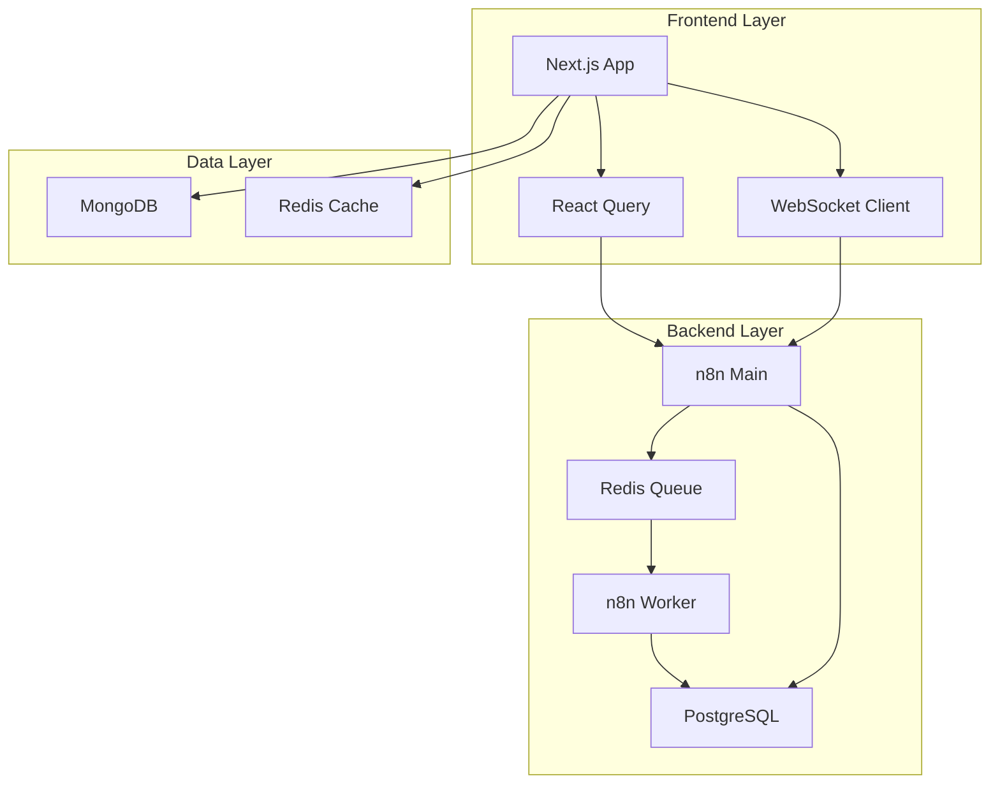

# n8n 워크플로우 관리 소개

Next.js 15 기반의 강력한 n8n 통합 플랫폼입니다.

## 주요 기능

### 🚀 워크플로우 관리
- **실시간 모니터링**: WebSocket 기반 실시간 워크플로우 실행 상태 추적
- **시각적 편집**: ReactFlow 기반의 직관적인 워크플로우 편집기
- **버전 관리**: 워크플로우 변경 이력 추적 및 롤백

### ⚡ 성능 최적화
- **Redis 캐싱**: 워크플로우 실행 결과 및 메타데이터 캐싱
- **MongoDB 인덱싱**: 최적화된 쿼리 성능
- **자동 스케일링**: n8n 워커 수평 확장 지원

### 🔍 모니터링 & 분석
- **실행 통계**: 워크플로우별 성공률, 실행 시간 분석
- **에러 분석**: AI 기반 에러 패턴 분석 및 해결 제안
- **성능 대시보드**: 실시간 시스템 메트릭 및 차트

### 🔒 보안
- **인증/인가**: n8n API 키 기반 보안 인증
- **에러 격리**: 워크플로우 실행 실패 격리 및 자동 복구
- **감사 로그**: 모든 워크플로우 변경 및 실행 이력 기록

## 기술 스택

### Frontend
- **Next.js 15**: React 19 기반 서버 사이드 렌더링
- **TypeScript**: 타입 안전성 보장
- **Tailwind CSS**: 유틸리티 우선 CSS 프레임워크
- **React Query**: 서버 상태 관리
- **Zustand**: 클라이언트 상태 관리

### Backend Integration
- **n8n REST API**: 워크플로우 CRUD 및 실행
- **n8n Webhooks**: 이벤트 기반 워크플로우 트리거
- **MongoDB**: 워크플로우 메타데이터 및 실행 이력 저장
- **Redis**: 캐싱 및 세션 관리

### Infrastructure
- **Docker**: n8n, PostgreSQL, Redis 컨테이너화
- **Nginx**: 리버스 프록시 및 SSL/TLS 종료
- **WebSocket**: Socket.io 기반 실시간 통신

## 아키텍처 개요

## 시스템 요구사항

### 최소 요구사항
- **Node.js**: 20.x 이상
- **Docker**: 20.10 이상
- **Docker Compose**: 2.0 이상
- **메모리**: 4GB RAM
- **디스크**: 10GB 여유 공간

### 권장 요구사항
- **Node.js**: 20.x LTS
- **Docker**: 최신 안정 버전
- **메모리**: 8GB RAM
- **디스크**: 20GB SSD
- **CPU**: 4코어 이상

## 지원 환경

### 운영체제
- ✅ Ubuntu 20.04 LTS / 22.04 LTS
- ✅ Debian 11+
- ✅ macOS 12+
- ✅ Windows 10/11 (WSL2 사용)

### 브라우저
- ✅ Chrome 90+
- ✅ Firefox 88+
- ✅ Safari 14+
- ✅ Edge 90+

## 다음 단계

1. [Docker 환경 설정](./docker-setup) - Docker 및 컨테이너 구성
2. [n8n 연동](./n8n-connection) - n8n 인스턴스 연결
3. [환경 변수 설정](./environment-variables) - 필수 환경 변수 구성
4. [첫 워크플로우 실행](./first-workflow) - 간단한 워크플로우 생성 및 실행

## 도움말

- 📖 [API 문서](/api/overview) - REST API 상세 문서
- 🔧 [n8n 통합 가이드](/n8n-integration/overview) - n8n 워크플로우 작성법
- 🚨 [트러블슈팅](/operations/troubleshooting) - 일반적인 문제 해결
- 💬 [GitHub Issues](https://github.com/your-org/your-repo/issues) - 버그 리포트 및 기능 요청
