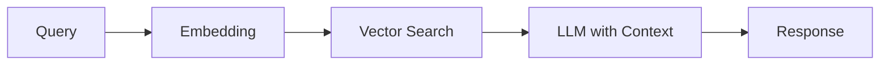
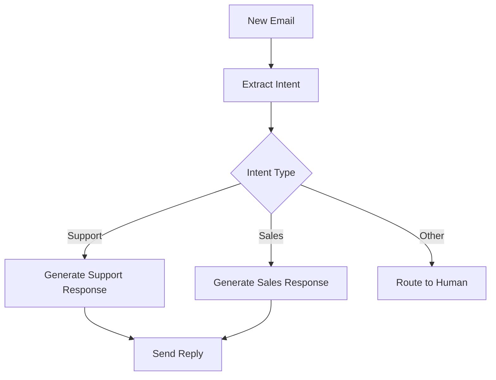
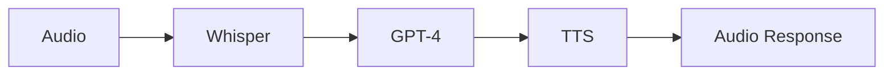

# AI 노드 사용법

n8n의 AI 기능을 활용하여 지능형 워크플로우를 구축하는 방법을 설명합니다.

## AI 노드 개요

n8n은 다양한 AI 서비스와 통합을 제공합니다:

- **OpenAI** - GPT 모델, DALL-E, Whisper
- **Anthropic Claude** - Claude AI 모델
- **Google AI** - Gemini, PaLM
- **Hugging Face** - 오픈소스 AI 모델
- **LangChain** - AI 체인 구성

## OpenAI 통합

### GPT를 사용한 텍스트 생성

**노드 설정:**

```json
{
  "id": "openai",
  "name": "Generate Text",
  "type": "n8n-nodes-base.openAi",
  "typeVersion": 1,
  "position": [450, 300],
  "parameters": {
    "resource": "text",
    "operation": "complete",
    "model": "gpt-4",
    "prompt": "={{ $json.userInput }}",
    "options": {
      "temperature": 0.7,
      "maxTokens": 500
    }
  },
  "credentials": {
    "openAiApi": {
      "id": "1",
      "name": "OpenAI API"
    }
  }
}
```

**워크플로우 예제: AI 챗봇**

```typescript
const chatbotWorkflow = {
  name: 'AI Chatbot',
  active: true,
  nodes: [
    {
      id: 'webhook',
      name: 'Webhook',
      type: 'n8n-nodes-base.webhook',
      typeVersion: 1,
      position: [250, 300],
      parameters: {
        httpMethod: 'POST',
        path: 'chat',
      },
    },
    {
      id: 'openai',
      name: 'GPT-4',
      type: 'n8n-nodes-base.openAi',
      typeVersion: 1,
      position: [450, 300],
      parameters: {
        resource: 'text',
        operation: 'message',
        model: 'gpt-4',
        messages: {
          values: [
            {
              role: 'system',
              content: 'You are a helpful assistant.',
            },
            {
              role: 'user',
              content: '={{ $json.message }}',
            },
          ],
        },
        options: {
          temperature: 0.7,
          maxTokens: 1000,
        },
      },
    },
    {
      id: 'respond',
      name: 'Respond',
      type: 'n8n-nodes-base.respondToWebhook',
      typeVersion: 1,
      position: [650, 300],
      parameters: {
        respondWith: 'json',
        responseBody: `{
          "reply": "={{ $json.choices[0].message.content }}",
          "model": "gpt-4"
        }`,
      },
    },
  ],
  connections: {
    webhook: {
      main: [[{ node: 'openai', type: 'main', index: 0 }]],
    },
    openai: {
      main: [[{ node: 'respond', type: 'main', index: 0 }]],
    },
  },
};
```

### 대화 기록 관리

**Function 노드로 대화 컨텍스트 유지:**

```javascript
// 이전 대화 가져오기
const conversationId = $json.conversationId;
const cache = $workflow.staticData;

if (!cache.conversations) {
  cache.conversations = {};
}

if (!cache.conversations[conversationId]) {
  cache.conversations[conversationId] = [];
}

const history = cache.conversations[conversationId];

// 현재 메시지 추가
history.push({
  role: 'user',
  content: $json.message,
});

// 최근 10개 메시지만 유지
if (history.length > 10) {
  history.splice(0, history.length - 10);
}

// OpenAI에 전달할 메시지 구성
const messages = [
  {
    role: 'system',
    content: 'You are a helpful assistant with memory of the conversation.',
  },
  ...history,
];

return [{ json: { messages, conversationId } }];
```

### 이미지 생성 (DALL-E)

```typescript
{
  id: 'dalle',
  name: 'Generate Image',
  type: 'n8n-nodes-base.openAi',
  typeVersion: 1,
  parameters: {
    resource: 'image',
    operation: 'create',
    prompt: '={{ $json.imageDescription }}',
    options: {
      size: '1024x1024',
      quality: 'hd',
      n: 1,
    },
  },
}
```

### 음성 인식 (Whisper)

```typescript
{
  id: 'whisper',
  name: 'Transcribe Audio',
  type: 'n8n-nodes-base.openAi',
  typeVersion: 1,
  parameters: {
    resource: 'audio',
    operation: 'transcribe',
    binaryPropertyName: 'audioFile',
    options: {
      language: 'ko',
      temperature: 0,
    },
  },
}
```

## Anthropic Claude 통합

### Claude를 사용한 텍스트 분석

```typescript
{
  id: 'claude',
  name: 'Analyze with Claude',
  type: 'n8n-nodes-base.anthropic',
  typeVersion: 1,
  parameters: {
    model: 'claude-3-opus-20240229',
    prompt: `Analyze the following text and provide:
1. Main topics
2. Sentiment (positive/negative/neutral)
3. Key insights

Text: {{ $json.content }}`,
    options: {
      maxTokens: 1000,
      temperature: 0.5,
    },
  },
}
```

## LangChain 통합

### AI 체인 구성

**벡터 스토어 + LLM 체인:**



**워크플로우 구현:**

```typescript
const ragWorkflow = {
  name: 'RAG (Retrieval Augmented Generation)',
  nodes: [
    {
      id: 'webhook',
      name: 'User Query',
      type: 'n8n-nodes-base.webhook',
      parameters: {
        httpMethod: 'POST',
        path: 'ask',
      },
    },
    {
      id: 'embedding',
      name: 'Create Embedding',
      type: 'n8n-nodes-base.openAi',
      parameters: {
        resource: 'embedding',
        model: 'text-embedding-ada-002',
        text: '={{ $json.query }}',
      },
    },
    {
      id: 'vectorsearch',
      name: 'Search Documents',
      type: 'n8n-nodes-base.pinecone',
      parameters: {
        operation: 'query',
        topK: 3,
        vector: '={{ $json.embedding }}',
      },
    },
    {
      id: 'llm',
      name: 'Generate Answer',
      type: 'n8n-nodes-base.openAi',
      parameters: {
        model: 'gpt-4',
        messages: {
          values: [
            {
              role: 'system',
              content: 'Answer based on the provided context only.',
            },
            {
              role: 'user',
              content: `Context: {{ $json.matches.map(m => m.metadata.text).join('\\n\\n') }}

Question: {{ $('webhook').item.json.query }}`,
            },
          ],
        },
      },
    },
  ],
};
```

## AI 기반 데이터 처리

### 텍스트 분류

```javascript
// Function 노드: 분류 프롬프트 생성
const categories = ['기술', '비즈니스', '건강', '스포츠', '엔터테인먼트'];

const prompt = `다음 텍스트를 아래 카테고리 중 하나로 분류하세요:
${categories.join(', ')}

텍스트: ${$json.text}

카테고리만 답변하세요.`;

return [{ json: { prompt, originalText: $json.text } }];
```

### 감정 분석

```typescript
{
  id: 'sentiment',
  name: 'Analyze Sentiment',
  type: 'n8n-nodes-base.openAi',
  parameters: {
    model: 'gpt-3.5-turbo',
    messages: {
      values: [
        {
          role: 'system',
          content: 'Analyze sentiment and respond with only: positive, negative, or neutral',
        },
        {
          role: 'user',
          content: '={{ $json.reviewText }}',
        },
      ],
    },
    options: {
      temperature: 0,
      maxTokens: 10,
    },
  },
}
```

### 데이터 추출

```javascript
// 구조화된 데이터 추출
const extractionPrompt = `Extract the following information from this email and return as JSON:
- sender_name
- sender_email
- subject
- urgency (low/medium/high)
- action_required (true/false)
- deadline (if mentioned)

Email: ${$json.emailContent}

Return only valid JSON.`;

return [{ json: { prompt: extractionPrompt } }];
```

## AI 기반 워크플로우 자동화

### 이메일 자동 응답



**구현:**

```typescript
const autoReplyWorkflow = {
  name: 'AI Email Auto-Reply',
  nodes: [
    {
      id: 'emailtrigger',
      name: 'Email Received',
      type: 'n8n-nodes-base.emailReadImap',
      parameters: {
        mailbox: 'INBOX',
        options: {
          markSeen: true,
        },
      },
    },
    {
      id: 'classify',
      name: 'Classify Intent',
      type: 'n8n-nodes-base.openAi',
      parameters: {
        model: 'gpt-3.5-turbo',
        messages: {
          values: [
            {
              role: 'system',
              content: 'Classify email intent: support, sales, general',
            },
            {
              role: 'user',
              content: '={{ $json.textPlain }}',
            },
          ],
        },
      },
    },
    {
      id: 'switch',
      name: 'Route by Intent',
      type: 'n8n-nodes-base.switch',
      parameters: {
        mode: 'expression',
        rules: {
          values: [
            {
              conditions: {
                string: [
                  {
                    value1: '={{ $json.intent }}',
                    operation: 'contains',
                    value2: 'support',
                  },
                ],
              },
              outputIndex: 0,
            },
            {
              conditions: {
                string: [
                  {
                    value1: '={{ $json.intent }}',
                    operation: 'contains',
                    value2: 'sales',
                  },
                ],
              },
              outputIndex: 1,
            },
          ],
        },
      },
    },
    {
      id: 'generate-support',
      name: 'Generate Support Reply',
      type: 'n8n-nodes-base.openAi',
      parameters: {
        model: 'gpt-4',
        messages: {
          values: [
            {
              role: 'system',
              content: 'You are a helpful customer support agent. Generate a professional reply.',
            },
            {
              role: 'user',
              content: '={{ $json.emailContent }}',
            },
          ],
        },
      },
    },
    {
      id: 'send-reply',
      name: 'Send Email',
      type: 'n8n-nodes-base.emailSend',
      parameters: {
        toEmail: '={{ $json.senderEmail }}',
        subject: 'Re: {{ $json.subject }}',
        text: '={{ $json.generatedReply }}',
      },
    },
  ],
};
```

### 콘텐츠 생성 파이프라인

```typescript
const contentPipeline = {
  name: 'AI Content Generator',
  nodes: [
    {
      id: 'topic',
      name: 'Generate Topics',
      type: 'n8n-nodes-base.openAi',
      parameters: {
        model: 'gpt-4',
        prompt: 'Generate 5 blog post topics about: {{ $json.category }}',
      },
    },
    {
      id: 'split',
      name: 'Split Topics',
      type: 'n8n-nodes-base.splitInBatches',
      parameters: {
        batchSize: 1,
      },
    },
    {
      id: 'outline',
      name: 'Create Outline',
      type: 'n8n-nodes-base.openAi',
      parameters: {
        model: 'gpt-4',
        prompt: 'Create detailed outline for: {{ $json.topic }}',
      },
    },
    {
      id: 'write',
      name: 'Write Article',
      type: 'n8n-nodes-base.openAi',
      parameters: {
        model: 'gpt-4',
        prompt: `Write a complete blog post based on this outline:
{{ $json.outline }}

Make it engaging and informative.`,
        options: {
          maxTokens: 2000,
        },
      },
    },
    {
      id: 'save',
      name: 'Save to CMS',
      type: 'n8n-nodes-base.httpRequest',
      parameters: {
        method: 'POST',
        url: 'https://cms.example.com/api/posts',
        jsonParameters: true,
        bodyParametersJson: `{
          "title": "{{ $json.topic }}",
          "content": "{{ $json.article }}",
          "status": "draft"
        }`,
      },
    },
  ],
};
```

## AI 모델 최적화

### 비용 최적화

```javascript
// Function 노드: 모델 선택 로직
const textLength = $json.text.length;

// 짧은 텍스트는 GPT-3.5, 긴 텍스트는 GPT-4
const model = textLength < 500 ? 'gpt-3.5-turbo' : 'gpt-4';

// 토큰 제한 동적 조정
const maxTokens = Math.min(textLength * 2, 2000);

return [{
  json: {
    model,
    maxTokens,
    prompt: $json.text,
  },
}];
```

### 응답 캐싱

```javascript
// 동일한 질문의 응답 캐싱
const cache = $workflow.staticData;

if (!cache.aiResponses) {
  cache.aiResponses = {};
}

const queryHash = require('crypto')
  .createHash('md5')
  .update($json.query)
  .digest('hex');

// 캐시 확인
if (cache.aiResponses[queryHash]) {
  return [{ json: cache.aiResponses[queryHash] }];
}

// 캐시 미스 - AI 호출 필요
return [{ json: { needsAiCall: true, queryHash } }];
```

## 멀티모달 AI

### 이미지 + 텍스트 분석

```typescript
{
  id: 'vision',
  name: 'Analyze Image',
  type: 'n8n-nodes-base.openAi',
  parameters: {
    model: 'gpt-4-vision-preview',
    messages: {
      values: [
        {
          role: 'user',
          content: [
            {
              type: 'text',
              text: 'Describe this image in detail',
            },
            {
              type: 'image_url',
              image_url: '={{ $json.imageUrl }}',
            },
          ],
        },
      ],
    },
  },
}
```

### 음성 → 텍스트 → AI → 음성



## 에러 처리 및 폴백

### AI 응답 검증

```javascript
// Function 노드: AI 응답 검증
const aiResponse = $json.aiResponse;

// 응답 길이 검증
if (!aiResponse || aiResponse.length < 10) {
  throw new Error('AI response too short');
}

// JSON 형식 검증 (필요 시)
if ($json.expectJson) {
  try {
    JSON.parse(aiResponse);
  } catch (error) {
    throw new Error('Invalid JSON response from AI');
  }
}

// 금지어 체크
const bannedWords = ['inappropriate', 'offensive'];
const hasBannedWords = bannedWords.some(word =>
  aiResponse.toLowerCase().includes(word)
);

if (hasBannedWords) {
  throw new Error('Response contains banned content');
}

return [{ json: { validatedResponse: aiResponse } }];
```

### 폴백 전략

```typescript
// GPT-4 실패 시 GPT-3.5로 폴백
{
  id: 'gpt4',
  name: 'Try GPT-4',
  type: 'n8n-nodes-base.openAi',
  parameters: {
    model: 'gpt-4',
    // ...
  },
  continueOnFail: true,
}

// IF 노드로 실패 체크
{
  id: 'check-error',
  name: 'Check Error',
  type: 'n8n-nodes-base.if',
  parameters: {
    conditions: {
      boolean: [
        {
          value1: '={{ $json.error !== undefined }}',
        },
      ],
    },
  },
}

// True path: GPT-3.5 폴백
{
  id: 'gpt35-fallback',
  name: 'Fallback to GPT-3.5',
  type: 'n8n-nodes-base.openAi',
  parameters: {
    model: 'gpt-3.5-turbo',
    // ...
  },
}
```

## 다음 단계

1. [커스텀 노드 개발](./custom-nodes) - AI 기능 확장
2. [성능 최적화](./performance-optimization) - AI 워크플로우 최적화
3. [베스트 프랙티스](./best-practices) - AI 사용 권장 사항

## 참고 자료

- [OpenAI API 문서](https://platform.openai.com/docs)
- [Anthropic Claude 문서](https://docs.anthropic.com/)
- [LangChain 문서](https://python.langchain.com/)
- [n8n AI 노드](https://docs.n8n.io/integrations/builtin/cluster-nodes/root-nodes/n8n-nodes-langchain/)
