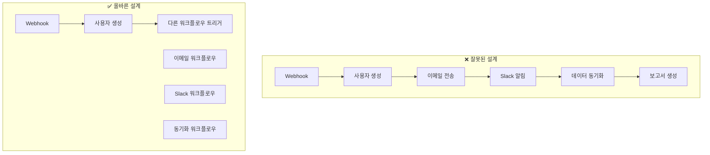

# n8n 통합 베스트 프랙티스

프로덕션 환경에서 안정적이고 유지보수 가능한 n8n 통합을 위한 권장 사항입니다.

## 워크플로우 설계 원칙

### 1. 단일 책임 원칙

각 워크플로우는 하나의 명확한 목적을 가져야 합니다.



**잘못된 예시**: 모든 것을 하나의 워크플로우에 넣기

```typescript
// ❌ 너무 많은 책임
const overloadedWorkflow = {
  name: 'Handle Everything',
  nodes: [
    // 사용자 생성
    // 이메일 전송
    // Slack 알림
    // 데이터 동기화
    // 보고서 생성
    // 청구 처리
  ],
};
```

**올바른 예시**: 워크플로우 분리

```typescript
// ✅ 명확한 책임
const userCreationWorkflow = {
  name: 'User Creation',
  nodes: [
    {
      id: 'webhook',
      name: 'Webhook Trigger',
      type: 'n8n-nodes-base.webhook',
    },
    {
      id: 'createUser',
      name: 'Create User in DB',
      type: 'n8n-nodes-base.mongodb',
    },
    {
      id: 'triggerEmail',
      name: 'Trigger Email Workflow',
      type: 'n8n-nodes-base.n8n',
      parameters: {
        operation: 'executeWorkflow',
        workflowId: 'welcome-email-workflow',
      },
    },
  ],
};

const welcomeEmailWorkflow = {
  name: 'Welcome Email',
  nodes: [
    {
      id: 'webhook',
      name: 'Webhook Trigger',
      type: 'n8n-nodes-base.webhook',
    },
    {
      id: 'sendEmail',
      name: 'Send Welcome Email',
      type: 'n8n-nodes-base.emailSend',
    },
  ],
};
```

### 2. 명명 규칙

일관된 명명 규칙으로 워크플로우 관리를 용이하게 합니다.

```typescript
// 워크플로우 명명 규칙
const namingConventions = {
  // 환경 프리픽스
  production: 'PROD - ',
  staging: 'STAGE - ',
  development: 'DEV - ',

  // 카테고리
  userManagement: '[User] ',
  dataSync: '[Sync] ',
  notification: '[Notify] ',
  automation: '[Auto] ',

  // 예시
  examples: [
    'PROD - [User] Registration Flow',
    'STAGE - [Sync] Daily Data Import',
    'DEV - [Notify] Email Campaign',
    'PROD - [Auto] Backup Database',
  ],
};

// 노드 명명 규칙
const nodeNaming = {
  // 명확한 동사 사용
  good: ['Fetch User Data', 'Transform to JSON', 'Send to Slack', 'Update Database'],

  // 모호한 이름 지양
  bad: ['Node 1', 'HTTP', 'Function', 'Process'],
};
```

### 3. 에러 처리 전략

모든 워크플로우에 적절한 에러 처리를 구현합니다.

```typescript
// ✅ 포괄적인 에러 처리
const robustWorkflow = {
  name: 'Robust Data Processing',
  nodes: [
    {
      id: 'fetchData',
      name: 'Fetch Data from API',
      type: 'n8n-nodes-base.httpRequest',
      continueOnFail: true, // 실패 시 워크플로우 계속 진행
    },
    {
      id: 'checkError',
      name: 'Check if Fetch Failed',
      type: 'n8n-nodes-base.if',
      parameters: {
        conditions: {
          boolean: [
            {
              value1: '={{ $("fetchData").item.json.error }}',
              operation: 'exists',
            },
          ],
        },
      },
    },
    {
      id: 'handleError',
      name: 'Log Error & Notify',
      type: 'n8n-nodes-base.function',
      parameters: {
        functionCode: `
          const error = $input.item.json.error;

          // 에러 로깅
          console.error('Data fetch failed:', error);

          // 에러 메트릭 전송
          await fetch('http://monitoring/api/errors', {
            method: 'POST',
            body: JSON.stringify({
              workflow: 'data-processing',
              error: error.message,
              timestamp: new Date().toISOString(),
            }),
          });

          return { json: { error: true, message: error.message } };
        `,
      },
    },
    {
      id: 'retryLogic',
      name: 'Retry with Exponential Backoff',
      type: 'n8n-nodes-base.function',
      parameters: {
        functionCode: `
          async function fetchWithRetry(url, maxRetries = 3) {
            for (let attempt = 0; attempt < maxRetries; attempt++) {
              try {
                const response = await fetch(url);
                if (response.ok) {
                  return await response.json();
                }
              } catch (error) {
                if (attempt === maxRetries - 1) throw error;

                // 지수 백오프: 2^attempt * 1000ms
                const delay = Math.pow(2, attempt) * 1000;
                await new Promise(resolve => setTimeout(resolve, delay));
              }
            }
          }

          const data = await fetchWithRetry($json.url);
          return { json: data };
        `,
      },
    },
  ],
  settings: {
    // 워크플로우 레벨 에러 처리
    errorWorkflow: 'error-handler-workflow',
    saveExecutionOnError: 'all',
    saveExecutionOnSuccess: 'all',
  },
};
```

### 4. 데이터 검증

입력 데이터를 항상 검증합니다.

```typescript
const validationNode = {
  id: 'validateInput',
  name: 'Validate Input Data',
  type: 'n8n-nodes-base.function',
  parameters: {
    functionCode: `
      const Joi = require('joi');

      // 검증 스키마 정의
      const schema = Joi.object({
        email: Joi.string().email().required(),
        name: Joi.string().min(2).max(100).required(),
        age: Joi.number().integer().min(18).max(120).optional(),
        role: Joi.string().valid('user', 'admin', 'moderator').required(),
      });

      // 입력 데이터 검증
      const { error, value } = schema.validate($json, {
        abortEarly: false,
        stripUnknown: true,
      });

      if (error) {
        // 검증 실패
        throw new Error(\`Validation failed: \${error.details.map(d => d.message).join(', ')}\`);
      }

      // 검증 성공 - 정제된 데이터 반환
      return { json: value };
    `,
  },
};
```

## 보안 권장 사항

### 1. 크레덴셜 관리

```typescript
// ✅ 환경 변수 사용
const secureConfig = {
  apiKey: process.env.API_KEY,
  webhookSecret: process.env.WEBHOOK_SECRET,
  databasePassword: process.env.DB_PASSWORD,
};

// ❌ 하드코딩된 크레덴셜
const insecureConfig = {
  apiKey: 'sk_live_123456789', // 절대 금지!
  password: 'mypassword123', // 절대 금지!
};
```

### 2. Webhook 보안

```typescript
// HMAC 서명 검증
export async function POST(request: NextRequest) {
  const body = await request.text();
  const signature = request.headers.get('X-Webhook-Signature');

  // 서명 검증
  const expectedSignature = crypto
    .createHmac('sha256', process.env.WEBHOOK_SECRET!)
    .update(body)
    .digest('hex');

  if (!crypto.timingSafeEqual(Buffer.from(signature || ''), Buffer.from(expectedSignature))) {
    return NextResponse.json({ error: 'Invalid signature' }, { status: 401 });
  }

  // IP 화이트리스트 검증
  const clientIp = request.headers.get('x-forwarded-for') || request.headers.get('x-real-ip');

  const allowedIPs = process.env.ALLOWED_IPS?.split(',') || [];

  if (!allowedIPs.includes(clientIp || '')) {
    return NextResponse.json({ error: 'IP not allowed' }, { status: 403 });
  }

  // 타임스탬프 검증 (리플레이 공격 방지)
  const payload = JSON.parse(body);
  const timestamp = new Date(payload.timestamp).getTime();
  const now = Date.now();

  if (Math.abs(now - timestamp) > 300000) {
    // 5분
    return NextResponse.json({ error: 'Request too old' }, { status: 400 });
  }

  // 요청 처리
  await handleWebhook(payload);

  return NextResponse.json({ success: true });
}
```

### 3. Rate Limiting

```typescript
import { Ratelimit } from '@upstash/ratelimit';
import { Redis } from '@upstash/redis';

const ratelimit = new Ratelimit({
  redis: Redis.fromEnv(),
  limiter: Ratelimit.slidingWindow(10, '10 s'), // 10초에 10번
});

export async function POST(request: NextRequest) {
  // IP 기반 rate limiting
  const ip = request.headers.get('x-forwarded-for') || 'unknown';
  const { success, limit, remaining } = await ratelimit.limit(ip);

  if (!success) {
    return NextResponse.json(
      {
        error: 'Too many requests',
        limit,
        remaining,
      },
      { status: 429 }
    );
  }

  // 요청 처리
  return NextResponse.json({ success: true });
}
```

### 4. 데이터 암호화

```typescript
import crypto from 'crypto';

class EncryptionService {
  private algorithm = 'aes-256-gcm';
  private key = Buffer.from(process.env.ENCRYPTION_KEY!, 'hex');

  encrypt(text: string): string {
    const iv = crypto.randomBytes(16);
    const cipher = crypto.createCipheriv(this.algorithm, this.key, iv);

    let encrypted = cipher.update(text, 'utf8', 'hex');
    encrypted += cipher.final('hex');

    const authTag = cipher.getAuthTag();

    return JSON.stringify({
      iv: iv.toString('hex'),
      data: encrypted,
      authTag: authTag.toString('hex'),
    });
  }

  decrypt(encryptedData: string): string {
    const { iv, data, authTag } = JSON.parse(encryptedData);

    const decipher = crypto.createDecipheriv(this.algorithm, this.key, Buffer.from(iv, 'hex'));

    decipher.setAuthTag(Buffer.from(authTag, 'hex'));

    let decrypted = decipher.update(data, 'hex', 'utf8');
    decrypted += decipher.final('utf8');

    return decrypted;
  }
}

// 사용 예시
const encryption = new EncryptionService();

// 민감한 데이터 저장 전 암호화
const encryptedApiKey = encryption.encrypt('sk_live_123456789');
await db.credentials.create({ apiKey: encryptedApiKey });

// 사용 시 복호화
const credential = await db.credentials.findOne({ id });
const apiKey = encryption.decrypt(credential.apiKey);
```

## 성능 최적화

### 1. 워크플로우 최적화

```typescript
// ✅ 병렬 실행
const parallelWorkflow = {
  name: 'Parallel Execution',
  nodes: [
    {
      id: 'start',
      name: 'Start',
      type: 'n8n-nodes-base.manualTrigger',
    },
    // 3개의 API를 병렬로 호출
    {
      id: 'api1',
      name: 'Fetch from API 1',
      type: 'n8n-nodes-base.httpRequest',
    },
    {
      id: 'api2',
      name: 'Fetch from API 2',
      type: 'n8n-nodes-base.httpRequest',
    },
    {
      id: 'api3',
      name: 'Fetch from API 3',
      type: 'n8n-nodes-base.httpRequest',
    },
    {
      id: 'merge',
      name: 'Merge Results',
      type: 'n8n-nodes-base.merge',
    },
  ],
  connections: {
    start: {
      main: [
        [{ node: 'api1', type: 'main', index: 0 }],
        [{ node: 'api2', type: 'main', index: 0 }],
        [{ node: 'api3', type: 'main', index: 0 }],
      ],
    },
    api1: {
      main: [[{ node: 'merge', type: 'main', index: 0 }]],
    },
    api2: {
      main: [[{ node: 'merge', type: 'main', index: 1 }]],
    },
    api3: {
      main: [[{ node: 'merge', type: 'main', index: 2 }]],
    },
  },
};
```

### 2. 배치 처리

```typescript
// Split In Batches 노드 사용
const batchProcessing = {
  id: 'splitInBatches',
  name: 'Process in Batches',
  type: 'n8n-nodes-base.splitInBatches',
  parameters: {
    batchSize: 100,
  },
};

// Function 노드에서 배치 처리
const batchFunction = {
  id: 'batchInsert',
  name: 'Batch Insert to DB',
  type: 'n8n-nodes-base.function',
  parameters: {
    functionCode: `
      const items = $input.all();

      // MongoDB bulk insert (100개씩)
      const bulkOps = items.map(item => ({
        insertOne: { document: item.json },
      }));

      const result = await db.collection('users').bulkWrite(bulkOps);

      return [{ json: { inserted: result.insertedCount } }];
    `,
  },
};
```

### 3. 캐싱 전략

```typescript
// Redis 캐싱 구현
const cacheNode = {
  id: 'checkCache',
  name: 'Check Redis Cache',
  type: 'n8n-nodes-base.function',
  parameters: {
    functionCode: `
      const Redis = require('ioredis');
      const redis = new Redis(process.env.REDIS_URL);

      const cacheKey = \`workflow:\${$json.workflowId}\`;

      // 캐시 확인
      const cached = await redis.get(cacheKey);

      if (cached) {
        // 캐시 히트
        return [{ json: JSON.parse(cached) }];
      }

      // 캐시 미스 - API 호출 필요
      return [{ json: { cache: 'miss' } }];
    `,
  },
};

const setCacheNode = {
  id: 'setCache',
  name: 'Set Redis Cache',
  type: 'n8n-nodes-base.function',
  parameters: {
    functionCode: `
      const Redis = require('ioredis');
      const redis = new Redis(process.env.REDIS_URL);

      const cacheKey = \`workflow:\${$json.workflowId}\`;

      // 1시간 캐시
      await redis.setex(cacheKey, 3600, JSON.stringify($json));

      return [{ json: $json }];
    `,
  },
};
```

## 테스트 전략

### 1. 워크플로우 단위 테스트

```typescript
import { executeWorkflow } from '@/lib/n8n/test-utils';

describe('User Registration Workflow', () => {
  it('should create user and send welcome email', async () => {
    const input = {
      email: 'test@example.com',
      name: 'Test User',
    };

    const result = await executeWorkflow('user-registration', input);

    expect(result.status).toBe('success');
    expect(result.data).toHaveProperty('userId');
    expect(result.data).toHaveProperty('emailSent', true);
  });

  it('should handle duplicate email error', async () => {
    const input = {
      email: 'existing@example.com',
      name: 'Duplicate User',
    };

    const result = await executeWorkflow('user-registration', input);

    expect(result.status).toBe('error');
    expect(result.error.code).toBe('DUPLICATE_EMAIL');
  });
});
```

### 2. 통합 테스트

```typescript
import { n8nClient } from '@/lib/n8n/client';

describe('Workflow Integration', () => {
  beforeAll(async () => {
    // 테스트 워크플로우 생성
    await n8nClient.createWorkflow({
      name: 'Test Workflow',
      nodes: [
        // ... 테스트 노드
      ],
    });
  });

  afterAll(async () => {
    // 테스트 워크플로우 삭제
    await n8nClient.deleteWorkflow('test-workflow-id');
  });

  it('should execute workflow end-to-end', async () => {
    const execution = await n8nClient.executeWorkflow('test-workflow-id', {
      input: 'test data',
    });

    // 실행 완료 대기
    const result = await waitForExecution(execution.id);

    expect(result.status).toBe('success');
    expect(result.data.output).toBe('expected output');
  });
});
```

### 3. E2E 테스트 (Playwright)

```typescript
import { test, expect } from '@playwright/test';

test('workflow execution from UI', async ({ page }) => {
  // 로그인
  await page.goto('http://localhost:3000');
  await page.fill('[name="email"]', 'test@example.com');
  await page.fill('[name="password"]', 'password');
  await page.click('button[type="submit"]');

  // 워크플로우 페이지로 이동
  await page.goto('http://localhost:3000/workflows/test-workflow-id');

  // 워크플로우 실행
  await page.click('button:has-text("Execute")');

  // 실행 완료 대기
  await page.waitForSelector('text=Success', { timeout: 30000 });

  // 결과 확인
  const output = await page.textContent('.execution-output');
  expect(output).toContain('expected output');
});
```

## 문서화 권장 사항

### 1. 워크플로우 문서화

각 워크플로우에 설명을 추가합니다:

```typescript
const documentedWorkflow = {
  name: 'PROD - [User] Registration Flow',

  // 워크플로우 설명
  notes: `
    ## 목적
    신규 사용자 등록 처리 및 환영 이메일 전송

    ## 트리거
    - Webhook: POST /api/webhooks/user-registration

    ## 프로세스
    1. 입력 데이터 검증 (email, name, password)
    2. 사용자 중복 확인
    3. MongoDB에 사용자 생성
    4. 환영 이메일 전송 (SendGrid)
    5. Slack에 알림

    ## 에러 처리
    - 중복 이메일: 409 Conflict 반환
    - 검증 실패: 400 Bad Request 반환
    - 이메일 전송 실패: 재시도 3회

    ## 의존성
    - MongoDB 연결
    - SendGrid API
    - Slack Webhook

    ## 모니터링
    - 성공률: 99%+ 목표
    - 평균 실행 시간: <2초
    - 에러 알림: #alerts 채널
  `,

  nodes: [
    // ... 노드 정의
  ],
};
```

### 2. 노드별 주석

```typescript
const nodeWithComments = {
  id: 'validateEmail',
  name: 'Validate Email Format',
  type: 'n8n-nodes-base.function',
  notes: `
    이메일 형식 검증 및 도메인 검사

    - RFC 5322 표준 준수
    - 일회용 이메일 도메인 차단
    - MX 레코드 검증 (옵션)
  `,
  parameters: {
    functionCode: `
      // 이메일 정규식 검증
      const emailRegex = /^[^\s@]+@[^\s@]+\.[^\s@]+$/;

      if (!emailRegex.test($json.email)) {
        throw new Error('Invalid email format');
      }

      // 일회용 이메일 도메인 차단
      const disposableDomains = ['tempmail.com', '10minutemail.com'];
      const domain = $json.email.split('@')[1];

      if (disposableDomains.includes(domain)) {
        throw new Error('Disposable email not allowed');
      }

      return { json: { email: $json.email, valid: true } };
    `,
  },
};
```

### 3. README 파일

프로젝트 루트에 README 작성:

````markdown
# n8n 워크플로우 프로젝트

## 개요

이 프로젝트는 사용자 관리, 데이터 동기화, 알림 자동화를 위한 n8n 워크플로우 모음입니다.

## 워크플로우 목록

### 사용자 관리

- **user-registration**: 신규 사용자 등록 및 환영 이메일
- **user-verification**: 이메일 인증 처리
- **password-reset**: 비밀번호 재설정 플로우

### 데이터 동기화

- **daily-sync**: 일일 데이터 동기화 (03:00 UTC)
- **realtime-sync**: 실시간 데이터 동기화 (Webhook)

### 알림

- **email-notifications**: 이메일 알림 전송
- **slack-alerts**: Slack 알림 전송

## 환경 설정

필요한 환경 변수:

```bash
N8N_HOST=https://n8n.example.com
N8N_API_KEY=your_api_key
MONGODB_URI=mongodb://localhost:27017/n8n
REDIS_URL=redis://localhost:6379
SENDGRID_API_KEY=your_sendgrid_key
SLACK_WEBHOOK_URL=your_slack_webhook
```
````

## 배포

### 개발 환경

```bash
npm run dev
```

### 프로덕션 배포

```bash
npm run build
npm run start
```

## 모니터링

- **대시보드**: https://monitoring.example.com
- **로그**: CloudWatch / Datadog
- **알림**: #alerts Slack 채널

## 기여 가이드

1. 새 브랜치 생성: `git checkout -b feature/new-workflow`
2. 워크플로우 작성 및 테스트
3. 문서 업데이트
4. Pull Request 생성

## 라이선스

MIT

````

## 버전 관리

### 1. Git 전략

```bash
# 워크플로우 JSON 파일을 Git에 커밋
workflows/
  ├── user-registration.json
  ├── daily-sync.json
  └── email-notifications.json

# .gitignore
node_modules/
.env
.env.local
*.log
.n8n/
````

### 2. 워크플로우 버전 관리

```typescript
// 워크플로우 버전 정보를 메타데이터에 포함
const versionedWorkflow = {
  name: 'User Registration v2.1.0',

  meta: {
    version: '2.1.0',
    changelog: [
      {
        version: '2.1.0',
        date: '2024-03-15',
        changes: ['Added email domain validation', 'Improved error handling'],
      },
      {
        version: '2.0.0',
        date: '2024-02-01',
        changes: ['Migrated to MongoDB from PostgreSQL', 'Added Slack notifications'],
      },
    ],
    author: 'Team Name',
    tags: ['user', 'registration', 'email'],
  },

  nodes: [
    // ... 노드 정의
  ],
};
```

### 3. 배포 전략

```typescript
// 환경별 워크플로우 관리
const deploymentStrategy = {
  development: {
    prefix: 'DEV -',
    n8nUrl: 'https://dev-n8n.example.com',
    testingRequired: false,
  },

  staging: {
    prefix: 'STAGE -',
    n8nUrl: 'https://stage-n8n.example.com',
    testingRequired: true,
    approvalRequired: false,
  },

  production: {
    prefix: 'PROD -',
    n8nUrl: 'https://n8n.example.com',
    testingRequired: true,
    approvalRequired: true,
    rollbackPlan: true,
  },
};

// 배포 스크립트
async function deployWorkflow(
  workflowFile: string,
  environment: 'development' | 'staging' | 'production'
) {
  const config = deploymentStrategy[environment];

  // 테스트 실행
  if (config.testingRequired) {
    console.log('Running tests...');
    await runTests(workflowFile);
  }

  // 승인 대기
  if (config.approvalRequired) {
    console.log('Waiting for approval...');
    await waitForApproval();
  }

  // 백업 생성
  if (config.rollbackPlan) {
    console.log('Creating backup...');
    await createBackup(environment);
  }

  // 워크플로우 배포
  console.log(`Deploying to ${environment}...`);
  const workflow = await loadWorkflow(workflowFile);
  workflow.name = `${config.prefix}${workflow.name}`;

  const client = new N8nApiClient({
    baseUrl: config.n8nUrl,
    apiKey: process.env.N8N_API_KEY!,
  });

  await client.createWorkflow(workflow);

  console.log('Deployment completed!');
}
```

## 모니터링 및 로깅

### 1. 실행 모니터링

```typescript
// 워크플로우 헬스체크
async function monitorWorkflows() {
  const workflows = await n8nClient.getWorkflows();

  for (const workflow of workflows) {
    // 최근 24시간 실행 통계
    const executions = await n8nClient.getExecutions({
      workflowId: workflow.id,
      startedAfter: new Date(Date.now() - 24 * 60 * 60 * 1000),
    });

    const stats = {
      total: executions.length,
      success: executions.filter((e) => e.status === 'success').length,
      failed: executions.filter((e) => e.status === 'error').length,
      successRate: 0,
    };

    stats.successRate = stats.total > 0 ? (stats.success / stats.total) * 100 : 0;

    // 성공률이 95% 미만이면 알림
    if (stats.successRate < 95) {
      await sendAlert({
        workflow: workflow.name,
        successRate: stats.successRate,
        failed: stats.failed,
      });
    }
  }
}

// 5분마다 실행
setInterval(monitorWorkflows, 5 * 60 * 1000);
```

### 2. 로깅 전략

```typescript
// 구조화된 로깅
import winston from 'winston';

const logger = winston.createLogger({
  level: 'info',
  format: winston.format.json(),
  defaultMeta: { service: 'n8n-workflows' },
  transports: [
    new winston.transports.File({ filename: 'error.log', level: 'error' }),
    new winston.transports.File({ filename: 'combined.log' }),
  ],
});

// 워크플로우 실행 로깅
async function executeWorkflowWithLogging(workflowId: string, data: any) {
  const startTime = Date.now();

  logger.info('Workflow execution started', {
    workflowId,
    input: data,
    timestamp: new Date().toISOString(),
  });

  try {
    const result = await n8nClient.executeWorkflow(workflowId, data);

    logger.info('Workflow execution completed', {
      workflowId,
      executionId: result.id,
      duration: Date.now() - startTime,
      status: 'success',
    });

    return result;
  } catch (error: any) {
    logger.error('Workflow execution failed', {
      workflowId,
      duration: Date.now() - startTime,
      error: error.message,
      stack: error.stack,
    });

    throw error;
  }
}
```

### 3. 메트릭 수집

```typescript
import { collectDefaultMetrics, Registry, Counter, Histogram } from 'prom-client';

const register = new Registry();

collectDefaultMetrics({ register });

// 워크플로우 실행 카운터
const executionCounter = new Counter({
  name: 'workflow_executions_total',
  help: 'Total number of workflow executions',
  labelNames: ['workflow_id', 'status'],
  registers: [register],
});

// 워크플로우 실행 시간 히스토그램
const executionDuration = new Histogram({
  name: 'workflow_execution_duration_seconds',
  help: 'Workflow execution duration in seconds',
  labelNames: ['workflow_id'],
  registers: [register],
});

// 메트릭 수집
async function trackWorkflowExecution(workflowId: string) {
  const end = executionDuration.startTimer({ workflow_id: workflowId });

  try {
    const result = await n8nClient.executeWorkflow(workflowId);

    executionCounter.inc({
      workflow_id: workflowId,
      status: result.status,
    });

    return result;
  } finally {
    end();
  }
}

// Prometheus 엔드포인트
app.get('/metrics', async (req, res) => {
  res.set('Content-Type', register.contentType);
  res.end(await register.metrics());
});
```

## 체크리스트

프로덕션 배포 전 확인 사항:

### 워크플로우 설계

- [ ] 단일 책임 원칙 준수
- [ ] 명확한 명명 규칙 적용
- [ ] 적절한 에러 처리 구현
- [ ] 입력 데이터 검증
- [ ] 문서화 완료

### 보안

- [ ] 크레덴셜을 환경 변수로 관리
- [ ] Webhook 서명 검증
- [ ] Rate limiting 구현
- [ ] 민감한 데이터 암호화
- [ ] IP 화이트리스트 설정 (필요 시)

### 성능

- [ ] 병렬 실행 가능한 노드 식별
- [ ] 배치 처리 구현
- [ ] 캐싱 전략 적용
- [ ] 실행 시간 최적화 (<5초 목표)

### 테스트

- [ ] 단위 테스트 작성
- [ ] 통합 테스트 완료
- [ ] E2E 테스트 통과
- [ ] 에러 시나리오 테스트

### 모니터링

- [ ] 로깅 구현
- [ ] 메트릭 수집 설정
- [ ] 알림 채널 구성
- [ ] 대시보드 생성

### 배포

- [ ] Git에 워크플로우 커밋
- [ ] 버전 정보 추가
- [ ] 롤백 계획 수립
- [ ] 환경별 테스트 완료
- [ ] 문서 업데이트

## 다음 단계

1. [운영 가이드](../operations/monitoring) - 모니터링 설정
2. [개발자 문서](../developers/architecture) - 아키텍처 이해
3. [트러블슈팅](../operations/troubleshooting) - 문제 해결

## 참고 자료

- [n8n Best Practices](https://docs.n8n.io/workflows/best-practices/)
- [n8n Security](https://docs.n8n.io/hosting/security/)
- [Workflow Templates](https://n8n.io/workflows/)
- [Community Forum](https://community.n8n.io/)
