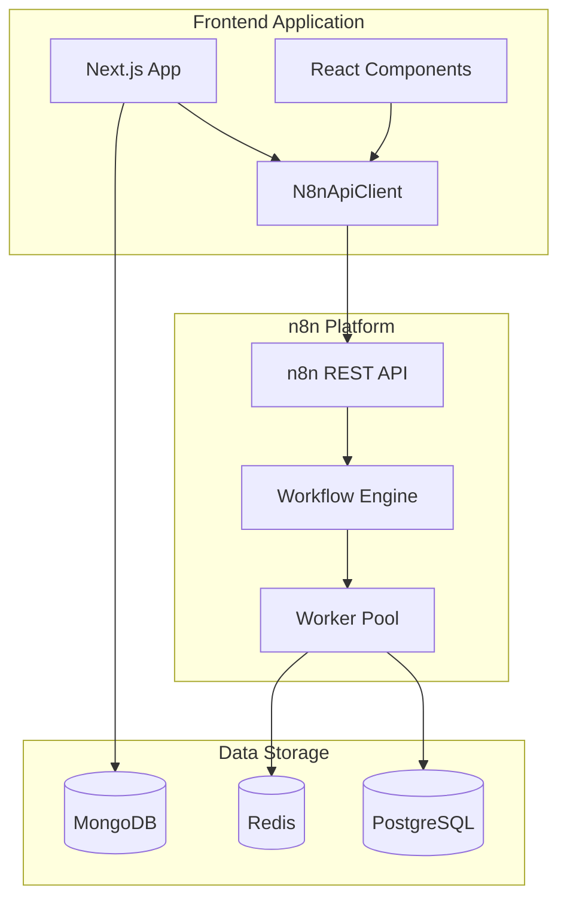
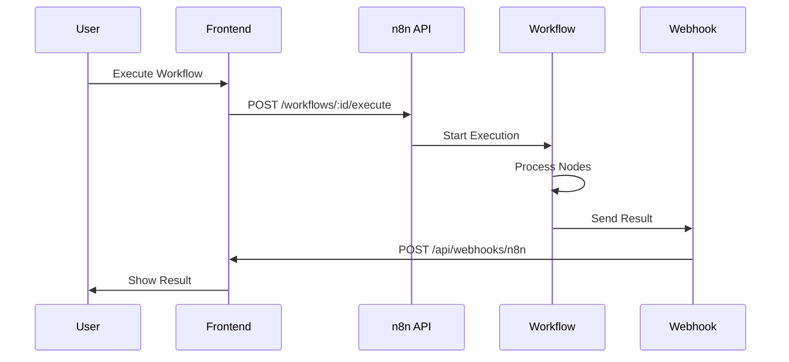
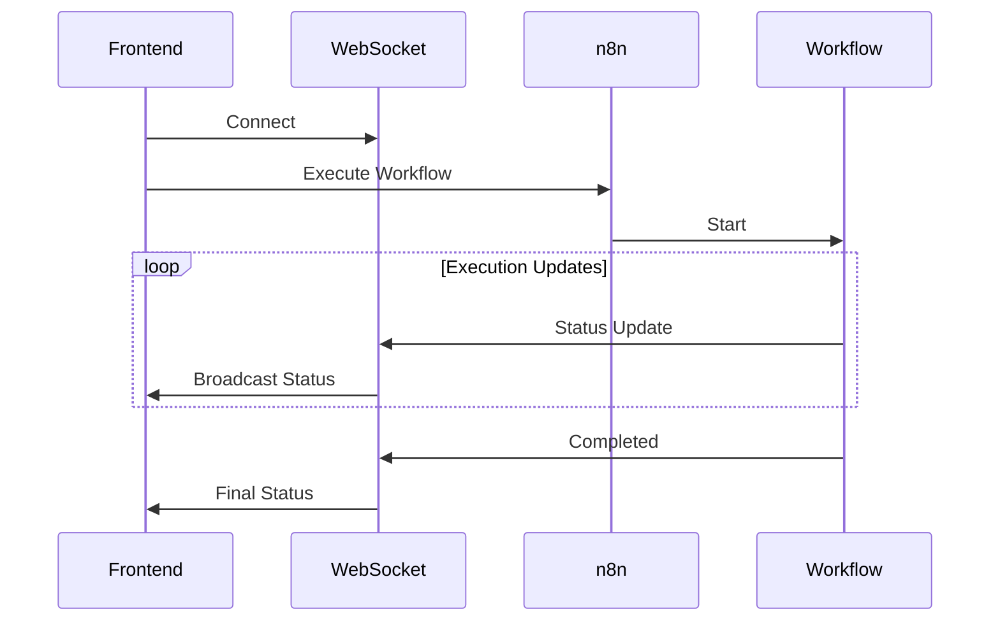

# n8n 통합 개요

Frontend 애플리케이션과 n8n 워크플로우 자동화 플랫폼의 통합 방법을 설명합니다.

## n8n이란?

n8n은 오픈소스 워크플로우 자동화 도구로, 다양한 서비스와 API를 연결하여 복잡한 자동화 작업을 구축할 수 있습니다.

### 주요 특징

- **비주얼 워크플로우 에디터** - 코드 없이 드래그 앤 드롭으로 워크플로우 생성
- **300+ 통합** - API, 데이터베이스, 클라우드 서비스 등 다양한 연결
- **자체 호스팅** - Docker를 통한 쉬운 배포
- **확장 가능** - 커스텀 노드 개발 지원
- **REST API** - 프로그래매틱 워크플로우 관리

## 통합 아키텍처



## 통합 방법

### 1. REST API 통합

n8n REST API를 통한 워크플로우 관리:

```typescript
import { N8nApiClient } from '@/lib/n8n/client';

const client = new N8nApiClient({
  baseUrl: process.env.NEXT_PUBLIC_N8N_API_URL!,
  apiKey: process.env.NEXT_PUBLIC_N8N_API_KEY!,
});

// 워크플로우 목록 조회
const workflows = await client.getWorkflows();

// 워크플로우 실행
const execution = await client.executeWorkflow('workflow-id');
```

### 2. Webhook 통합

n8n에서 Frontend로 이벤트 전송:

```typescript
// app/api/webhooks/n8n/route.ts
export async function POST(request: NextRequest) {
  const payload = await request.json();

  // 이벤트 처리
  await handleWebhookEvent(payload);

  return NextResponse.json({ success: true });
}
```

### 3. WebSocket 통합

실시간 워크플로우 실행 상태 수신:

```typescript
const ws = new WebSocket(
  `${process.env.NEXT_PUBLIC_N8N_WEBSOCKET_URL}/execution/${executionId}`
);

ws.onmessage = (event) => {
  const data = JSON.parse(event.data);
  console.log('Execution status:', data.status);
};
```

## 주요 사용 사례

### 1. 워크플로우 관리

- 워크플로우 생성, 수정, 삭제
- 워크플로우 활성화/비활성화
- 워크플로우 복사 및 버전 관리

### 2. 자동화 실행

- 수동 워크플로우 실행
- 스케줄 기반 자동 실행
- 이벤트 기반 트리거 실행

### 3. 모니터링

- 실행 이력 조회
- 실시간 실행 상태 모니터링
- 에러 분석 및 알림

### 4. 데이터 통합

- 외부 API 데이터 수집
- 데이터 변환 및 가공
- 다중 시스템 간 데이터 동기화

## 통합 구성 요소

### N8nApiClient

TypeScript 클라이언트 라이브러리:

```typescript
class N8nApiClient {
  async getWorkflows(): Promise<Workflow[]>
  async getWorkflow(id: string): Promise<Workflow>
  async createWorkflow(workflow: CreateWorkflowDto): Promise<Workflow>
  async updateWorkflow(id: string, data: UpdateWorkflowDto): Promise<Workflow>
  async deleteWorkflow(id: string): Promise<void>
  async executeWorkflow(id: string, data?: any): Promise<Execution>
  async getExecutions(filters?: ExecutionFilters): Promise<Execution[]>
  async getExecution(id: string): Promise<Execution>
}
```

### React Hooks

React Query 기반 데이터 훅:

```typescript
// 워크플로우 목록
const { data: workflows } = useWorkflows();

// 워크플로우 상세
const { data: workflow } = useWorkflow(workflowId);

// 워크플로우 실행
const { mutate: execute } = useExecuteWorkflow();

// 실행 목록
const { data: executions } = useExecutions(workflowId);
```

### Webhook Handler

n8n 이벤트 수신 및 처리:

```typescript
async function handleWebhookEvent(payload: WebhookPayload) {
  switch (payload.event) {
    case 'workflow.execution.completed':
      await handleExecutionCompleted(payload);
      break;
    case 'workflow.execution.failed':
      await handleExecutionFailed(payload);
      break;
  }
}
```

## 데이터 흐름

### 워크플로우 실행 흐름



### 실시간 모니터링 흐름



## 보안 고려사항

### 1. API 키 관리

```bash
# .env.local
NEXT_PUBLIC_N8N_API_KEY=n8n_api_xxxxxxxxxxxxxxxx

# 절대로 Git에 커밋하지 마세요!
# .gitignore에 .env.local 추가
```

### 2. Webhook 인증

```typescript
// Webhook secret 검증
const secret = request.headers.get('X-Webhook-Secret');

if (secret !== process.env.WEBHOOK_SECRET) {
  return NextResponse.json({ error: 'Unauthorized' }, { status: 401 });
}
```

### 3. HTTPS 사용

```bash
# 프로덕션 환경에서는 HTTPS 필수
NEXT_PUBLIC_N8N_API_URL=https://n8n.yourdomain.com/api/v1
NEXT_PUBLIC_N8N_WEBSOCKET_URL=wss://n8n.yourdomain.com
```

### 4. Rate Limiting

```typescript
// 요청 제한 구현
const limiter = rateLimit({
  interval: 60 * 1000, // 1분
  uniqueTokenPerInterval: 500,
});

await limiter.check(request, 60); // 분당 60회 제한
```

## 성능 최적화

### 1. 캐싱

```typescript
// React Query 캐싱
export function useWorkflows() {
  return useQuery({
    queryKey: ['workflows'],
    queryFn: () => n8nClient.getWorkflows(),
    staleTime: 30000, // 30초
    cacheTime: 300000, // 5분
  });
}
```

### 2. 페이지네이션

```typescript
// 대량 데이터 페이지네이션
const { data } = useInfiniteQuery({
  queryKey: ['executions', workflowId],
  queryFn: ({ pageParam = 0 }) =>
    n8nClient.getExecutions({
      workflowId,
      limit: 20,
      offset: pageParam,
    }),
  getNextPageParam: (lastPage, pages) =>
    lastPage.length === 20 ? pages.length * 20 : undefined,
});
```

### 3. 배치 요청

```typescript
// 여러 워크플로우 병렬 조회
const workflowIds = ['1', '2', '3'];

const workflows = await Promise.all(
  workflowIds.map(id => n8nClient.getWorkflow(id))
);
```

### 4. WebSocket 연결 풀링

```typescript
// 여러 실행 상태를 하나의 WebSocket으로 모니터링
const ws = new WebSocket(process.env.NEXT_PUBLIC_N8N_WEBSOCKET_URL!);

ws.onmessage = (event) => {
  const data = JSON.parse(event.data);

  // 실행 ID별로 라우팅
  notifyExecution(data.executionId, data);
};
```

## 에러 처리

### 일반적인 에러 시나리오

```typescript
try {
  const execution = await n8nClient.executeWorkflow(workflowId);
} catch (error: any) {
  if (error.code === 'N8N_CONNECTION_ERROR') {
    console.error('n8n 서버에 연결할 수 없습니다');
  } else if (error.code === 'WORKFLOW_NOT_FOUND') {
    console.error('워크플로우를 찾을 수 없습니다');
  } else if (error.code === 'EXECUTION_FAILED') {
    console.error('워크플로우 실행 실패:', error.details);
  } else {
    console.error('알 수 없는 오류:', error);
  }
}
```

### 재시도 로직

```typescript
async function executeWithRetry(
  workflowId: string,
  maxRetries = 3
): Promise<Execution> {
  for (let attempt = 1; attempt <= maxRetries; attempt++) {
    try {
      return await n8nClient.executeWorkflow(workflowId);
    } catch (error: any) {
      if (attempt === maxRetries) throw error;

      const delay = Math.pow(2, attempt) * 1000;
      await new Promise(resolve => setTimeout(resolve, delay));
    }
  }

  throw new Error('Max retries exceeded');
}
```

## 모니터링 및 로깅

### 실행 통계

```typescript
interface ExecutionStats {
  total: number;
  success: number;
  failed: number;
  successRate: number;
  averageDuration: number;
}

async function getWorkflowStats(workflowId: string): Promise<ExecutionStats> {
  const executions = await n8nClient.getExecutions({ workflowId });

  const total = executions.length;
  const success = executions.filter(e => e.status === 'success').length;
  const failed = executions.filter(e => e.status === 'error').length;

  const successRate = total > 0 ? (success / total) * 100 : 0;

  const durations = executions
    .filter(e => e.stoppedAt)
    .map(e =>
      new Date(e.stoppedAt!).getTime() - new Date(e.startedAt).getTime()
    );

  const averageDuration =
    durations.length > 0
      ? durations.reduce((a, b) => a + b, 0) / durations.length
      : 0;

  return { total, success, failed, successRate, averageDuration };
}
```

### 에러 로깅

```typescript
import * as Sentry from '@sentry/nextjs';

export function logWorkflowError(
  workflowId: string,
  executionId: string,
  error: any
) {
  console.error(`Workflow ${workflowId} execution ${executionId} failed:`, error);

  Sentry.captureException(error, {
    tags: {
      workflow_id: workflowId,
      execution_id: executionId,
    },
    extra: {
      error_details: error.details,
    },
  });
}
```

## 테스트

### Unit 테스트

```typescript
describe('N8nApiClient', () => {
  it('should get workflows', async () => {
    const client = new N8nApiClient({
      baseUrl: 'http://localhost:5678/api/v1',
      apiKey: 'test-api-key',
    });

    const workflows = await client.getWorkflows();

    expect(workflows).toBeInstanceOf(Array);
  });
});
```

### Integration 테스트

```typescript
describe('Workflow Execution', () => {
  it('should execute workflow and receive result', async () => {
    // 워크플로우 실행
    const execution = await n8nClient.executeWorkflow(testWorkflowId);

    // 완료 대기
    await waitForExecution(execution.executionId);

    // 결과 확인
    const result = await n8nClient.getExecution(execution.executionId);

    expect(result.status).toBe('success');
  });
});
```

## 다음 단계

1. [워크플로우 생성 가이드](./workflow-creation) - 워크플로우 작성 방법
2. [AI 노드 사용법](./ai-nodes) - AI 기능 활용
3. [커스텀 노드 개발](./custom-nodes) - 사용자 정의 노드
4. [성능 최적화](./performance-optimization) - 성능 튜닝
5. [베스트 프랙티스](./best-practices) - 권장 사항

## 참고 자료

- [n8n 공식 문서](https://docs.n8n.io/)
- [n8n API 문서](https://docs.n8n.io/api/)
- [n8n 커뮤니티](https://community.n8n.io/)
- [n8n GitHub](https://github.com/n8n-io/n8n)
