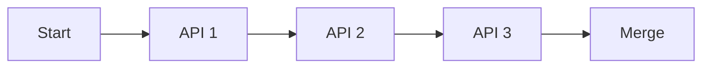
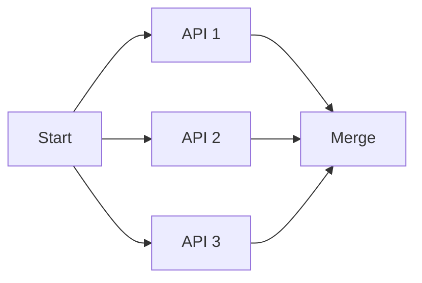

# 성능 최적화

n8n 워크플로우와 Frontend 통합의 성능을 최적화하는 방법을 설명합니다.

## 성능 측정

### 실행 시간 모니터링

```typescript
async function measureExecutionTime(workflowId: string) {
  const start = Date.now();

  const execution = await n8nClient.executeWorkflow(workflowId);

  // 실행 완료 대기
  await waitForCompletion(execution.executionId);

  const end = Date.now();
  const duration = end - start;

  console.log(`Execution time: ${duration}ms`);

  return { executionId: execution.executionId, duration };
}
```

### 노드별 성능 분석

```typescript
async function analyzeNodePerformance(executionId: string) {
  const execution = await n8nClient.getExecution(executionId);

  if (!execution.data?.resultData?.runData) {
    return null;
  }

  const nodeTimings = Object.entries(execution.data.resultData.runData).map(
    ([nodeName, runs]) => ({
      nodeName,
      executionTime: runs[0].executionTime,
      startTime: runs[0].startTime,
    })
  );

  // 실행 시간 기준 정렬
  nodeTimings.sort((a, b) => b.executionTime - a.executionTime);

  console.log('노드별 실행 시간:');
  nodeTimings.forEach(({ nodeName, executionTime }) => {
    console.log(`${nodeName}: ${executionTime}ms`);
  });

  return nodeTimings;
}
```

## n8n 워크플로우 최적화

### 1. 불필요한 노드 제거

**Before (비효율적):**
```
Start → HTTP Request → Set → Function → Set → Response
```

**After (최적화):**
```
Start → HTTP Request → Function → Response
```

### 2. 병렬 실행

**Sequential (느림):**


**Parallel (빠름):**


**구현:**

```typescript
{
  id: 'split',
  name: 'Split',
  type: 'n8n-nodes-base.noOp',
  position: [250, 300],
}

// 3개의 병렬 HTTP Request 노드
{
  id: 'api1',
  name: 'Fetch API 1',
  type: 'n8n-nodes-base.httpRequest',
  position: [450, 200],
  parameters: {
    url: 'https://api1.example.com/data',
  },
}

{
  id: 'api2',
  name: 'Fetch API 2',
  type: 'n8n-nodes-base.httpRequest',
  position: [450, 300],
  parameters: {
    url: 'https://api2.example.com/data',
  },
}

{
  id: 'api3',
  name: 'Fetch API 3',
  type: 'n8n-nodes-base.httpRequest',
  position: [450, 400],
  parameters: {
    url: 'https://api3.example.com/data',
  },
}

// Merge 노드
{
  id: 'merge',
  name: 'Merge Results',
  type: 'n8n-nodes-base.merge',
  position: [650, 300],
  parameters: {
    mode: 'append',
  },
}
```

### 3. 배치 처리

**대량 데이터 처리:**

```typescript
{
  id: 'split-batches',
  name: 'Process in Batches',
  type: 'n8n-nodes-base.splitInBatches',
  parameters: {
    batchSize: 100, // 100개씩 처리
    options: {
      reset: false,
    },
  },
}
```

### 4. 조건부 실행

불필요한 노드 실행 방지:

```typescript
{
  id: 'if-check-cache',
  name: 'Check Cache',
  type: 'n8n-nodes-base.if',
  parameters: {
    conditions: {
      boolean: [
        {
          // 캐시가 없거나 만료된 경우에만 API 호출
          value1: '={{ !$workflow.staticData.cache || Date.now() > $workflow.staticData.cache.expiry }}',
        },
      ],
    },
  },
}
```

### 5. 데이터 크기 최소화

**Before:**
```javascript
// Function 노드: 모든 데이터 반환
return items;
```

**After:**
```javascript
// Function 노드: 필요한 필드만 반환
return items.map(item => ({
  json: {
    id: item.json.id,
    name: item.json.name,
    // 불필요한 필드 제외
  },
}));
```

## Frontend 최적화

### 1. React Query 캐싱

```typescript
export function useWorkflows() {
  return useQuery({
    queryKey: ['workflows'],
    queryFn: () => n8nClient.getWorkflows(),
    staleTime: 60000, // 1분 동안 stale하지 않음
    cacheTime: 300000, // 5분 동안 캐시 유지
    refetchOnWindowFocus: false, // 포커스 시 자동 갱신 비활성화
  });
}
```

### 2. 페이지네이션

**Infinite Scroll:**

```typescript
export function useExecutionsInfinite(workflowId: string) {
  return useInfiniteQuery({
    queryKey: ['executions', workflowId],
    queryFn: async ({ pageParam = 0 }) => {
      const executions = await n8nClient.getExecutions({
        workflowId,
        limit: 20,
        offset: pageParam,
      });

      return executions;
    },
    getNextPageParam: (lastPage, pages) => {
      // 마지막 페이지가 20개 미만이면 더 이상 없음
      if (lastPage.length < 20) return undefined;

      return pages.length * 20;
    },
  });
}

// 컴포넌트에서 사용
function ExecutionList({ workflowId }: { workflowId: string }) {
  const {
    data,
    fetchNextPage,
    hasNextPage,
    isFetchingNextPage,
  } = useExecutionsInfinite(workflowId);

  return (
    <div>
      {data?.pages.map((page, i) => (
        <React.Fragment key={i}>
          {page.map(execution => (
            <ExecutionItem key={execution.id} execution={execution} />
          ))}
        </React.Fragment>
      ))}

      {hasNextPage && (
        <Button onClick={() => fetchNextPage()} disabled={isFetchingNextPage}>
          {isFetchingNextPage ? '로딩 중...' : '더 보기'}
        </Button>
      )}
    </div>
  );
}
```

### 3. 데이터 프리페칭

```typescript
export function usePrefetchWorkflow(workflowId: string) {
  const queryClient = useQueryClient();

  return () => {
    queryClient.prefetchQuery({
      queryKey: ['workflow', workflowId],
      queryFn: () => n8nClient.getWorkflow(workflowId),
    });
  };
}

// 사용 예시
function WorkflowListItem({ workflow }: { workflow: Workflow }) {
  const prefetch = usePrefetchWorkflow(workflow.id);

  return (
    <Link
      to={`/workflows/${workflow.id}`}
      onMouseEnter={prefetch} // 마우스 오버 시 프리페치
    >
      {workflow.name}
    </Link>
  );
}
```

### 4. 디바운싱 및 쓰로틀링

```typescript
import { useDebouncedCallback } from 'use-debounce';

function WorkflowSearch() {
  const [searchTerm, setSearchTerm] = useState('');

  const debouncedSearch = useDebouncedCallback((value: string) => {
    // API 호출
    searchWorkflows(value);
  }, 500); // 500ms 디바운스

  const handleChange = (e: React.ChangeEvent<HTMLInputElement>) => {
    const value = e.target.value;
    setSearchTerm(value);
    debouncedSearch(value);
  };

  return (
    <input
      type="text"
      value={searchTerm}
      onChange={handleChange}
      placeholder="워크플로우 검색..."
    />
  );
}
```

### 5. 컴포넌트 지연 로딩

```typescript
import { lazy, Suspense } from 'react';

// 컴포넌트 지연 로딩
const WorkflowEditor = lazy(() => import('./WorkflowEditor'));
const ExecutionLogs = lazy(() => import('./ExecutionLogs'));

function WorkflowDetail() {
  return (
    <div>
      <Suspense fallback={<div>로딩 중...</div>}>
        <WorkflowEditor />
      </Suspense>

      <Suspense fallback={<div>로그 로딩 중...</div>}>
        <ExecutionLogs />
      </Suspense>
    </div>
  );
}
```

## 데이터베이스 최적화

### MongoDB 인덱스

```typescript
// MongoDB 컬렉션에 인덱스 생성
await db.collection('workflow_executions').createIndex(
  { workflowId: 1, createdAt: -1 },
  { background: true }
);

await db.collection('workflow_executions').createIndex(
  { status: 1 },
  { background: true }
);

// 복합 인덱스
await db.collection('webhook_events').createIndex(
  { workflowId: 1, event: 1, timestamp: -1 },
  { background: true }
);
```

### 쿼리 최적화

**Before (느림):**
```typescript
// 모든 필드 가져오기
const executions = await db
  .collection('workflow_executions')
  .find({ workflowId })
  .toArray();
```

**After (빠름):**
```typescript
// 필요한 필드만 가져오기
const executions = await db
  .collection('workflow_executions')
  .find({ workflowId })
  .project({
    id: 1,
    status: 1,
    startedAt: 1,
    stoppedAt: 1,
  })
  .sort({ startedAt: -1 })
  .limit(20)
  .toArray();
```

### 집계 파이프라인

```typescript
// 워크플로우별 통계 계산
const stats = await db
  .collection('workflow_executions')
  .aggregate([
    {
      $match: {
        workflowId,
        startedAt: { $gte: new Date(Date.now() - 30 * 24 * 60 * 60 * 1000) },
      },
    },
    {
      $group: {
        _id: '$status',
        count: { $sum: 1 },
        avgDuration: {
          $avg: {
            $subtract: [
              { $toDate: '$stoppedAt' },
              { $toDate: '$startedAt' },
            ],
          },
        },
      },
    },
  ])
  .toArray();
```

## Redis 캐싱

### 실행 결과 캐싱

```typescript
import { redis } from '@/lib/redis';

async function getExecutionWithCache(
  executionId: string
): Promise<Execution> {
  // 캐시 확인
  const cached = await redis.get(`execution:${executionId}`);

  if (cached) {
    return JSON.parse(cached);
  }

  // 캐시 미스 - n8n에서 가져오기
  const execution = await n8nClient.getExecution(executionId);

  // 캐시 저장 (1시간)
  await redis.setex(
    `execution:${executionId}`,
    3600,
    JSON.stringify(execution)
  );

  return execution;
}
```

### 워크플로우 목록 캐싱

```typescript
async function getWorkflowsWithCache(): Promise<Workflow[]> {
  const cacheKey = 'workflows:all';

  // 캐시 확인
  const cached = await redis.get(cacheKey);

  if (cached) {
    return JSON.parse(cached);
  }

  // n8n에서 가져오기
  const workflows = await n8nClient.getWorkflows();

  // 캐시 저장 (5분)
  await redis.setex(cacheKey, 300, JSON.stringify(workflows));

  return workflows;
}

// 워크플로우 변경 시 캐시 무효화
async function invalidateWorkflowCache() {
  await redis.del('workflows:all');
}
```

## N8nApiClient 최적화

### 연결 풀링

```typescript
import { Agent } from 'https';

const httpsAgent = new Agent({
  keepAlive: true,
  maxSockets: 50,
  maxFreeSockets: 10,
  timeout: 60000,
  freeSocketTimeout: 30000,
});

const client = new N8nApiClient({
  baseUrl: process.env.NEXT_PUBLIC_N8N_API_URL!,
  apiKey: process.env.NEXT_PUBLIC_N8N_API_KEY!,
  httpAgent: httpsAgent,
});
```

### 요청 배칭

```typescript
async function batchGetWorkflows(
  workflowIds: string[]
): Promise<Workflow[]> {
  // 병렬로 여러 워크플로우 가져오기
  const promises = workflowIds.map(id => n8nClient.getWorkflow(id));

  // Promise.all 대신 Promise.allSettled 사용
  // 일부 실패해도 나머지 성공한 결과 반환
  const results = await Promise.allSettled(promises);

  return results
    .filter((result): result is PromiseFulfilledResult<Workflow> =>
      result.status === 'fulfilled'
    )
    .map(result => result.value);
}
```

### 재시도 최적화

```typescript
class N8nApiClient {
  private async requestWithRetry<T>(
    options: RequestOptions,
    maxRetries = 3
  ): Promise<T> {
    for (let attempt = 1; attempt <= maxRetries; attempt++) {
      try {
        return await this.request<T>(options);
      } catch (error: any) {
        // 재시도하지 않아야 하는 에러
        if (
          error.statusCode >= 400 &&
          error.statusCode < 500 &&
          error.statusCode !== 429
        ) {
          throw error;
        }

        if (attempt === maxRetries) {
          throw error;
        }

        // 지수 백오프 with jitter
        const baseDelay = Math.pow(2, attempt) * 1000;
        const jitter = Math.random() * 1000;
        const delay = baseDelay + jitter;

        await new Promise(resolve => setTimeout(resolve, delay));
      }
    }

    throw new Error('Max retries exceeded');
  }
}
```

## 성능 모니터링

### 메트릭 수집

```typescript
interface PerformanceMetrics {
  workflowId: string;
  executionTime: number;
  nodeCount: number;
  dataSize: number;
  timestamp: Date;
}

async function collectMetrics(
  workflowId: string,
  executionId: string
): Promise<PerformanceMetrics> {
  const execution = await n8nClient.getExecution(executionId);

  const startTime = new Date(execution.startedAt).getTime();
  const endTime = execution.stoppedAt
    ? new Date(execution.stoppedAt).getTime()
    : Date.now();

  const executionTime = endTime - startTime;

  const nodeCount = Object.keys(
    execution.data?.resultData?.runData || {}
  ).length;

  const dataSize = JSON.stringify(execution.data).length;

  const metrics: PerformanceMetrics = {
    workflowId,
    executionTime,
    nodeCount,
    dataSize,
    timestamp: new Date(),
  };

  // MongoDB에 저장
  await db.collection('performance_metrics').insertOne(metrics);

  return metrics;
}
```

### 성능 알림

```typescript
async function checkPerformanceThresholds(
  metrics: PerformanceMetrics
): Promise<void> {
  const thresholds = {
    executionTime: 30000, // 30초
    dataSize: 1000000, // 1MB
  };

  if (metrics.executionTime > thresholds.executionTime) {
    await sendAlert({
      type: 'performance',
      severity: 'warning',
      message: `워크플로우 ${metrics.workflowId} 실행 시간이 ${metrics.executionTime}ms로 임계값을 초과했습니다.`,
    });
  }

  if (metrics.dataSize > thresholds.dataSize) {
    await sendAlert({
      type: 'performance',
      severity: 'warning',
      message: `워크플로우 ${metrics.workflowId} 데이터 크기가 ${metrics.dataSize} bytes로 임계값을 초과했습니다.`,
    });
  }
}
```

## 다음 단계

1. [베스트 프랙티스](./best-practices) - 성능 최적화 권장 사항
2. [모니터링 설정](/operations/monitoring) - 프로덕션 모니터링
3. [트러블슈팅](/operations/troubleshooting) - 성능 문제 해결

## 참고 자료

- [n8n 성능 가이드](https://docs.n8n.io/hosting/scaling/)
- [React Query 최적화](https://tanstack.com/query/latest/docs/react/guides/optimistic-updates)
- [MongoDB 성능 튜닝](https://www.mongodb.com/docs/manual/administration/analyzing-mongodb-performance/)
- [Redis 캐싱 전략](https://redis.io/docs/manual/patterns/)
