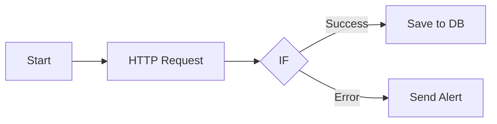
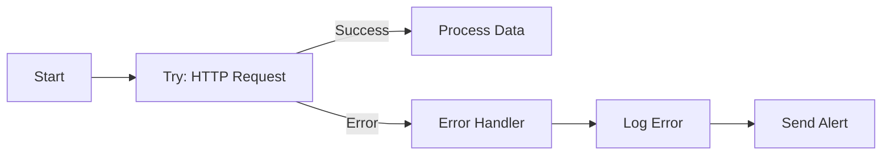
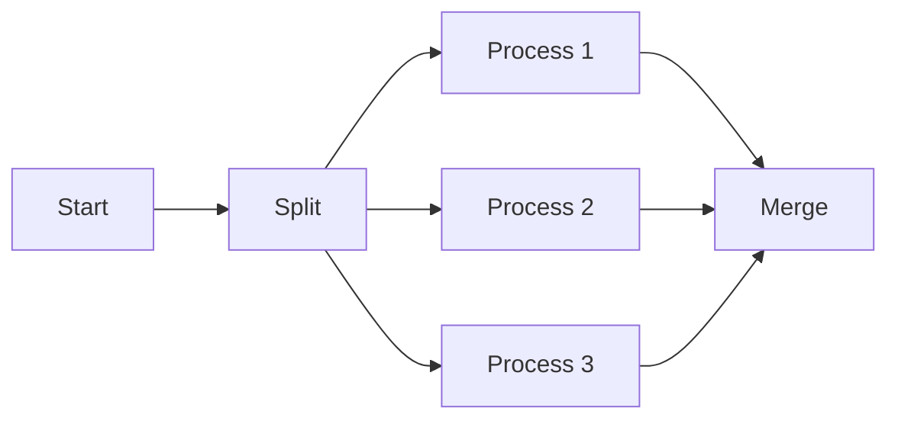

# 워크플로우 생성 가이드

n8n에서 효과적인 워크플로우를 작성하는 방법을 단계별로 설명합니다.

## 워크플로우 기본 개념

### 노드 (Nodes)

워크플로우의 기본 구성 요소:

- **Trigger 노드** - 워크플로우 시작 (Webhook, Schedule, Manual 등)
- **Action 노드** - 작업 수행 (HTTP Request, Database, API 호출 등)
- **Logic 노드** - 흐름 제어 (IF, Switch, Merge 등)
- **Transform 노드** - 데이터 변환 (Set, Function, Code 등)

### 연결 (Connections)

노드 간 데이터 흐름:



## 기본 워크플로우 생성

### 1. 수동 트리거 워크플로우

가장 간단한 형태의 워크플로우:

**구조:**
```
Start → HTTP Request → Set → Response
```

**노드 설정:**

#### Start 노드
- 자동으로 추가됨
- 수동 실행 시 트리거

#### HTTP Request 노드
```json
{
  "method": "GET",
  "url": "https://jsonplaceholder.typicode.com/todos/1",
  "options": {
    "timeout": 10000
  }
}
```

#### Set 노드
```json
{
  "keepOnlySet": true,
  "values": {
    "title": "={{ $json.title }}",
    "completed": "={{ $json.completed }}",
    "processedAt": "={{ $now.toISO() }}"
  }
}
```

**TypeScript로 생성:**

```typescript
const workflow = {
  name: 'Simple API Fetch',
  active: false,
  nodes: [
    {
      id: 'start',
      name: 'Start',
      type: 'n8n-nodes-base.start',
      typeVersion: 1,
      position: [250, 300],
      parameters: {},
    },
    {
      id: 'http',
      name: 'Fetch Data',
      type: 'n8n-nodes-base.httpRequest',
      typeVersion: 1,
      position: [450, 300],
      parameters: {
        url: 'https://jsonplaceholder.typicode.com/todos/1',
        method: 'GET',
        options: {},
      },
    },
    {
      id: 'set',
      name: 'Format Data',
      type: 'n8n-nodes-base.set',
      typeVersion: 1,
      position: [650, 300],
      parameters: {
        keepOnlySet: true,
        values: {
          title: '={{ $json.title }}',
          completed: '={{ $json.completed }}',
          processedAt: '={{ $now.toISO() }}',
        },
      },
    },
  ],
  connections: {
    start: {
      main: [[{ node: 'http', type: 'main', index: 0 }]],
    },
    http: {
      main: [[{ node: 'set', type: 'main', index: 0 }]],
    },
  },
};

const created = await n8nClient.createWorkflow(workflow);
```

### 2. 스케줄 기반 워크플로우

정기적으로 실행되는 워크플로우:

**구조:**
```
Schedule Trigger → Fetch Data → Process → Save to DB
```

**Schedule Trigger 노드:**

```json
{
  "rule": {
    "interval": [
      {
        "field": "hours",
        "hoursInterval": 6
      }
    ]
  },
  "triggerTimes": {
    "mode": "everyX"
  }
}
```

**예제: 6시간마다 API 데이터 수집**

```typescript
const scheduledWorkflow = {
  name: 'Scheduled Data Sync',
  active: true, // 활성화된 상태로 생성
  nodes: [
    {
      id: 'schedule',
      name: 'Every 6 Hours',
      type: 'n8n-nodes-base.scheduleTrigger',
      typeVersion: 1,
      position: [250, 300],
      parameters: {
        rule: {
          interval: [{ field: 'hours', hoursInterval: 6 }],
        },
      },
    },
    {
      id: 'http',
      name: 'Fetch API Data',
      type: 'n8n-nodes-base.httpRequest',
      typeVersion: 1,
      position: [450, 300],
      parameters: {
        url: 'https://api.example.com/data',
        method: 'GET',
        authentication: 'genericCredentialType',
        genericAuthType: 'httpHeaderAuth',
      },
    },
    {
      id: 'function',
      name: 'Transform Data',
      type: 'n8n-nodes-base.function',
      typeVersion: 1,
      position: [650, 300],
      parameters: {
        functionCode: `
          return items.map(item => ({
            json: {
              ...item.json,
              syncedAt: new Date().toISOString(),
              source: 'scheduled_sync'
            }
          }));
        `,
      },
    },
    {
      id: 'mongodb',
      name: 'Save to Database',
      type: 'n8n-nodes-base.mongodb',
      typeVersion: 1,
      position: [850, 300],
      parameters: {
        operation: 'insertMany',
        collection: 'synced_data',
      },
    },
  ],
  connections: {
    schedule: {
      main: [[{ node: 'http', type: 'main', index: 0 }]],
    },
    http: {
      main: [[{ node: 'function', type: 'main', index: 0 }]],
    },
    function: {
      main: [[{ node: 'mongodb', type: 'main', index: 0 }]],
    },
  },
};
```

### 3. Webhook 트리거 워크플로우

외부 이벤트에 반응하는 워크플로우:

**구조:**
```
Webhook → Validate → Process → Respond
```

**Webhook 노드:**

```json
{
  "httpMethod": "POST",
  "path": "user-signup",
  "responseMode": "responseNode",
  "options": {
    "rawBody": false
  }
}
```

**예제: 사용자 가입 처리**

```typescript
const webhookWorkflow = {
  name: 'User Signup Handler',
  active: true,
  nodes: [
    {
      id: 'webhook',
      name: 'Webhook Trigger',
      type: 'n8n-nodes-base.webhook',
      typeVersion: 1,
      position: [250, 300],
      parameters: {
        httpMethod: 'POST',
        path: 'user-signup',
        responseMode: 'responseNode',
      },
    },
    {
      id: 'validate',
      name: 'Validate Input',
      type: 'n8n-nodes-base.function',
      typeVersion: 1,
      position: [450, 300],
      parameters: {
        functionCode: `
          const { email, name } = items[0].json;

          if (!email || !name) {
            throw new Error('Email and name are required');
          }

          if (!/^[^\\s@]+@[^\\s@]+\\.[^\\s@]+$/.test(email)) {
            throw new Error('Invalid email format');
          }

          return items;
        `,
      },
    },
    {
      id: 'create-user',
      name: 'Create User',
      type: 'n8n-nodes-base.mongodb',
      typeVersion: 1,
      position: [650, 300],
      parameters: {
        operation: 'insert',
        collection: 'users',
        fields: `email,name,createdAt`,
      },
    },
    {
      id: 'send-email',
      name: 'Send Welcome Email',
      type: 'n8n-nodes-base.emailSend',
      typeVersion: 1,
      position: [850, 300],
      parameters: {
        fromEmail: 'noreply@example.com',
        toEmail: '={{ $json.email }}',
        subject: 'Welcome!',
        text: 'Welcome to our platform, {{ $json.name }}!',
      },
    },
    {
      id: 'respond',
      name: 'Respond to Webhook',
      type: 'n8n-nodes-base.respondToWebhook',
      typeVersion: 1,
      position: [1050, 300],
      parameters: {
        respondWith: 'json',
        responseBody: `{
          "success": true,
          "userId": "={{ $json._id }}",
          "message": "User created successfully"
        }`,
      },
    },
  ],
  connections: {
    webhook: {
      main: [[{ node: 'validate', type: 'main', index: 0 }]],
    },
    validate: {
      main: [[{ node: 'create-user', type: 'main', index: 0 }]],
    },
    'create-user': {
      main: [[{ node: 'send-email', type: 'main', index: 0 }]],
    },
    'send-email': {
      main: [[{ node: 'respond', type: 'main', index: 0 }]],
    },
  },
};
```

## 조건부 로직

### IF 노드를 사용한 분기

**구조:**
```
       ┌─ True Path ─┐
Input → IF             → Merge
       └─ False Path ─┘
```

**예제: API 응답 코드에 따른 처리**

```typescript
{
  id: 'if',
  name: 'Check Status',
  type: 'n8n-nodes-base.if',
  typeVersion: 1,
  position: [450, 300],
  parameters: {
    conditions: {
      number: [
        {
          value1: '={{ $json.statusCode }}',
          operation: 'equal',
          value2: 200,
        },
      ],
    },
  },
}
```

### Switch 노드를 사용한 다중 분기

**구조:**
```
         ┌─ Case 1 ─┐
         ├─ Case 2 ─┤
Input → Switch        → Merge
         ├─ Case 3 ─┤
         └─ Default ─┘
```

**예제: 주문 상태별 처리**

```typescript
{
  id: 'switch',
  name: 'Route by Status',
  type: 'n8n-nodes-base.switch',
  typeVersion: 1,
  position: [450, 300],
  parameters: {
    mode: 'expression',
    output: 'multiple',
    rules: {
      values: [
        {
          conditions: {
            string: [
              {
                value1: '={{ $json.status }}',
                operation: 'equal',
                value2: 'pending',
              },
            ],
          },
          outputIndex: 0,
        },
        {
          conditions: {
            string: [
              {
                value1: '={{ $json.status }}',
                operation: 'equal',
                value2: 'processing',
              },
            ],
          },
          outputIndex: 1,
        },
        {
          conditions: {
            string: [
              {
                value1: '={{ $json.status }}',
                operation: 'equal',
                value2: 'completed',
              },
            ],
          },
          outputIndex: 2,
        },
      ],
    },
    fallbackOutput: 3, // Default
  },
}
```

## 데이터 변환

### Set 노드

간단한 데이터 매핑:

```json
{
  "keepOnlySet": true,
  "values": {
    "userId": "={{ $json.id }}",
    "fullName": "={{ $json.firstName }} {{ $json.lastName }}",
    "email": "={{ $json.email.toLowerCase() }}",
    "createdAt": "={{ $now.toISO() }}"
  }
}
```

### Function 노드

복잡한 JavaScript 로직:

```javascript
// Function 노드 코드
const processedItems = [];

for (const item of items) {
  const { id, name, price, quantity } = item.json;

  // 계산
  const total = price * quantity;
  const tax = total * 0.1;
  const finalPrice = total + tax;

  // 결과 생성
  processedItems.push({
    json: {
      orderId: id,
      productName: name,
      subtotal: total.toFixed(2),
      tax: tax.toFixed(2),
      total: finalPrice.toFixed(2),
      processedAt: new Date().toISOString(),
    },
  });
}

return processedItems;
```

### Code 노드 (Python/JavaScript)

Python 예제:

```python
import json
from datetime import datetime

# 입력 데이터 처리
for item in items:
    data = item.json

    # 데이터 변환
    processed = {
        'id': data['id'],
        'timestamp': datetime.now().isoformat(),
        'computed_value': data['value'] * 1.5
    }

    # 출력
    items[0] = {
        'json': processed
    }

return items
```

## 에러 처리

### Try-Catch 패턴



**구현:**

```typescript
{
  id: 'http',
  name: 'API Call',
  type: 'n8n-nodes-base.httpRequest',
  typeVersion: 1,
  position: [450, 300],
  parameters: {
    url: 'https://api.example.com/data',
    method: 'GET',
  },
  continueOnFail: true, // 실패 시에도 계속 진행
}

// IF 노드로 에러 체크
{
  id: 'check-error',
  name: 'Check for Errors',
  type: 'n8n-nodes-base.if',
  typeVersion: 1,
  position: [650, 300],
  parameters: {
    conditions: {
      boolean: [
        {
          value1: '={{ $json.error !== undefined }}',
        },
      ],
    },
  },
}
```

### 재시도 로직

**Loop 노드 사용:**

```typescript
{
  id: 'loop',
  name: 'Retry Loop',
  type: 'n8n-nodes-base.loop',
  typeVersion: 1,
  parameters: {
    maxIterations: 3,
    loopDelay: 2000, // 2초 대기
  },
}
```

## 데이터 집계

### Split In Batches 노드

대량 데이터 처리:

```typescript
{
  id: 'split',
  name: 'Split in Batches',
  type: 'n8n-nodes-base.splitInBatches',
  typeVersion: 1,
  parameters: {
    batchSize: 10,
    options: {},
  },
}
```

**사용 예:**

```
Fetch 1000 items → Split (10개씩) → Process Batch → Loop
```

### Merge 노드

여러 경로의 데이터 합치기:

```typescript
{
  id: 'merge',
  name: 'Merge Data',
  type: 'n8n-nodes-base.merge',
  typeVersion: 1,
  parameters: {
    mode: 'append',
    options: {},
  },
}
```

**Merge 모드:**
- `append` - 모든 데이터 추가
- `keep-key-matches` - 키가 일치하는 항목만
- `merge-by-index` - 인덱스로 병합
- `merge-by-key` - 특정 키로 병합

## 워크플로우 최적화

### 1. 병렬 실행



### 2. 캐싱

```typescript
// Function 노드에서 캐싱
const cache = $workflow.staticData;

if (cache.data && cache.timestamp > Date.now() - 3600000) {
  // 1시간 이내 캐시 사용
  return [{ json: cache.data }];
}

// 새 데이터 가져오기
const newData = await fetchData();

cache.data = newData;
cache.timestamp = Date.now();

return [{ json: newData }];
```

### 3. 조건부 실행

불필요한 노드 실행 방지:

```typescript
// IF 노드로 조건 확인
{
  conditions: {
    boolean: [
      {
        // 캐시가 없거나 만료된 경우에만 API 호출
        value1: '={{ !$workflow.staticData.cache || $workflow.staticData.cache.expiry < Date.now() }}',
      },
    ],
  },
}
```

## 템플릿 및 재사용

### 서브워크플로우 패턴

공통 로직을 별도 워크플로우로 분리:

```typescript
// 메인 워크플로우
{
  id: 'execute-workflow',
  name: 'Call Error Handler',
  type: 'n8n-nodes-base.executeWorkflow',
  typeVersion: 1,
  parameters: {
    workflowId: 'error-handler-workflow-id',
    source: 'database',
  },
}
```

### 워크플로우 복사

```typescript
// 기존 워크플로우 복사
const original = await n8nClient.getWorkflow(originalId);

const copy = {
  ...original,
  id: undefined, // 새 ID 생성
  name: `${original.name} (Copy)`,
  active: false,
};

const created = await n8nClient.createWorkflow(copy);
```

## 다음 단계

1. [AI 노드 사용법](./ai-nodes) - AI 기능 통합
2. [커스텀 노드 개발](./custom-nodes) - 사용자 정의 노드
3. [성능 최적화](./performance-optimization) - 성능 튜닝
4. [베스트 프랙티스](./best-practices) - 권장 사항

## 참고 자료

- [n8n 워크플로우 가이드](https://docs.n8n.io/workflows/)
- [n8n 노드 레퍼런스](https://docs.n8n.io/integrations/)
- [n8n 표현식](https://docs.n8n.io/code-examples/expressions/)
- [워크플로우 템플릿](https://n8n.io/workflows/)
