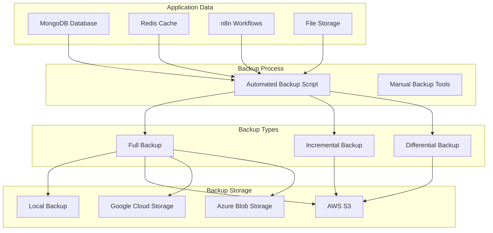

# 백업 및 복구

데이터 보호와 재해 복구를 위한 백업 및 복구 전략을 설명합니다.

## 백업 아키텍처



## 백업 전략

### 1. MongoDB 백업

#### 전체 백업 (Full Backup)

```typescript
// scripts/backup/mongodb-full.ts
import { MongoClient } from 'mongodb';
import { exec } from 'child_process';
import { promisify } from 'util';
import fs from 'fs/promises';
import path from 'path';

const execAsync = promisify(exec);

interface BackupConfig {
  uri: string;
  database: string;
  outputDir: string;
  compress: boolean;
  retention: number; // 백업 보관 일수
}

export class MongoDBBackupService {
  constructor(private config: BackupConfig) {}

  async createFullBackup(): Promise<string> {
    const timestamp = new Date().toISOString().replace(/[:.]/g, '-');
    const backupName = `mongodb-full-${timestamp}`;
    const backupPath = path.join(this.config.outputDir, backupName);

    console.log(`Creating full MongoDB backup: ${backupName}`);

    try {
      // mongodump 실행
      const command = [
        'mongodump',
        `--uri="${this.config.uri}"`,
        `--db=${this.config.database}`,
        `--out=${backupPath}`,
        this.config.compress ? '--gzip' : '',
      ]
        .filter(Boolean)
        .join(' ');

      const { stdout, stderr } = await execAsync(command);

      console.log('Backup stdout:', stdout);
      if (stderr) console.error('Backup stderr:', stderr);

      // 압축 (선택사항)
      if (this.config.compress) {
        await this.compressBackup(backupPath);
      }

      // 메타데이터 저장
      await this.saveMetadata(backupPath, {
        type: 'full',
        timestamp: new Date().toISOString(),
        database: this.config.database,
        compressed: this.config.compress,
      });

      console.log(`Backup completed: ${backupPath}`);

      // 오래된 백업 삭제
      await this.cleanupOldBackups();

      return backupPath;
    } catch (error: any) {
      console.error('Backup failed:', error);
      throw error;
    }
  }

  // 증분 백업 (Incremental Backup)
  async createIncrementalBackup(lastBackupTime: Date): Promise<string> {
    const timestamp = new Date().toISOString().replace(/[:.]/g, '-');
    const backupName = `mongodb-incremental-${timestamp}`;
    const backupPath = path.join(this.config.outputDir, backupName);

    console.log(`Creating incremental MongoDB backup since: ${lastBackupTime}`);

    const client = new MongoClient(this.config.uri);

    try {
      await client.connect();
      const db = client.db(this.config.database);

      // oplog 기반 증분 백업
      const oplog = db.collection('oplog.rs');
      const changes = await oplog
        .find({
          ts: { $gte: lastBackupTime },
        })
        .toArray();

      // 변경사항 저장
      await fs.mkdir(backupPath, { recursive: true });
      await fs.writeFile(path.join(backupPath, 'oplog.json'), JSON.stringify(changes, null, 2));

      await this.saveMetadata(backupPath, {
        type: 'incremental',
        timestamp: new Date().toISOString(),
        database: this.config.database,
        lastBackupTime: lastBackupTime.toISOString(),
        changesCount: changes.length,
      });

      console.log(`Incremental backup completed: ${backupPath}`);

      return backupPath;
    } finally {
      await client.close();
    }
  }

  // 스냅샷 백업 (특정 컬렉션만)
  async createCollectionSnapshot(collectionName: string): Promise<string> {
    const timestamp = new Date().toISOString().replace(/[:.]/g, '-');
    const backupName = `mongodb-${collectionName}-${timestamp}`;
    const backupPath = path.join(this.config.outputDir, backupName);

    console.log(`Creating snapshot for collection: ${collectionName}`);

    const client = new MongoClient(this.config.uri);

    try {
      await client.connect();
      const db = client.db(this.config.database);
      const collection = db.collection(collectionName);

      // 전체 문서 조회
      const documents = await collection.find({}).toArray();

      // JSON 파일로 저장
      await fs.mkdir(backupPath, { recursive: true });
      await fs.writeFile(
        path.join(backupPath, `${collectionName}.json`),
        JSON.stringify(documents, null, 2)
      );

      await this.saveMetadata(backupPath, {
        type: 'collection-snapshot',
        timestamp: new Date().toISOString(),
        database: this.config.database,
        collection: collectionName,
        documentCount: documents.length,
      });

      console.log(`Snapshot completed: ${backupPath}`);

      return backupPath;
    } finally {
      await client.close();
    }
  }

  private async compressBackup(backupPath: string): Promise<void> {
    const archivePath = `${backupPath}.tar.gz`;

    await execAsync(
      `tar -czf ${archivePath} -C ${path.dirname(backupPath)} ${path.basename(backupPath)}`
    );
    await fs.rm(backupPath, { recursive: true });

    console.log(`Backup compressed: ${archivePath}`);
  }

  private async saveMetadata(backupPath: string, metadata: Record<string, any>): Promise<void> {
    const metadataPath = path.join(backupPath, 'metadata.json');

    await fs.mkdir(backupPath, { recursive: true });
    await fs.writeFile(metadataPath, JSON.stringify(metadata, null, 2));
  }

  private async cleanupOldBackups(): Promise<void> {
    const files = await fs.readdir(this.config.outputDir);
    const now = Date.now();
    const retentionMs = this.config.retention * 24 * 60 * 60 * 1000;

    for (const file of files) {
      const filePath = path.join(this.config.outputDir, file);
      const stats = await fs.stat(filePath);

      if (now - stats.mtimeMs > retentionMs) {
        console.log(`Deleting old backup: ${file}`);
        await fs.rm(filePath, { recursive: true });
      }
    }
  }
}

// 사용 예시
const backupService = new MongoDBBackupService({
  uri: process.env.MONGODB_URI!,
  database: 'n8n_frontend',
  outputDir: '/backups/mongodb',
  compress: true,
  retention: 30, // 30일 보관
});

// 전체 백업
await backupService.createFullBackup();

// 증분 백업
const lastBackup = new Date('2024-01-01');
await backupService.createIncrementalBackup(lastBackup);

// 컬렉션 스냅샷
await backupService.createCollectionSnapshot('workflows');
```

#### 클라우드 저장소 업로드

```typescript
// scripts/backup/upload-to-cloud.ts
import { S3Client, PutObjectCommand } from '@aws-sdk/client-s3';
import { Storage } from '@google-cloud/storage';
import fs from 'fs/promises';
import path from 'path';

export class CloudBackupService {
  private s3Client: S3Client;
  private gcsStorage: Storage;

  constructor() {
    // AWS S3 클라이언트
    this.s3Client = new S3Client({
      region: process.env.AWS_REGION || 'us-east-1',
      credentials: {
        accessKeyId: process.env.AWS_ACCESS_KEY_ID!,
        secretAccessKey: process.env.AWS_SECRET_ACCESS_KEY!,
      },
    });

    // Google Cloud Storage 클라이언트
    this.gcsStorage = new Storage({
      projectId: process.env.GCP_PROJECT_ID,
      keyFilename: process.env.GCP_KEY_FILE,
    });
  }

  // AWS S3에 백업 업로드
  async uploadToS3(
    localPath: string,
    s3Key: string,
    bucket: string = process.env.AWS_S3_BACKUP_BUCKET!
  ): Promise<void> {
    console.log(`Uploading to S3: s3://${bucket}/${s3Key}`);

    const fileContent = await fs.readFile(localPath);

    const command = new PutObjectCommand({
      Bucket: bucket,
      Key: s3Key,
      Body: fileContent,
      ServerSideEncryption: 'AES256',
      StorageClass: 'STANDARD_IA', // Infrequent Access
    });

    await this.s3Client.send(command);

    console.log('Upload to S3 completed');
  }

  // Google Cloud Storage에 백업 업로드
  async uploadToGCS(
    localPath: string,
    gcsPath: string,
    bucket: string = process.env.GCS_BACKUP_BUCKET!
  ): Promise<void> {
    console.log(`Uploading to GCS: gs://${bucket}/${gcsPath}`);

    const bucketObj = this.gcsStorage.bucket(bucket);

    await bucketObj.upload(localPath, {
      destination: gcsPath,
      metadata: {
        cacheControl: 'no-cache',
      },
    });

    console.log('Upload to GCS completed');
  }

  // 멀티 클라우드 백업 (S3 + GCS)
  async uploadToMultipleLocations(localPath: string): Promise<void> {
    const filename = path.basename(localPath);
    const timestamp = new Date().toISOString().split('T')[0];
    const remotePath = `backups/${timestamp}/${filename}`;

    await Promise.all([
      this.uploadToS3(localPath, remotePath),
      this.uploadToGCS(localPath, remotePath),
    ]);

    console.log('Multi-cloud backup completed');
  }
}

// 사용 예시
const cloudBackup = new CloudBackupService();

const backupPath = '/backups/mongodb/mongodb-full-2024-01-15.tar.gz';
await cloudBackup.uploadToMultipleLocations(backupPath);
```

### 2. n8n 워크플로우 백업

```typescript
// scripts/backup/n8n-workflows.ts
import { N8nApiClient } from '@/lib/n8n/client';
import fs from 'fs/promises';
import path from 'path';

export class N8nWorkflowBackupService {
  constructor(
    private n8nClient: N8nApiClient,
    private backupDir: string
  ) {}

  // 모든 워크플로우 백업
  async backupAllWorkflows(): Promise<string> {
    const timestamp = new Date().toISOString().replace(/[:.]/g, '-');
    const backupName = `n8n-workflows-${timestamp}`;
    const backupPath = path.join(this.backupDir, backupName);

    await fs.mkdir(backupPath, { recursive: true });

    console.log('Fetching all workflows...');

    const workflows = await this.n8nClient.getWorkflows();

    console.log(`Found ${workflows.length} workflows`);

    // 각 워크플로우를 개별 JSON 파일로 저장
    for (const workflow of workflows) {
      const filename = `${workflow.id}-${workflow.name.replace(/[^a-z0-9]/gi, '-')}.json`;
      const filePath = path.join(backupPath, filename);

      await fs.writeFile(filePath, JSON.stringify(workflow, null, 2));

      console.log(`Backed up: ${workflow.name}`);
    }

    // 메타데이터 저장
    await fs.writeFile(
      path.join(backupPath, 'metadata.json'),
      JSON.stringify(
        {
          timestamp: new Date().toISOString(),
          totalWorkflows: workflows.length,
          activeWorkflows: workflows.filter((w) => w.active).length,
        },
        null,
        2
      )
    );

    // 전체 백업을 하나의 JSON 파일로도 저장
    await fs.writeFile(
      path.join(backupPath, 'all-workflows.json'),
      JSON.stringify(workflows, null, 2)
    );

    console.log(`Workflow backup completed: ${backupPath}`);

    return backupPath;
  }

  // 특정 워크플로우 백업
  async backupWorkflow(workflowId: string): Promise<string> {
    const workflow = await this.n8nClient.getWorkflow(workflowId);

    const timestamp = new Date().toISOString().replace(/[:.]/g, '-');
    const filename = `workflow-${workflowId}-${timestamp}.json`;
    const filePath = path.join(this.backupDir, filename);

    await fs.writeFile(filePath, JSON.stringify(workflow, null, 2));

    console.log(`Workflow backed up: ${filePath}`);

    return filePath;
  }

  // 크레덴셜 백업 (주의: 암호화된 상태로만 백업)
  async backupCredentials(): Promise<string> {
    console.warn('⚠️  Credentials backup: Encrypted credentials only!');

    const timestamp = new Date().toISOString().replace(/[:.]/g, '-');
    const backupName = `n8n-credentials-${timestamp}`;
    const backupPath = path.join(this.backupDir, backupName);

    await fs.mkdir(backupPath, { recursive: true });

    // n8n API를 통한 크레덴셜 조회
    // 주의: 실제 값은 노출되지 않고 암호화된 형태로만 백업됨
    const credentials = await this.n8nClient.getCredentials();

    await fs.writeFile(
      path.join(backupPath, 'credentials.json'),
      JSON.stringify(credentials, null, 2)
    );

    console.log(`Credentials backed up: ${backupPath}`);

    return backupPath;
  }
}

// 사용 예시
const n8nBackup = new N8nWorkflowBackupService(n8nClient, '/backups/n8n');

await n8nBackup.backupAllWorkflows();
await n8nBackup.backupCredentials();
```

### 3. Redis 백업

```typescript
// scripts/backup/redis-backup.ts
import Redis from 'ioredis';
import { exec } from 'child_process';
import { promisify } from 'util';
import fs from 'fs/promises';
import path from 'path';

const execAsync = promisify(exec);

export class RedisBackupService {
  constructor(
    private redis: Redis,
    private backupDir: string
  ) {}

  // RDB 스냅샷 생성
  async createRDBSnapshot(): Promise<string> {
    console.log('Creating Redis RDB snapshot...');

    // BGSAVE 명령으로 백그라운드 스냅샷 생성
    await this.redis.bgsave();

    // 스냅샷 완료 대기
    let saving = true;
    while (saving) {
      const info = await this.redis.info('persistence');
      saving = info.includes('rdb_bgsave_in_progress:1');

      if (saving) {
        await new Promise((resolve) => setTimeout(resolve, 1000));
      }
    }

    // RDB 파일 복사
    const timestamp = new Date().toISOString().replace(/[:.]/g, '-');
    const backupPath = path.join(this.backupDir, `redis-snapshot-${timestamp}.rdb`);

    // Redis 설정에서 RDB 파일 위치 확인
    const config = await this.redis.config('GET', 'dir');
    const rdbDir = config[1];
    const rdbFile = path.join(rdbDir, 'dump.rdb');

    await fs.copyFile(rdbFile, backupPath);

    console.log(`Redis snapshot created: ${backupPath}`);

    return backupPath;
  }

  // AOF (Append Only File) 백업
  async backupAOF(): Promise<string> {
    console.log('Backing up Redis AOF...');

    const timestamp = new Date().toISOString().replace(/[:.]/g, '-');
    const backupPath = path.join(this.backupDir, `redis-aof-${timestamp}.aof`);

    // AOF 파일 위치 확인
    const config = await this.redis.config('GET', 'dir');
    const aofDir = config[1];
    const aofFile = path.join(aofDir, 'appendonly.aof');

    await fs.copyFile(aofFile, backupPath);

    console.log(`Redis AOF backed up: ${backupPath}`);

    return backupPath;
  }

  // 논리적 백업 (모든 키-값 쌍을 JSON으로 덤프)
  async createLogicalBackup(): Promise<string> {
    console.log('Creating Redis logical backup...');

    const timestamp = new Date().toISOString().replace(/[:.]/g, '-');
    const backupPath = path.join(this.backupDir, `redis-logical-${timestamp}.json`);

    const backup: Record<string, any> = {};

    // 모든 키 조회
    const keys = await this.redis.keys('*');

    console.log(`Found ${keys.length} keys`);

    // 각 키의 타입과 값 조회
    for (const key of keys) {
      const type = await this.redis.type(key);
      const ttl = await this.redis.ttl(key);

      let value: any;

      switch (type) {
        case 'string':
          value = await this.redis.get(key);
          break;
        case 'list':
          value = await this.redis.lrange(key, 0, -1);
          break;
        case 'set':
          value = await this.redis.smembers(key);
          break;
        case 'zset':
          value = await this.redis.zrange(key, 0, -1, 'WITHSCORES');
          break;
        case 'hash':
          value = await this.redis.hgetall(key);
          break;
        default:
          value = null;
      }

      backup[key] = {
        type,
        ttl,
        value,
      };
    }

    await fs.writeFile(backupPath, JSON.stringify(backup, null, 2));

    console.log(`Redis logical backup created: ${backupPath}`);

    return backupPath;
  }
}

// 사용 예시
const redis = new Redis(process.env.REDIS_URL);
const redisBackup = new RedisBackupService(redis, '/backups/redis');

await redisBackup.createRDBSnapshot();
await redisBackup.createLogicalBackup();
```

### 4. 파일 스토리지 백업

```typescript
// scripts/backup/file-storage.ts
import fs from 'fs/promises';
import path from 'path';
import { exec } from 'child_process';
import { promisify } from 'util';

const execAsync = promisify(exec);

export class FileStorageBackupService {
  constructor(
    private sourceDir: string,
    private backupDir: string
  ) {}

  // rsync를 사용한 증분 백업
  async createIncrementalBackup(): Promise<string> {
    const timestamp = new Date().toISOString().replace(/[:.]/g, '-');
    const backupName = `files-incremental-${timestamp}`;
    const backupPath = path.join(this.backupDir, backupName);

    console.log(`Creating incremental file backup: ${backupName}`);

    await fs.mkdir(backupPath, { recursive: true });

    // rsync로 변경된 파일만 복사
    const command = ['rsync', '-avz', '--delete', `${this.sourceDir}/`, `${backupPath}/`].join(' ');

    const { stdout, stderr } = await execAsync(command);

    console.log('rsync output:', stdout);
    if (stderr) console.error('rsync errors:', stderr);

    console.log(`Incremental backup completed: ${backupPath}`);

    return backupPath;
  }

  // tar를 사용한 전체 백업
  async createFullBackup(): Promise<string> {
    const timestamp = new Date().toISOString().replace(/[:.]/g, '-');
    const backupName = `files-full-${timestamp}.tar.gz`;
    const backupPath = path.join(this.backupDir, backupName);

    console.log(`Creating full file backup: ${backupName}`);

    const command = [
      'tar',
      '-czf',
      backupPath,
      '-C',
      path.dirname(this.sourceDir),
      path.basename(this.sourceDir),
    ].join(' ');

    await execAsync(command);

    console.log(`Full backup completed: ${backupPath}`);

    return backupPath;
  }
}

// 사용 예시
const fileBackup = new FileStorageBackupService('/var/app/uploads', '/backups/files');

await fileBackup.createIncrementalBackup();
```

## 자동화된 백업 스케줄

### 1. Cron 기반 백업

```typescript
// scripts/backup/scheduler.ts
import cron from 'node-cron';
import { MongoDBBackupService } from './mongodb-full';
import { N8nWorkflowBackupService } from './n8n-workflows';
import { RedisBackupService } from './redis-backup';
import { CloudBackupService } from './upload-to-cloud';
import { logger } from '@/lib/logging/logger';

export class BackupScheduler {
  private mongoBackup: MongoDBBackupService;
  private n8nBackup: N8nWorkflowBackupService;
  private redisBackup: RedisBackupService;
  private cloudBackup: CloudBackupService;

  constructor() {
    this.mongoBackup = new MongoDBBackupService({
      uri: process.env.MONGODB_URI!,
      database: 'n8n_frontend',
      outputDir: '/backups/mongodb',
      compress: true,
      retention: 30,
    });

    this.n8nBackup = new N8nWorkflowBackupService(n8nClient, '/backups/n8n');

    this.redisBackup = new RedisBackupService(redis, '/backups/redis');

    this.cloudBackup = new CloudBackupService();
  }

  start() {
    // 매일 새벽 2시: MongoDB 전체 백업
    cron.schedule('0 2 * * *', async () => {
      logger.info('Starting scheduled MongoDB full backup');

      try {
        const backupPath = await this.mongoBackup.createFullBackup();
        await this.cloudBackup.uploadToMultipleLocations(backupPath);

        logger.info('MongoDB backup completed and uploaded');
      } catch (error: any) {
        logger.error('MongoDB backup failed', { error });
      }
    });

    // 매 6시간: MongoDB 증분 백업
    cron.schedule('0 */6 * * *', async () => {
      logger.info('Starting scheduled MongoDB incremental backup');

      try {
        const lastBackup = await this.getLastBackupTime();
        const backupPath = await this.mongoBackup.createIncrementalBackup(lastBackup);
        await this.cloudBackup.uploadToMultipleLocations(backupPath);

        logger.info('MongoDB incremental backup completed');
      } catch (error: any) {
        logger.error('MongoDB incremental backup failed', { error });
      }
    });

    // 매일 새벽 3시: n8n 워크플로우 백업
    cron.schedule('0 3 * * *', async () => {
      logger.info('Starting scheduled n8n workflow backup');

      try {
        const backupPath = await this.n8nBackup.backupAllWorkflows();
        await this.cloudBackup.uploadToMultipleLocations(backupPath);

        logger.info('n8n workflow backup completed');
      } catch (error: any) {
        logger.error('n8n workflow backup failed', { error });
      }
    });

    // 매 12시간: Redis 백업
    cron.schedule('0 */12 * * *', async () => {
      logger.info('Starting scheduled Redis backup');

      try {
        const backupPath = await this.redisBackup.createRDBSnapshot();
        await this.cloudBackup.uploadToMultipleLocations(backupPath);

        logger.info('Redis backup completed');
      } catch (error: any) {
        logger.error('Redis backup failed', { error });
      }
    });

    logger.info('Backup scheduler started');
  }

  private async getLastBackupTime(): Promise<Date> {
    // 실제 구현: 마지막 백업 시간 조회
    return new Date(Date.now() - 6 * 60 * 60 * 1000); // 6시간 전
  }
}

// 애플리케이션 시작 시 스케줄러 시작
const scheduler = new BackupScheduler();
scheduler.start();
```

### 2. GitHub Actions 워크플로우

```yaml
# .github/workflows/backup.yml
name: Automated Backup

on:
  schedule:
    # 매일 UTC 18:00 (한국 시간 03:00)
    - cron: '0 18 * * *'
  workflow_dispatch: # 수동 트리거

jobs:
  backup:
    runs-on: ubuntu-latest

    steps:
      - name: Checkout code
        uses: actions/checkout@v3

      - name: Setup Node.js
        uses: actions/setup-node@v3
        with:
          node-version: '18'

      - name: Install dependencies
        run: npm ci

      - name: Run backup script
        env:
          MONGODB_URI: ${{ secrets.MONGODB_URI }}
          N8N_API_URL: ${{ secrets.N8N_API_URL }}
          N8N_API_KEY: ${{ secrets.N8N_API_KEY }}
          REDIS_URL: ${{ secrets.REDIS_URL }}
          AWS_ACCESS_KEY_ID: ${{ secrets.AWS_ACCESS_KEY_ID }}
          AWS_SECRET_ACCESS_KEY: ${{ secrets.AWS_SECRET_ACCESS_KEY }}
          AWS_S3_BACKUP_BUCKET: ${{ secrets.AWS_S3_BACKUP_BUCKET }}
        run: npm run backup:all

      - name: Notify on success
        if: success()
        uses: 8398a7/action-slack@v3
        with:
          status: custom
          custom_payload: |
            {
              text: '✅ Automated backup completed successfully'
            }
        env:
          SLACK_WEBHOOK_URL: ${{ secrets.SLACK_WEBHOOK_URL }}

      - name: Notify on failure
        if: failure()
        uses: 8398a7/action-slack@v3
        with:
          status: custom
          custom_payload: |
            {
              text: '❌ Automated backup failed'
            }
        env:
          SLACK_WEBHOOK_URL: ${{ secrets.SLACK_WEBHOOK_URL }}
```

## 복구 절차

### 1. MongoDB 복구

```typescript
// scripts/recovery/mongodb-restore.ts
import { exec } from 'child_process';
import { promisify } from 'util';
import fs from 'fs/promises';
import path from 'path';

const execAsync = promisify(exec);

export class MongoDBRestoreService {
  constructor(
    private uri: string,
    private database: string
  ) {}

  // 전체 백업 복구
  async restoreFromFullBackup(backupPath: string): Promise<void> {
    console.log(`Restoring MongoDB from: ${backupPath}`);

    // 압축된 백업인 경우 압축 해제
    if (backupPath.endsWith('.tar.gz')) {
      const extractPath = backupPath.replace('.tar.gz', '');
      await execAsync(`tar -xzf ${backupPath} -C ${path.dirname(backupPath)}`);
      backupPath = extractPath;
    }

    // mongorestore 실행
    const command = [
      'mongorestore',
      `--uri="${this.uri}"`,
      `--db=${this.database}`,
      `--drop`, // 기존 데이터 삭제 후 복구
      backupPath,
    ].join(' ');

    const { stdout, stderr } = await execAsync(command);

    console.log('Restore stdout:', stdout);
    if (stderr) console.error('Restore stderr:', stderr);

    console.log('MongoDB restore completed');
  }

  // 증분 백업 복구
  async restoreFromIncrementalBackup(
    fullBackupPath: string,
    incrementalBackupPaths: string[]
  ): Promise<void> {
    console.log('Restoring from incremental backups');

    // 1. 전체 백업 복구
    await this.restoreFromFullBackup(fullBackupPath);

    // 2. 증분 백업들을 순서대로 적용
    for (const incrementalPath of incrementalBackupPaths) {
      console.log(`Applying incremental backup: ${incrementalPath}`);

      const oplogData = JSON.parse(
        await fs.readFile(path.join(incrementalPath, 'oplog.json'), 'utf-8')
      );

      // oplog 엔트리를 DB에 적용
      // 실제 구현에서는 oplog를 파싱하고 적용하는 로직 필요
      console.log(`Applied ${oplogData.length} operations`);
    }

    console.log('Incremental restore completed');
  }

  // 특정 컬렉션만 복구
  async restoreCollection(backupPath: string, collectionName: string): Promise<void> {
    console.log(`Restoring collection: ${collectionName}`);

    const jsonFile = path.join(backupPath, `${collectionName}.json`);
    const documents = JSON.parse(await fs.readFile(jsonFile, 'utf-8'));

    const MongoClient = (await import('mongodb')).MongoClient;
    const client = new MongoClient(this.uri);

    try {
      await client.connect();
      const db = client.db(this.database);
      const collection = db.collection(collectionName);

      // 기존 데이터 삭제
      await collection.deleteMany({});

      // 백업 데이터 삽입
      if (documents.length > 0) {
        await collection.insertMany(documents);
      }

      console.log(`Restored ${documents.length} documents to ${collectionName}`);
    } finally {
      await client.close();
    }
  }

  // PITR (Point-in-Time Recovery)
  async restoreToPointInTime(backupPath: string, targetTime: Date): Promise<void> {
    console.log(`Restoring to point in time: ${targetTime}`);

    // 1. 가장 가까운 전체 백업 복구
    await this.restoreFromFullBackup(backupPath);

    // 2. oplog를 targetTime까지만 재생
    // MongoDB oplog 기반 PITR 구현
    console.log('Point-in-time restore completed');
  }
}

// 사용 예시
const restoreService = new MongoDBRestoreService(process.env.MONGODB_URI!, 'n8n_frontend');

// 전체 백업 복구
await restoreService.restoreFromFullBackup('/backups/mongodb/mongodb-full-2024-01-15');

// 특정 컬렉션만 복구
await restoreService.restoreCollection(
  '/backups/mongodb/mongodb-workflows-2024-01-15',
  'workflows'
);

// PITR
await restoreService.restoreToPointInTime(
  '/backups/mongodb/mongodb-full-2024-01-15',
  new Date('2024-01-15T10:30:00Z')
);
```

### 2. n8n 워크플로우 복구

```typescript
// scripts/recovery/n8n-restore.ts
import { N8nApiClient } from '@/lib/n8n/client';
import fs from 'fs/promises';
import path from 'path';

export class N8nWorkflowRestoreService {
  constructor(private n8nClient: N8nApiClient) {}

  // 모든 워크플로우 복구
  async restoreAllWorkflows(backupPath: string): Promise<void> {
    console.log(`Restoring n8n workflows from: ${backupPath}`);

    // all-workflows.json 파일 읽기
    const workflowsFile = path.join(backupPath, 'all-workflows.json');
    const workflows = JSON.parse(await fs.readFile(workflowsFile, 'utf-8'));

    console.log(`Found ${workflows.length} workflows to restore`);

    for (const workflow of workflows) {
      try {
        // 기존 워크플로우 확인
        const existing = await this.n8nClient.getWorkflow(workflow.id).catch(() => null);

        if (existing) {
          // 업데이트
          await this.n8nClient.updateWorkflow(workflow.id, workflow);
          console.log(`Updated workflow: ${workflow.name}`);
        } else {
          // 새로 생성
          await this.n8nClient.createWorkflow(workflow);
          console.log(`Created workflow: ${workflow.name}`);
        }
      } catch (error: any) {
        console.error(`Failed to restore workflow ${workflow.name}:`, error);
      }
    }

    console.log('Workflow restore completed');
  }

  // 특정 워크플로우 복구
  async restoreWorkflow(backupFilePath: string): Promise<void> {
    const workflow = JSON.parse(await fs.readFile(backupFilePath, 'utf-8'));

    console.log(`Restoring workflow: ${workflow.name}`);

    const existing = await this.n8nClient.getWorkflow(workflow.id).catch(() => null);

    if (existing) {
      await this.n8nClient.updateWorkflow(workflow.id, workflow);
      console.log('Workflow updated');
    } else {
      await this.n8nClient.createWorkflow(workflow);
      console.log('Workflow created');
    }
  }

  // 선택적 복구 (활성 워크플로우만)
  async restoreActiveWorkflows(backupPath: string): Promise<void> {
    const workflowsFile = path.join(backupPath, 'all-workflows.json');
    const workflows = JSON.parse(await fs.readFile(workflowsFile, 'utf-8'));

    const activeWorkflows = workflows.filter((w: any) => w.active);

    console.log(`Restoring ${activeWorkflows.length} active workflows`);

    for (const workflow of activeWorkflows) {
      await this.n8nClient.createWorkflow(workflow);
      console.log(`Restored: ${workflow.name}`);
    }
  }
}

// 사용 예시
const restoreService = new N8nWorkflowRestoreService(n8nClient);

await restoreService.restoreAllWorkflows('/backups/n8n/n8n-workflows-2024-01-15');
```

### 3. Redis 복구

```typescript
// scripts/recovery/redis-restore.ts
import Redis from 'ioredis';
import fs from 'fs/promises';
import { exec } from 'child_process';
import { promisify } from 'util';

const execAsync = promisify(exec);

export class RedisRestoreService {
  constructor(private redis: Redis) {}

  // RDB 스냅샷 복구
  async restoreFromRDB(backupPath: string): Promise<void> {
    console.log(`Restoring Redis from RDB: ${backupPath}`);

    // Redis 설정에서 RDB 파일 위치 확인
    const config = await this.redis.config('GET', 'dir');
    const rdbDir = config[1];
    const rdbFile = path.join(rdbDir, 'dump.rdb');

    // Redis 중지
    console.log('Stopping Redis...');
    await execAsync('redis-cli shutdown');

    // RDB 파일 교체
    await fs.copyFile(backupPath, rdbFile);

    // Redis 재시작
    console.log('Starting Redis...');
    await execAsync('redis-server');

    console.log('Redis restore from RDB completed');
  }

  // 논리적 백업 복구
  async restoreFromLogicalBackup(backupPath: string): Promise<void> {
    console.log(`Restoring Redis from logical backup: ${backupPath}`);

    const backup = JSON.parse(await fs.readFile(backupPath, 'utf-8'));

    // 모든 키 삭제
    await this.redis.flushdb();

    // 백업 데이터 복구
    for (const [key, data] of Object.entries(backup)) {
      const { type, ttl, value } = data as any;

      switch (type) {
        case 'string':
          await this.redis.set(key, value);
          break;
        case 'list':
          await this.redis.rpush(key, ...value);
          break;
        case 'set':
          await this.redis.sadd(key, ...value);
          break;
        case 'zset':
          await this.redis.zadd(key, ...value);
          break;
        case 'hash':
          await this.redis.hmset(key, value);
          break;
      }

      // TTL 설정
      if (ttl > 0) {
        await this.redis.expire(key, ttl);
      }

      console.log(`Restored key: ${key}`);
    }

    console.log('Redis logical restore completed');
  }
}

// 사용 예시
const redis = new Redis(process.env.REDIS_URL);
const restoreService = new RedisRestoreService(redis);

await restoreService.restoreFromLogicalBackup('/backups/redis/redis-logical-2024-01-15.json');
```

## 재해 복구 계획 (Disaster Recovery Plan)

### 1. RTO/RPO 목표

```typescript
// 재해 복구 목표 정의
const disasterRecoveryObjectives = {
  // Recovery Time Objective (복구 시간 목표)
  rto: {
    critical: '1 hour', // 핵심 서비스
    important: '4 hours', // 중요 서비스
    normal: '24 hours', // 일반 서비스
  },

  // Recovery Point Objective (복구 시점 목표)
  rpo: {
    critical: '15 minutes', // 최대 15분 데이터 손실 허용
    important: '1 hour', // 최대 1시간 데이터 손실 허용
    normal: '24 hours', // 최대 24시간 데이터 손실 허용
  },
};
```

### 2. 재해 복구 절차

```markdown
## 재해 발생 시 복구 절차

### Phase 1: 평가 및 알림 (0-15분)

1. 장애 범위 확인
2. 운영팀에 알림
3. 백업 상태 확인
4. 복구 전략 결정

### Phase 2: 긴급 조치 (15-30분)

1. 트래픽을 유지보수 페이지로 리디렉션
2. 사용자에게 공지
3. 영향받은 서비스 격리

### Phase 3: 데이터 복구 (30분-2시간)

1. 최신 백업 확인
2. MongoDB 복구
3. Redis 복구
4. n8n 워크플로우 복구
5. 파일 스토리지 복구

### Phase 4: 서비스 재시작 (2-3시간)

1. 데이터베이스 연결 확인
2. 애플리케이션 재시작
3. 헬스체크 실행
4. 기능 테스트

### Phase 5: 검증 및 모니터링 (3-4시간)

1. 전체 시스템 검증
2. 데이터 무결성 확인
3. 모니터링 강화
4. 사용자 접근 허용

### Phase 6: 사후 분석

1. 장애 원인 분석
2. 복구 절차 문서화
3. 개선 사항 도출
```

## 백업 검증

### 1. 자동 백업 검증

```typescript
// scripts/backup/verify-backup.ts
import { MongoClient } from 'mongodb';
import fs from 'fs/promises';
import path from 'path';

export class BackupVerificationService {
  async verifyMongoDBBackup(backupPath: string): Promise<boolean> {
    console.log(`Verifying MongoDB backup: ${backupPath}`);

    try {
      // 메타데이터 확인
      const metadata = JSON.parse(
        await fs.readFile(path.join(backupPath, 'metadata.json'), 'utf-8')
      );

      console.log('Backup metadata:', metadata);

      // 백업 파일 존재 확인
      const files = await fs.readdir(backupPath);
      console.log(`Found ${files.length} files in backup`);

      // 크기 확인
      let totalSize = 0;
      for (const file of files) {
        const stats = await fs.stat(path.join(backupPath, file));
        totalSize += stats.size;
      }

      console.log(`Total backup size: ${(totalSize / 1024 / 1024).toFixed(2)} MB`);

      // 최소 크기 검증 (빈 백업 방지)
      if (totalSize < 1024) {
        console.error('Backup size too small!');
        return false;
      }

      console.log('✅ Backup verification passed');
      return true;
    } catch (error: any) {
      console.error('❌ Backup verification failed:', error);
      return false;
    }
  }

  async verifyBackupIntegrity(backupPath: string): Promise<boolean> {
    // 체크섬 검증, 압축 파일 무결성 확인 등
    return true;
  }
}

// 사용 예시
const verifier = new BackupVerificationService();

const isValid = await verifier.verifyMongoDBBackup('/backups/mongodb/mongodb-full-2024-01-15');

if (!isValid) {
  // 알림 전송
  console.error('Backup validation failed! Creating new backup...');
}
```

## 백업 관리 대시보드

```typescript
// app/api/admin/backups/route.ts
import { NextResponse } from 'next/server';
import fs from 'fs/promises';
import path from 'path';

export async function GET() {
  const backupDir = '/backups';

  const backups = {
    mongodb: [],
    n8n: [],
    redis: [],
  };

  // MongoDB 백업 목록
  const mongodbBackups = await fs.readdir(path.join(backupDir, 'mongodb'));
  for (const backup of mongodbBackups) {
    const stats = await fs.stat(path.join(backupDir, 'mongodb', backup));

    backups.mongodb.push({
      name: backup,
      size: stats.size,
      createdAt: stats.birthtime,
      type: backup.includes('incremental') ? 'incremental' : 'full',
    });
  }

  // n8n 백업 목록
  const n8nBackups = await fs.readdir(path.join(backupDir, 'n8n'));
  for (const backup of n8nBackups) {
    const stats = await fs.stat(path.join(backupDir, 'n8n', backup));

    backups.n8n.push({
      name: backup,
      size: stats.size,
      createdAt: stats.birthtime,
      type: 'full',
    });
  }

  // Redis 백업 목록
  const redisBackups = await fs.readdir(path.join(backupDir, 'redis'));
  for (const backup of redisBackups) {
    const stats = await fs.stat(path.join(backupDir, 'redis', backup));

    backups.redis.push({
      name: backup,
      size: stats.size,
      createdAt: stats.birthtime,
      type: backup.includes('logical') ? 'logical' : 'snapshot',
    });
  }

  return NextResponse.json(backups);
}
```

## 백업 체크리스트

### 백업 설정

- [ ] MongoDB 전체 백업 스케줄 설정 (일일)
- [ ] MongoDB 증분 백업 스케줄 설정 (6시간마다)
- [ ] n8n 워크플로우 백업 스케줄 설정 (일일)
- [ ] Redis 백업 스케줄 설정 (12시간마다)
- [ ] 파일 스토리지 백업 스케줄 설정

### 클라우드 저장소

- [ ] AWS S3 버킷 생성 및 권한 설정
- [ ] Google Cloud Storage 버킷 설정
- [ ] 멀티 리전 복제 활성화
- [ ] 버전 관리 활성화
- [ ] 수명 주기 정책 설정

### 복구 계획

- [ ] 재해 복구 계획 문서화
- [ ] RTO/RPO 목표 정의
- [ ] 복구 절차 테스트
- [ ] 운영팀 교육
- [ ] 비상 연락망 구축

### 검증

- [ ] 백업 자동 검증 설정
- [ ] 월간 복구 테스트 수행
- [ ] 백업 무결성 확인
- [ ] 로그 모니터링

## 다음 단계

1. [스케일링](./scaling) - 수평/수직 확장
2. [트러블슈팅](./troubleshooting) - 문제 해결 가이드
3. [보안](./security) - 보안 설정

## 참고 자료

- [MongoDB Backup Methods](https://docs.mongodb.com/manual/core/backups/)
- [Redis Persistence](https://redis.io/topics/persistence)
- [AWS S3 Backup](https://aws.amazon.com/s3/backup/)
- [Disaster Recovery Best Practices](https://aws.amazon.com/disaster-recovery/)
