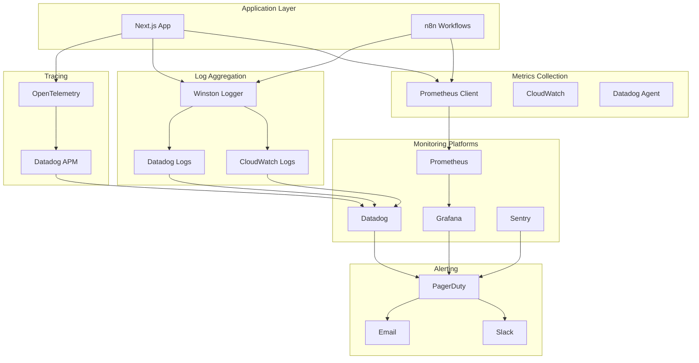

# 모니터링 및 관찰성

Frontend 애플리케이션과 n8n 워크플로우의 운영 상태를 모니터링하고 관찰하는 방법을 설명합니다.

## 모니터링 아키텍처



## 메트릭 수집

### 1. Prometheus 설정

```typescript
// lib/monitoring/prometheus.ts
import {
  collectDefaultMetrics,
  Counter,
  Gauge,
  Histogram,
  Registry,
} from 'prom-client';

// 레지스트리 생성
export const register = new Registry();

// 기본 메트릭 수집 (CPU, 메모리, GC 등)
collectDefaultMetrics({
  register,
  prefix: 'n8n_frontend_',
});

// 커스텀 메트릭 정의

// HTTP 요청 카운터
export const httpRequestsTotal = new Counter({
  name: 'http_requests_total',
  help: 'Total number of HTTP requests',
  labelNames: ['method', 'route', 'status_code'],
  registers: [register],
});

// HTTP 요청 시간 히스토그램
export const httpRequestDuration = new Histogram({
  name: 'http_request_duration_seconds',
  help: 'Duration of HTTP requests in seconds',
  labelNames: ['method', 'route', 'status_code'],
  buckets: [0.1, 0.3, 0.5, 0.7, 1, 3, 5, 7, 10],
  registers: [register],
});

// 활성 n8n 워크플로우 게이지
export const activeWorkflowsGauge = new Gauge({
  name: 'active_workflows_total',
  help: 'Number of active n8n workflows',
  registers: [register],
});

// 워크플로우 실행 카운터
export const workflowExecutionsTotal = new Counter({
  name: 'workflow_executions_total',
  help: 'Total number of workflow executions',
  labelNames: ['workflow_id', 'workflow_name', 'status'],
  registers: [register],
});

// 워크플로우 실행 시간
export const workflowExecutionDuration = new Histogram({
  name: 'workflow_execution_duration_seconds',
  help: 'Duration of workflow executions in seconds',
  labelNames: ['workflow_id', 'workflow_name'],
  buckets: [0.5, 1, 2, 5, 10, 30, 60, 120, 300],
  registers: [register],
});

// API 에러 카운터
export const apiErrorsTotal = new Counter({
  name: 'api_errors_total',
  help: 'Total number of API errors',
  labelNames: ['error_code', 'error_type'],
  registers: [register],
});

// 데이터베이스 연결 풀 게이지
export const dbConnectionsGauge = new Gauge({
  name: 'db_connections_total',
  help: 'Number of database connections',
  labelNames: ['pool', 'state'],
  registers: [register],
});

// Redis 캐시 히트율
export const cacheHitRate = new Counter({
  name: 'cache_operations_total',
  help: 'Cache operations',
  labelNames: ['operation', 'result'],
  registers: [register],
});
```

### 2. 메트릭 수집 미들웨어

```typescript
// middleware/metrics.ts
import { NextRequest, NextResponse } from 'next/server';
import {
  httpRequestsTotal,
  httpRequestDuration,
} from '@/lib/monitoring/prometheus';

export async function metricsMiddleware(
  request: NextRequest,
  next: () => Promise<NextResponse>
) {
  const start = Date.now();
  const route = request.nextUrl.pathname;
  const method = request.method;

  try {
    const response = await next();

    // 메트릭 기록
    const duration = (Date.now() - start) / 1000;

    httpRequestsTotal.inc({
      method,
      route,
      status_code: response.status,
    });

    httpRequestDuration.observe(
      {
        method,
        route,
        status_code: response.status,
      },
      duration
    );

    return response;
  } catch (error) {
    // 에러 메트릭
    httpRequestsTotal.inc({
      method,
      route,
      status_code: 500,
    });

    throw error;
  }
}
```

### 3. Prometheus 엔드포인트

```typescript
// app/api/metrics/route.ts
import { NextResponse } from 'next/server';
import { register } from '@/lib/monitoring/prometheus';

export async function GET() {
  const metrics = await register.metrics();

  return new NextResponse(metrics, {
    headers: {
      'Content-Type': register.contentType,
    },
  });
}
```

### 4. 워크플로우 메트릭 수집

```typescript
// lib/monitoring/workflow-metrics.ts
import {
  workflowExecutionsTotal,
  workflowExecutionDuration,
  activeWorkflowsGauge,
} from './prometheus';
import { n8nClient } from '@/lib/n8n/client';

export class WorkflowMetricsCollector {
  private intervalId: NodeJS.Timeout | null = null;

  // 주기적 메트릭 수집 시작
  start(intervalMs: number = 60000) {
    this.intervalId = setInterval(() => {
      this.collectMetrics();
    }, intervalMs);

    // 즉시 한 번 수집
    this.collectMetrics();
  }

  stop() {
    if (this.intervalId) {
      clearInterval(this.intervalId);
      this.intervalId = null;
    }
  }

  private async collectMetrics() {
    try {
      // 활성 워크플로우 수
      const workflows = await n8nClient.getWorkflows();
      const activeCount = workflows.filter(w => w.active).length;

      activeWorkflowsGauge.set(activeCount);

      // 각 워크플로우의 최근 실행 통계
      for (const workflow of workflows) {
        await this.collectWorkflowExecutionMetrics(workflow.id, workflow.name);
      }
    } catch (error) {
      console.error('Failed to collect workflow metrics:', error);
    }
  }

  private async collectWorkflowExecutionMetrics(
    workflowId: string,
    workflowName: string
  ) {
    try {
      // 최근 1시간 실행 조회
      const executions = await n8nClient.getExecutions({
        workflowId,
        startedAfter: new Date(Date.now() - 60 * 60 * 1000),
      });

      for (const execution of executions) {
        // 실행 카운터 증가
        workflowExecutionsTotal.inc({
          workflow_id: workflowId,
          workflow_name: workflowName,
          status: execution.status,
        });

        // 실행 시간 기록
        if (execution.stoppedAt && execution.startedAt) {
          const duration =
            (new Date(execution.stoppedAt).getTime() -
              new Date(execution.startedAt).getTime()) /
            1000;

          workflowExecutionDuration.observe(
            {
              workflow_id: workflowId,
              workflow_name: workflowName,
            },
            duration
          );
        }
      }
    } catch (error) {
      console.error(
        `Failed to collect metrics for workflow ${workflowId}:`,
        error
      );
    }
  }
}

// 싱글톤 인스턴스
export const workflowMetricsCollector = new WorkflowMetricsCollector();
```

### 5. 애플리케이션 시작 시 메트릭 수집

```typescript
// app/layout.tsx
import { workflowMetricsCollector } from '@/lib/monitoring/workflow-metrics';

export default function RootLayout({
  children,
}: {
  children: React.ReactNode;
}) {
  // 서버 사이드에서만 실행
  if (typeof window === 'undefined') {
    // 메트릭 수집 시작 (1분 간격)
    workflowMetricsCollector.start(60000);
  }

  return (
    <html lang="ko">
      <body>{children}</body>
    </html>
  );
}
```

## 로그 관리

### 1. Winston Logger 설정

```typescript
// lib/logging/logger.ts
import winston from 'winston';
import { format } from 'winston';

const { combine, timestamp, printf, errors, json } = format;

// 커스텀 로그 포맷
const customFormat = printf(({ level, message, timestamp, ...meta }) => {
  return JSON.stringify({
    timestamp,
    level,
    message,
    ...meta,
  });
});

// 로거 생성
export const logger = winston.createLogger({
  level: process.env.LOG_LEVEL || 'info',
  format: combine(
    timestamp({ format: 'YYYY-MM-DD HH:mm:ss' }),
    errors({ stack: true }),
    json(),
    customFormat
  ),
  defaultMeta: {
    service: 'n8n-frontend',
    environment: process.env.NODE_ENV,
  },
  transports: [
    // 콘솔 출력
    new winston.transports.Console({
      format: winston.format.combine(
        winston.format.colorize(),
        winston.format.simple()
      ),
    }),

    // 에러 로그 파일
    new winston.transports.File({
      filename: 'logs/error.log',
      level: 'error',
      maxsize: 10 * 1024 * 1024, // 10MB
      maxFiles: 5,
    }),

    // 모든 로그 파일
    new winston.transports.File({
      filename: 'logs/combined.log',
      maxsize: 10 * 1024 * 1024,
      maxFiles: 5,
    }),
  ],
});

// 프로덕션 환경에서는 CloudWatch로 전송
if (process.env.NODE_ENV === 'production') {
  const CloudWatchTransport = require('winston-cloudwatch');

  logger.add(
    new CloudWatchTransport({
      logGroupName: '/aws/lambda/n8n-frontend',
      logStreamName: `${process.env.NODE_ENV}-${new Date().toISOString().split('T')[0]}`,
      awsRegion: process.env.AWS_REGION || 'us-east-1',
      jsonMessage: true,
    })
  );
}
```

### 2. 구조화된 로깅

```typescript
// lib/logging/structured-logger.ts
import { logger } from './logger';

export class StructuredLogger {
  // HTTP 요청 로깅
  logHttpRequest(req: {
    method: string;
    url: string;
    headers: Record<string, string>;
    body?: any;
  }) {
    logger.info('HTTP Request', {
      type: 'http_request',
      method: req.method,
      url: req.url,
      headers: this.sanitizeHeaders(req.headers),
      body: this.sanitizeBody(req.body),
    });
  }

  // HTTP 응답 로깅
  logHttpResponse(res: {
    statusCode: number;
    duration: number;
    url: string;
  }) {
    logger.info('HTTP Response', {
      type: 'http_response',
      statusCode: res.statusCode,
      duration: res.duration,
      url: res.url,
    });
  }

  // 워크플로우 실행 로깅
  logWorkflowExecution(execution: {
    workflowId: string;
    workflowName: string;
    executionId: string;
    status: string;
    duration?: number;
    error?: any;
  }) {
    const logLevel = execution.status === 'error' ? 'error' : 'info';

    logger[logLevel]('Workflow Execution', {
      type: 'workflow_execution',
      workflow_id: execution.workflowId,
      workflow_name: execution.workflowName,
      execution_id: execution.executionId,
      status: execution.status,
      duration: execution.duration,
      error: execution.error,
    });
  }

  // 데이터베이스 쿼리 로깅
  logDatabaseQuery(query: {
    operation: string;
    collection: string;
    duration: number;
    error?: any;
  }) {
    if (query.error) {
      logger.error('Database Query Failed', {
        type: 'database_query',
        ...query,
      });
    } else {
      logger.debug('Database Query', {
        type: 'database_query',
        ...query,
      });
    }
  }

  // 캐시 작업 로깅
  logCacheOperation(operation: {
    type: 'get' | 'set' | 'delete';
    key: string;
    hit?: boolean;
    duration: number;
  }) {
    logger.debug('Cache Operation', {
      type: 'cache_operation',
      ...operation,
    });
  }

  // 에러 로깅
  logError(error: Error, context?: Record<string, any>) {
    logger.error('Application Error', {
      type: 'application_error',
      error: {
        name: error.name,
        message: error.message,
        stack: error.stack,
      },
      ...context,
    });
  }

  // 민감한 정보 제거
  private sanitizeHeaders(headers: Record<string, string>) {
    const sanitized = { ...headers };
    const sensitiveHeaders = [
      'authorization',
      'cookie',
      'x-api-key',
      'x-auth-token',
    ];

    for (const header of sensitiveHeaders) {
      if (sanitized[header]) {
        sanitized[header] = '[REDACTED]';
      }
    }

    return sanitized;
  }

  private sanitizeBody(body: any) {
    if (!body) return body;

    const sanitized = { ...body };
    const sensitiveFields = ['password', 'apiKey', 'secret', 'token'];

    for (const field of sensitiveFields) {
      if (sanitized[field]) {
        sanitized[field] = '[REDACTED]';
      }
    }

    return sanitized;
  }
}

export const structuredLogger = new StructuredLogger();
```

### 3. 로그 사용 예시

```typescript
// app/api/workflows/[id]/execute/route.ts
import { NextRequest, NextResponse } from 'next/server';
import { structuredLogger } from '@/lib/logging/structured-logger';
import { n8nClient } from '@/lib/n8n/client';

export async function POST(
  request: NextRequest,
  { params }: { params: { id: string } }
) {
  const startTime = Date.now();

  try {
    const body = await request.json();

    // 요청 로깅
    structuredLogger.logHttpRequest({
      method: 'POST',
      url: `/api/workflows/${params.id}/execute`,
      headers: Object.fromEntries(request.headers),
      body,
    });

    // 워크플로우 실행
    const execution = await n8nClient.executeWorkflow(params.id, body);

    // 실행 로깅
    structuredLogger.logWorkflowExecution({
      workflowId: params.id,
      workflowName: execution.workflowData?.name || 'Unknown',
      executionId: execution.id,
      status: execution.status,
      duration: Date.now() - startTime,
    });

    // 응답 로깅
    structuredLogger.logHttpResponse({
      statusCode: 200,
      duration: Date.now() - startTime,
      url: `/api/workflows/${params.id}/execute`,
    });

    return NextResponse.json(execution);
  } catch (error: any) {
    // 에러 로깅
    structuredLogger.logError(error, {
      workflowId: params.id,
      endpoint: `/api/workflows/${params.id}/execute`,
    });

    return NextResponse.json(
      { error: error.message },
      { status: 500 }
    );
  }
}
```

## 분산 추적 (Distributed Tracing)

### 1. OpenTelemetry 설정

```typescript
// lib/tracing/opentelemetry.ts
import { NodeSDK } from '@opentelemetry/sdk-node';
import { getNodeAutoInstrumentations } from '@opentelemetry/auto-instrumentations-node';
import { OTLPTraceExporter } from '@opentelemetry/exporter-trace-otlp-http';
import { Resource } from '@opentelemetry/resources';
import { SemanticResourceAttributes } from '@opentelemetry/semantic-conventions';

const traceExporter = new OTLPTraceExporter({
  url: process.env.OTEL_EXPORTER_OTLP_ENDPOINT || 'http://localhost:4318/v1/traces',
});

const sdk = new NodeSDK({
  resource: new Resource({
    [SemanticResourceAttributes.SERVICE_NAME]: 'n8n-frontend',
    [SemanticResourceAttributes.SERVICE_VERSION]: process.env.npm_package_version,
    [SemanticResourceAttributes.DEPLOYMENT_ENVIRONMENT]: process.env.NODE_ENV,
  }),
  traceExporter,
  instrumentations: [
    getNodeAutoInstrumentations({
      // HTTP 자동 계측
      '@opentelemetry/instrumentation-http': {
        enabled: true,
      },
      // Express 자동 계측
      '@opentelemetry/instrumentation-express': {
        enabled: true,
      },
      // MongoDB 자동 계측
      '@opentelemetry/instrumentation-mongodb': {
        enabled: true,
        enhancedDatabaseReporting: true,
      },
      // Redis 자동 계측
      '@opentelemetry/instrumentation-redis': {
        enabled: true,
      },
    }),
  ],
});

sdk.start();

export default sdk;
```

### 2. 커스텀 스팬 생성

```typescript
// lib/tracing/tracer.ts
import { trace, context, SpanStatusCode } from '@opentelemetry/api';

const tracer = trace.getTracer('n8n-frontend', '1.0.0');

export class TracingService {
  // 워크플로우 실행 추적
  async traceWorkflowExecution<T>(
    workflowId: string,
    workflowName: string,
    fn: () => Promise<T>
  ): Promise<T> {
    return tracer.startActiveSpan(
      'workflow.execute',
      {
        attributes: {
          'workflow.id': workflowId,
          'workflow.name': workflowName,
        },
      },
      async (span) => {
        try {
          const result = await fn();

          span.setStatus({ code: SpanStatusCode.OK });
          span.setAttribute('workflow.status', 'success');

          return result;
        } catch (error: any) {
          span.setStatus({
            code: SpanStatusCode.ERROR,
            message: error.message,
          });
          span.recordException(error);

          throw error;
        } finally {
          span.end();
        }
      }
    );
  }

  // API 호출 추적
  async traceApiCall<T>(
    method: string,
    url: string,
    fn: () => Promise<T>
  ): Promise<T> {
    return tracer.startActiveSpan(
      `http.${method.toLowerCase()}`,
      {
        attributes: {
          'http.method': method,
          'http.url': url,
        },
      },
      async (span) => {
        try {
          const result = await fn();

          span.setAttribute('http.status_code', 200);
          span.setStatus({ code: SpanStatusCode.OK });

          return result;
        } catch (error: any) {
          span.setAttribute('http.status_code', error.statusCode || 500);
          span.setStatus({
            code: SpanStatusCode.ERROR,
            message: error.message,
          });
          span.recordException(error);

          throw error;
        } finally {
          span.end();
        }
      }
    );
  }

  // 데이터베이스 쿼리 추적
  async traceDatabaseQuery<T>(
    operation: string,
    collection: string,
    fn: () => Promise<T>
  ): Promise<T> {
    return tracer.startActiveSpan(
      `db.${operation}`,
      {
        attributes: {
          'db.system': 'mongodb',
          'db.operation': operation,
          'db.mongodb.collection': collection,
        },
      },
      async (span) => {
        try {
          const result = await fn();

          span.setStatus({ code: SpanStatusCode.OK });

          return result;
        } catch (error: any) {
          span.setStatus({
            code: SpanStatusCode.ERROR,
            message: error.message,
          });
          span.recordException(error);

          throw error;
        } finally {
          span.end();
        }
      }
    );
  }
}

export const tracingService = new TracingService();
```

## 헬스체크

### 1. 헬스체크 엔드포인트

```typescript
// app/api/health/route.ts
import { NextResponse } from 'next/server';
import { n8nClient } from '@/lib/n8n/client';
import { db } from '@/lib/db';
import { redis } from '@/lib/redis';

interface HealthCheckResult {
  status: 'healthy' | 'degraded' | 'unhealthy';
  timestamp: string;
  services: {
    [key: string]: {
      status: 'up' | 'down';
      responseTime?: number;
      error?: string;
    };
  };
}

export async function GET() {
  const startTime = Date.now();
  const result: HealthCheckResult = {
    status: 'healthy',
    timestamp: new Date().toISOString(),
    services: {},
  };

  // n8n 헬스체크
  try {
    const n8nStart = Date.now();
    await n8nClient.getWorkflows({ limit: 1 });

    result.services.n8n = {
      status: 'up',
      responseTime: Date.now() - n8nStart,
    };
  } catch (error: any) {
    result.services.n8n = {
      status: 'down',
      error: error.message,
    };
    result.status = 'degraded';
  }

  // MongoDB 헬스체크
  try {
    const dbStart = Date.now();
    await db.command({ ping: 1 });

    result.services.mongodb = {
      status: 'up',
      responseTime: Date.now() - dbStart,
    };
  } catch (error: any) {
    result.services.mongodb = {
      status: 'down',
      error: error.message,
    };
    result.status = 'unhealthy';
  }

  // Redis 헬스체크
  try {
    const redisStart = Date.now();
    await redis.ping();

    result.services.redis = {
      status: 'up',
      responseTime: Date.now() - redisStart,
    };
  } catch (error: any) {
    result.services.redis = {
      status: 'down',
      error: error.message,
    };
    result.status = 'degraded';
  }

  // 응답 상태 코드 결정
  const statusCode = result.status === 'healthy' ? 200 : result.status === 'degraded' ? 200 : 503;

  return NextResponse.json(result, { status: statusCode });
}
```

### 2. 상세 헬스체크

```typescript
// app/api/health/detailed/route.ts
import { NextResponse } from 'next/server';
import os from 'os';
import { db } from '@/lib/db';
import { redis } from '@/lib/redis';

export async function GET() {
  const result = {
    status: 'healthy',
    timestamp: new Date().toISOString(),
    system: {
      uptime: process.uptime(),
      memory: {
        total: os.totalmem(),
        free: os.freemem(),
        used: os.totalmem() - os.freemem(),
        usagePercent: ((os.totalmem() - os.freemem()) / os.totalmem()) * 100,
      },
      cpu: {
        model: os.cpus()[0].model,
        cores: os.cpus().length,
        load: os.loadavg(),
      },
      platform: os.platform(),
      nodeVersion: process.version,
    },
    database: {
      mongodb: {
        status: 'unknown' as 'up' | 'down' | 'unknown',
        stats: null as any,
      },
      redis: {
        status: 'unknown' as 'up' | 'down' | 'unknown',
        info: null as any,
      },
    },
  };

  // MongoDB 상세 정보
  try {
    const dbStats = await db.stats();

    result.database.mongodb = {
      status: 'up',
      stats: {
        collections: dbStats.collections,
        dataSize: dbStats.dataSize,
        indexes: dbStats.indexes,
        indexSize: dbStats.indexSize,
        avgObjSize: dbStats.avgObjSize,
      },
    };
  } catch (error) {
    result.database.mongodb.status = 'down';
  }

  // Redis 상세 정보
  try {
    const redisInfo = await redis.info();

    result.database.redis = {
      status: 'up',
      info: parseRedisInfo(redisInfo),
    };
  } catch (error) {
    result.database.redis.status = 'down';
  }

  return NextResponse.json(result);
}

function parseRedisInfo(info: string) {
  const parsed: Record<string, any> = {};
  const lines = info.split('\r\n');

  for (const line of lines) {
    if (line.includes(':')) {
      const [key, value] = line.split(':');
      parsed[key] = value;
    }
  }

  return {
    version: parsed.redis_version,
    uptime: parsed.uptime_in_seconds,
    connectedClients: parsed.connected_clients,
    usedMemory: parsed.used_memory_human,
    maxMemory: parsed.maxmemory_human,
  };
}
```

## 알림 및 경보

### 1. 알림 서비스

```typescript
// lib/monitoring/alerting.ts
import { logger } from '@/lib/logging/logger';

export interface Alert {
  severity: 'info' | 'warning' | 'error' | 'critical';
  title: string;
  description: string;
  source: string;
  metadata?: Record<string, any>;
}

export class AlertingService {
  // Slack 알림
  async sendSlackAlert(alert: Alert) {
    const webhookUrl = process.env.SLACK_WEBHOOK_URL;

    if (!webhookUrl) {
      logger.warn('Slack webhook URL not configured');
      return;
    }

    const color = {
      info: '#36a64f',
      warning: '#ff9900',
      error: '#ff0000',
      critical: '#8b0000',
    }[alert.severity];

    const payload = {
      attachments: [
        {
          color,
          title: `[${alert.severity.toUpperCase()}] ${alert.title}`,
          text: alert.description,
          fields: [
            {
              title: 'Source',
              value: alert.source,
              short: true,
            },
            {
              title: 'Timestamp',
              value: new Date().toISOString(),
              short: true,
            },
            ...Object.entries(alert.metadata || {}).map(([key, value]) => ({
              title: key,
              value: String(value),
              short: true,
            })),
          ],
        },
      ],
    };

    try {
      await fetch(webhookUrl, {
        method: 'POST',
        headers: { 'Content-Type': 'application/json' },
        body: JSON.stringify(payload),
      });

      logger.info('Slack alert sent', { alert });
    } catch (error: any) {
      logger.error('Failed to send Slack alert', { error, alert });
    }
  }

  // PagerDuty 알림
  async sendPagerDutyAlert(alert: Alert) {
    const integrationKey = process.env.PAGERDUTY_INTEGRATION_KEY;

    if (!integrationKey) {
      logger.warn('PagerDuty integration key not configured');
      return;
    }

    const payload = {
      routing_key: integrationKey,
      event_action: 'trigger',
      payload: {
        summary: alert.title,
        severity: alert.severity,
        source: alert.source,
        custom_details: {
          description: alert.description,
          ...alert.metadata,
        },
      },
    };

    try {
      await fetch('https://events.pagerduty.com/v2/enqueue', {
        method: 'POST',
        headers: { 'Content-Type': 'application/json' },
        body: JSON.stringify(payload),
      });

      logger.info('PagerDuty alert sent', { alert });
    } catch (error: any) {
      logger.error('Failed to send PagerDuty alert', { error, alert });
    }
  }

  // 이메일 알림
  async sendEmailAlert(alert: Alert) {
    // SendGrid, AWS SES, 또는 다른 이메일 서비스 사용
    logger.info('Email alert', { alert });
  }

  // 통합 알림 전송
  async sendAlert(alert: Alert) {
    // 심각도에 따라 다른 채널 사용
    if (alert.severity === 'critical') {
      await Promise.all([
        this.sendSlackAlert(alert),
        this.sendPagerDutyAlert(alert),
        this.sendEmailAlert(alert),
      ]);
    } else if (alert.severity === 'error') {
      await Promise.all([
        this.sendSlackAlert(alert),
        this.sendPagerDutyAlert(alert),
      ]);
    } else {
      await this.sendSlackAlert(alert);
    }
  }
}

export const alertingService = new AlertingService();
```

### 2. 자동 알림 규칙

```typescript
// lib/monitoring/alert-rules.ts
import { alertingService } from './alerting';
import { workflowExecutionsTotal } from './prometheus';

export class AlertRuleEngine {
  private checkInterval: NodeJS.Timeout | null = null;

  start(intervalMs: number = 60000) {
    this.checkInterval = setInterval(() => {
      this.checkRules();
    }, intervalMs);
  }

  stop() {
    if (this.checkInterval) {
      clearInterval(this.checkInterval);
    }
  }

  private async checkRules() {
    await Promise.all([
      this.checkWorkflowFailureRate(),
      this.checkApiErrorRate(),
      this.checkDatabaseConnections(),
      this.checkMemoryUsage(),
    ]);
  }

  // 워크플로우 실패율 확인
  private async checkWorkflowFailureRate() {
    const metrics = await workflowExecutionsTotal.get();

    for (const metric of metrics.values) {
      const { workflow_id, workflow_name, status } = metric.labels;

      if (status === 'error') {
        const failureRate = this.calculateFailureRate(workflow_id);

        if (failureRate > 0.5) {
          // 50% 이상 실패
          await alertingService.sendAlert({
            severity: 'critical',
            title: `High Failure Rate: ${workflow_name}`,
            description: `Workflow ${workflow_name} has ${(failureRate * 100).toFixed(1)}% failure rate`,
            source: 'workflow-monitoring',
            metadata: {
              workflow_id,
              workflow_name,
              failure_rate: failureRate,
            },
          });
        }
      }
    }
  }

  // API 에러율 확인
  private async checkApiErrorRate() {
    // 구현 로직
  }

  // 데이터베이스 연결 확인
  private async checkDatabaseConnections() {
    // 구현 로직
  }

  // 메모리 사용량 확인
  private async checkMemoryUsage() {
    const used = process.memoryUsage();
    const heapUsedPercent = (used.heapUsed / used.heapTotal) * 100;

    if (heapUsedPercent > 90) {
      await alertingService.sendAlert({
        severity: 'warning',
        title: 'High Memory Usage',
        description: `Heap usage at ${heapUsedPercent.toFixed(1)}%`,
        source: 'system-monitoring',
        metadata: {
          heapUsed: used.heapUsed,
          heapTotal: used.heapTotal,
          rss: used.rss,
        },
      });
    }
  }

  private calculateFailureRate(workflowId: string): number {
    // 실제 구현에서는 메트릭에서 계산
    return 0;
  }
}

export const alertRuleEngine = new AlertRuleEngine();
```

## Grafana 대시보드

### 1. Prometheus 데이터 소스 설정

```yaml
# grafana/provisioning/datasources/prometheus.yml
apiVersion: 1

datasources:
  - name: Prometheus
    type: prometheus
    access: proxy
    url: http://prometheus:9090
    isDefault: true
    editable: false
```

### 2. 대시보드 JSON

```json
{
  "dashboard": {
    "title": "n8n Frontend Monitoring",
    "panels": [
      {
        "id": 1,
        "title": "HTTP Request Rate",
        "targets": [
          {
            "expr": "rate(http_requests_total[5m])",
            "legendFormat": "{{method}} {{route}}"
          }
        ],
        "type": "graph"
      },
      {
        "id": 2,
        "title": "HTTP Request Duration (95th percentile)",
        "targets": [
          {
            "expr": "histogram_quantile(0.95, rate(http_request_duration_seconds_bucket[5m]))",
            "legendFormat": "{{method}} {{route}}"
          }
        ],
        "type": "graph"
      },
      {
        "id": 3,
        "title": "Active Workflows",
        "targets": [
          {
            "expr": "active_workflows_total"
          }
        ],
        "type": "stat"
      },
      {
        "id": 4,
        "title": "Workflow Execution Success Rate",
        "targets": [
          {
            "expr": "sum(rate(workflow_executions_total{status=\"success\"}[5m])) / sum(rate(workflow_executions_total[5m]))",
            "legendFormat": "Success Rate"
          }
        ],
        "type": "gauge"
      },
      {
        "id": 5,
        "title": "API Errors",
        "targets": [
          {
            "expr": "rate(api_errors_total[5m])",
            "legendFormat": "{{error_code}}"
          }
        ],
        "type": "graph"
      }
    ]
  }
}
```

## 모니터링 체크리스트

### 설정 확인
- [ ] Prometheus 메트릭 수집 설정 완료
- [ ] Winston 로거 설정 및 로그 레벨 구성
- [ ] OpenTelemetry 분산 추적 활성화
- [ ] 헬스체크 엔드포인트 구현
- [ ] Grafana 대시보드 생성

### 알림 구성
- [ ] Slack webhook URL 설정
- [ ] PagerDuty 통합 키 설정
- [ ] 알림 규칙 및 임계값 정의
- [ ] 심각도별 알림 채널 매핑

### 데이터 수집
- [ ] HTTP 요청/응답 메트릭 수집
- [ ] 워크플로우 실행 메트릭 수집
- [ ] 데이터베이스 쿼리 성능 추적
- [ ] 캐시 히트율 모니터링
- [ ] 에러 및 예외 로깅

### 시각화
- [ ] 실시간 대시보드 구성
- [ ] 주요 메트릭 패널 생성
- [ ] 알림 이력 대시보드
- [ ] SLA 추적 대시보드

## 다음 단계

1. [백업 및 복구](./backup-recovery) - 데이터 백업 전략
2. [스케일링](./scaling) - 수평/수직 확장 방법
3. [트러블슈팅](./troubleshooting) - 문제 해결 가이드

## 참고 자료

- [Prometheus Documentation](https://prometheus.io/docs/)
- [Grafana Documentation](https://grafana.com/docs/)
- [Winston Logger](https://github.com/winstonjs/winston)
- [OpenTelemetry](https://opentelemetry.io/docs/)
- [Datadog APM](https://docs.datadoghq.com/tracing/)
