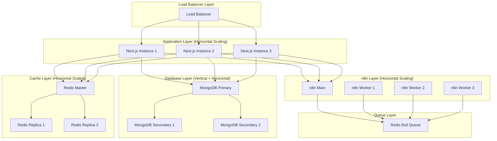
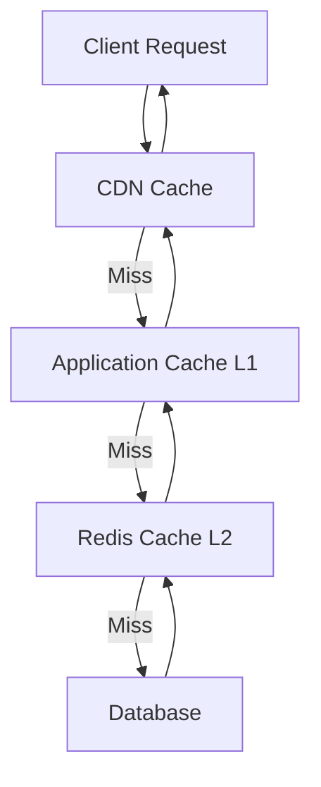

# 스케일링 전략

애플리케이션의 트래픽 증가와 워크로드 확장에 대응하기 위한 수평 및 수직 스케일링 전략을 설명합니다.

## 스케일링 아키텍처



## 수평 스케일링 (Horizontal Scaling)

### 1. Next.js 애플리케이션 스케일링

#### Docker Compose 멀티 인스턴스

```yaml
# docker-compose.yml
version: '3.8'

services:
  app-1:
    build: .
    environment:
      - NODE_ENV=production
      - PORT=3000
    ports:
      - "3001:3000"
    deploy:
      resources:
        limits:
          cpus: '1'
          memory: 1G

  app-2:
    build: .
    environment:
      - NODE_ENV=production
      - PORT=3000
    ports:
      - "3002:3000"
    deploy:
      resources:
        limits:
          cpus: '1'
          memory: 1G

  app-3:
    build: .
    environment:
      - NODE_ENV=production
      - PORT=3000
    ports:
      - "3003:3000"
    deploy:
      resources:
        limits:
          cpus: '1'
          memory: 1G

  nginx:
    image: nginx:alpine
    ports:
      - "80:80"
      - "443:443"
    volumes:
      - ./nginx.conf:/etc/nginx/nginx.conf
      - ./ssl:/etc/nginx/ssl
    depends_on:
      - app-1
      - app-2
      - app-3
```

#### Nginx 로드 밸런서 설정

```nginx
# nginx.conf
upstream nextjs_backend {
    # 라운드 로빈 (기본)
    server app-1:3000;
    server app-2:3000;
    server app-3:3000;

    # 또는 가중치 기반
    # server app-1:3000 weight=3;
    # server app-2:3000 weight=2;
    # server app-3:3000 weight=1;

    # 또는 least_conn (최소 연결 수)
    # least_conn;

    # 또는 ip_hash (세션 고정)
    # ip_hash;

    # 헬스체크
    # health_check interval=10s fails=3 passes=2;
}

server {
    listen 80;
    server_name example.com;

    # HTTPS 리디렉션
    return 301 https://$server_name$request_uri;
}

server {
    listen 443 ssl http2;
    server_name example.com;

    ssl_certificate /etc/nginx/ssl/cert.pem;
    ssl_certificate_key /etc/nginx/ssl/key.pem;

    # SSL 설정
    ssl_protocols TLSv1.2 TLSv1.3;
    ssl_ciphers HIGH:!aNULL:!MD5;

    location / {
        proxy_pass http://nextjs_backend;
        proxy_http_version 1.1;

        # 헤더 전달
        proxy_set_header Upgrade $http_upgrade;
        proxy_set_header Connection 'upgrade';
        proxy_set_header Host $host;
        proxy_set_header X-Real-IP $remote_addr;
        proxy_set_header X-Forwarded-For $proxy_add_x_forwarded_for;
        proxy_set_header X-Forwarded-Proto $scheme;

        # 타임아웃
        proxy_connect_timeout 60s;
        proxy_send_timeout 60s;
        proxy_read_timeout 60s;

        # 버퍼링
        proxy_buffering off;
        proxy_cache_bypass $http_upgrade;
    }

    # 헬스체크 엔드포인트
    location /health {
        proxy_pass http://nextjs_backend/api/health;
        access_log off;
    }
}
```

#### Kubernetes 배포

```yaml
# k8s/deployment.yaml
apiVersion: apps/v1
kind: Deployment
metadata:
  name: nextjs-app
  labels:
    app: nextjs
spec:
  replicas: 3  # 초기 인스턴스 수
  selector:
    matchLabels:
      app: nextjs
  template:
    metadata:
      labels:
        app: nextjs
    spec:
      containers:
      - name: nextjs
        image: your-registry/nextjs-app:latest
        ports:
        - containerPort: 3000
        env:
        - name: NODE_ENV
          value: "production"
        - name: MONGODB_URI
          valueFrom:
            secretKeyRef:
              name: app-secrets
              key: mongodb-uri
        - name: REDIS_URL
          valueFrom:
            secretKeyRef:
              name: app-secrets
              key: redis-url
        resources:
          requests:
            cpu: 500m
            memory: 512Mi
          limits:
            cpu: 1000m
            memory: 1Gi
        livenessProbe:
          httpGet:
            path: /api/health
            port: 3000
          initialDelaySeconds: 30
          periodSeconds: 10
        readinessProbe:
          httpGet:
            path: /api/health
            port: 3000
          initialDelaySeconds: 5
          periodSeconds: 5

---
apiVersion: v1
kind: Service
metadata:
  name: nextjs-service
spec:
  selector:
    app: nextjs
  ports:
  - protocol: TCP
    port: 80
    targetPort: 3000
  type: LoadBalancer

---
apiVersion: autoscaling/v2
kind: HorizontalPodAutoscaler
metadata:
  name: nextjs-hpa
spec:
  scaleTargetRef:
    apiVersion: apps/v1
    kind: Deployment
    name: nextjs-app
  minReplicas: 3
  maxReplicas: 10
  metrics:
  - type: Resource
    resource:
      name: cpu
      target:
        type: Utilization
        averageUtilization: 70
  - type: Resource
    resource:
      name: memory
      target:
        type: Utilization
        averageUtilization: 80
  behavior:
    scaleDown:
      stabilizationWindowSeconds: 300
      policies:
      - type: Percent
        value: 50
        periodSeconds: 60
    scaleUp:
      stabilizationWindowSeconds: 0
      policies:
      - type: Percent
        value: 100
        periodSeconds: 30
      - type: Pods
        value: 2
        periodSeconds: 30
```

### 2. n8n 워크플로우 스케일링

#### n8n Worker 확장

```yaml
# docker-compose.n8n.yml
version: '3.8'

services:
  n8n-main:
    image: n8nio/n8n:latest
    environment:
      - EXECUTIONS_MODE=queue
      - QUEUE_BULL_REDIS_HOST=redis
      - QUEUE_BULL_REDIS_PORT=6379
      - DB_TYPE=postgresdb
      - DB_POSTGRESDB_HOST=postgres
      - N8N_ENCRYPTION_KEY=${N8N_ENCRYPTION_KEY}
    ports:
      - "5678:5678"
    depends_on:
      - postgres
      - redis

  # Worker 1
  n8n-worker-1:
    image: n8nio/n8n:latest
    command: worker
    environment:
      - EXECUTIONS_MODE=queue
      - QUEUE_BULL_REDIS_HOST=redis
      - QUEUE_BULL_REDIS_PORT=6379
      - DB_TYPE=postgresdb
      - DB_POSTGRESDB_HOST=postgres
      - N8N_ENCRYPTION_KEY=${N8N_ENCRYPTION_KEY}
    depends_on:
      - redis
      - postgres

  # Worker 2
  n8n-worker-2:
    image: n8nio/n8n:latest
    command: worker
    environment:
      - EXECUTIONS_MODE=queue
      - QUEUE_BULL_REDIS_HOST=redis
      - QUEUE_BULL_REDIS_PORT=6379
      - DB_TYPE=postgresdb
      - DB_POSTGRESDB_HOST=postgres
      - N8N_ENCRYPTION_KEY=${N8N_ENCRYPTION_KEY}
    depends_on:
      - redis
      - postgres

  # Worker 3
  n8n-worker-3:
    image: n8nio/n8n:latest
    command: worker
    environment:
      - EXECUTIONS_MODE=queue
      - QUEUE_BULL_REDIS_HOST=redis
      - QUEUE_BULL_REDIS_PORT=6379
      - DB_TYPE=postgresdb
      - DB_POSTGRESDB_HOST=postgres
      - N8N_ENCRYPTION_KEY=${N8N_ENCRYPTION_KEY}
    depends_on:
      - redis
      - postgres

  postgres:
    image: postgres:16
    environment:
      - POSTGRES_USER=n8n
      - POSTGRES_PASSWORD=${POSTGRES_PASSWORD}
      - POSTGRES_DB=n8n
    volumes:
      - postgres_data:/var/lib/postgresql/data

  redis:
    image: redis:7-alpine
    command: redis-server --maxmemory 2gb --maxmemory-policy allkeys-lru

volumes:
  postgres_data:
```

#### Kubernetes n8n 스케일링

```yaml
# k8s/n8n-deployment.yaml
apiVersion: apps/v1
kind: Deployment
metadata:
  name: n8n-worker
spec:
  replicas: 5  # Worker 수
  selector:
    matchLabels:
      app: n8n-worker
  template:
    metadata:
      labels:
        app: n8n-worker
    spec:
      containers:
      - name: n8n-worker
        image: n8nio/n8n:latest
        command: ["n8n", "worker"]
        env:
        - name: EXECUTIONS_MODE
          value: "queue"
        - name: QUEUE_BULL_REDIS_HOST
          value: redis-service
        - name: N8N_ENCRYPTION_KEY
          valueFrom:
            secretKeyRef:
              name: n8n-secrets
              key: encryption-key
        resources:
          requests:
            cpu: 500m
            memory: 1Gi
          limits:
            cpu: 2000m
            memory: 2Gi

---
apiVersion: autoscaling/v2
kind: HorizontalPodAutoscaler
metadata:
  name: n8n-worker-hpa
spec:
  scaleTargetRef:
    apiVersion: apps/v1
    kind: Deployment
    name: n8n-worker
  minReplicas: 3
  maxReplicas: 20
  metrics:
  - type: Resource
    resource:
      name: cpu
      target:
        type: Utilization
        averageUtilization: 75
  # 큐 길이 기반 스케일링 (커스텀 메트릭)
  - type: Pods
    pods:
      metric:
        name: queue_length
      target:
        type: AverageValue
        averageValue: "10"
```

### 3. MongoDB 레플리카 세트

```yaml
# docker-compose.mongo.yml
version: '3.8'

services:
  mongo-primary:
    image: mongo:7
    command: mongod --replSet rs0 --bind_ip_all
    ports:
      - "27017:27017"
    volumes:
      - mongo-primary-data:/data/db
    environment:
      - MONGO_INITDB_ROOT_USERNAME=admin
      - MONGO_INITDB_ROOT_PASSWORD=${MONGO_PASSWORD}

  mongo-secondary-1:
    image: mongo:7
    command: mongod --replSet rs0 --bind_ip_all
    ports:
      - "27018:27017"
    volumes:
      - mongo-secondary-1-data:/data/db
    environment:
      - MONGO_INITDB_ROOT_USERNAME=admin
      - MONGO_INITDB_ROOT_PASSWORD=${MONGO_PASSWORD}
    depends_on:
      - mongo-primary

  mongo-secondary-2:
    image: mongo:7
    command: mongod --replSet rs0 --bind_ip_all
    ports:
      - "27019:27017"
    volumes:
      - mongo-secondary-2-data:/data/db
    environment:
      - MONGO_INITDB_ROOT_USERNAME=admin
      - MONGO_INITDB_ROOT_PASSWORD=${MONGO_PASSWORD}
    depends_on:
      - mongo-primary

  mongo-init:
    image: mongo:7
    depends_on:
      - mongo-primary
      - mongo-secondary-1
      - mongo-secondary-2
    volumes:
      - ./init-replica-set.js:/docker-entrypoint-initdb.d/init.js
    command: >
      bash -c "
        sleep 10 &&
        mongosh --host mongo-primary -u admin -p ${MONGO_PASSWORD} --authenticationDatabase admin /docker-entrypoint-initdb.d/init.js
      "

volumes:
  mongo-primary-data:
  mongo-secondary-1-data:
  mongo-secondary-2-data:
```

```javascript
// init-replica-set.js
rs.initiate({
  _id: 'rs0',
  members: [
    { _id: 0, host: 'mongo-primary:27017', priority: 2 },
    { _id: 1, host: 'mongo-secondary-1:27017', priority: 1 },
    { _id: 2, host: 'mongo-secondary-2:27017', priority: 1 },
  ],
});

// 레플리카 세트 상태 확인
rs.status();
```

#### MongoDB 샤딩

```javascript
// MongoDB 샤딩 설정
// 1. Config 서버 레플리카 세트
sh.addShard('shard1/mongo-shard1-1:27017,mongo-shard1-2:27017,mongo-shard1-3:27017');
sh.addShard('shard2/mongo-shard2-1:27017,mongo-shard2-2:27017,mongo-shard2-3:27017');

// 2. 샤딩 활성화
sh.enableSharding('n8n_frontend');

// 3. 컬렉션 샤딩 설정
sh.shardCollection('n8n_frontend.workflows', { userId: 'hashed' });
sh.shardCollection('n8n_frontend.executions', { workflowId: 1, startedAt: 1 });
```

### 4. Redis 클러스터

```yaml
# docker-compose.redis-cluster.yml
version: '3.8'

services:
  redis-master:
    image: redis:7-alpine
    command: redis-server --appendonly yes --requirepass ${REDIS_PASSWORD}
    ports:
      - "6379:6379"
    volumes:
      - redis-master-data:/data

  redis-replica-1:
    image: redis:7-alpine
    command: redis-server --appendonly yes --replicaof redis-master 6379 --masterauth ${REDIS_PASSWORD} --requirepass ${REDIS_PASSWORD}
    ports:
      - "6380:6379"
    volumes:
      - redis-replica-1-data:/data
    depends_on:
      - redis-master

  redis-replica-2:
    image: redis:7-alpine
    command: redis-server --appendonly yes --replicaof redis-master 6379 --masterauth ${REDIS_PASSWORD} --requirepass ${REDIS_PASSWORD}
    ports:
      - "6381:6379"
    volumes:
      - redis-replica-2-data:/data
    depends_on:
      - redis-master

  redis-sentinel-1:
    image: redis:7-alpine
    command: redis-sentinel /etc/redis/sentinel.conf
    volumes:
      - ./sentinel.conf:/etc/redis/sentinel.conf
    depends_on:
      - redis-master

  redis-sentinel-2:
    image: redis:7-alpine
    command: redis-sentinel /etc/redis/sentinel.conf
    volumes:
      - ./sentinel.conf:/etc/redis/sentinel.conf
    depends_on:
      - redis-master

  redis-sentinel-3:
    image: redis:7-alpine
    command: redis-sentinel /etc/redis/sentinel.conf
    volumes:
      - ./sentinel.conf:/etc/redis/sentinel.conf
    depends_on:
      - redis-master

volumes:
  redis-master-data:
  redis-replica-1-data:
  redis-replica-2-data:
```

```conf
# sentinel.conf
sentinel monitor mymaster redis-master 6379 2
sentinel auth-pass mymaster ${REDIS_PASSWORD}
sentinel down-after-milliseconds mymaster 5000
sentinel parallel-syncs mymaster 1
sentinel failover-timeout mymaster 10000
```

## 수직 스케일링 (Vertical Scaling)

### 1. Next.js 성능 최적화

```typescript
// next.config.js
module.exports = {
  // 프로덕션 최적화
  productionBrowserSourceMaps: false,

  // 이미지 최적화
  images: {
    formats: ['image/avif', 'image/webp'],
    deviceSizes: [640, 750, 828, 1080, 1200, 1920, 2048, 3840],
    imageSizes: [16, 32, 48, 64, 96, 128, 256, 384],
  },

  // 번들 크기 최적화
  webpack: (config, { isServer }) => {
    if (!isServer) {
      // 클라이언트 번들 최적화
      config.optimization = {
        ...config.optimization,
        splitChunks: {
          chunks: 'all',
          cacheGroups: {
            default: false,
            vendors: false,
            // 공통 모듈 분리
            commons: {
              name: 'commons',
              chunks: 'all',
              minChunks: 2,
            },
            // React 라이브러리 분리
            react: {
              name: 'react',
              test: /[\\/]node_modules[\\/](react|react-dom|scheduler)[\\/]/,
              priority: 20,
            },
            // 큰 라이브러리 분리
            libs: {
              name: 'libs',
              test: /[\\/]node_modules[\\/]/,
              priority: 10,
            },
          },
        },
      };
    }

    return config;
  },

  // 컴파일러 최적화
  compiler: {
    removeConsole: process.env.NODE_ENV === 'production',
  },

  // Experimental 기능
  experimental: {
    optimizeCss: true,
    optimizePackageImports: ['@mui/material', 'lodash'],
  },
};
```

### 2. Node.js 메모리 최적화

```json
// package.json
{
  "scripts": {
    "start": "NODE_OPTIONS='--max-old-space-size=4096' next start",
    "start:production": "NODE_OPTIONS='--max-old-space-size=8192 --optimize-for-size --max-semi-space-size=1024 --max-executable-size=256' next start"
  }
}
```

### 3. MongoDB 성능 튜닝

```javascript
// MongoDB 설정 최적화
db.adminCommand({
  setParameter: 1,
  // WiredTiger 캐시 크기 (RAM의 50%)
  wiredTigerCacheSizeGB: 16,
  // 동시 연결 수
  maxConns: 500,
  // 쿼리 실행 로깅 임계값 (ms)
  slowOpThresholdMs: 100,
});

// 인덱스 최적화
db.workflows.createIndex({ userId: 1, createdAt: -1 });
db.workflows.createIndex({ active: 1, name: 1 });
db.executions.createIndex({ workflowId: 1, startedAt: -1 });
db.executions.createIndex({ status: 1, finishedAt: -1 });

// 컬렉션 통계 확인
db.workflows.stats();
```

## 자동 스케일링

### 1. AWS Auto Scaling

```typescript
// infrastructure/aws-autoscaling.ts
import * as AWS from 'aws-sdk';

const autoscaling = new AWS.AutoScaling({
  region: process.env.AWS_REGION,
});

// Auto Scaling 그룹 생성
export async function createAutoScalingGroup() {
  const params = {
    AutoScalingGroupName: 'nextjs-app-asg',
    LaunchConfigurationName: 'nextjs-launch-config',
    MinSize: 3,
    MaxSize: 10,
    DesiredCapacity: 3,
    HealthCheckGracePeriod: 300,
    HealthCheckType: 'ELB',
    LoadBalancerNames: ['nextjs-lb'],
    VPCZoneIdentifier: process.env.AWS_SUBNET_IDS,
    Tags: [
      {
        Key: 'Name',
        Value: 'nextjs-app',
        PropagateAtLaunch: true,
      },
    ],
  };

  await autoscaling.createAutoScalingGroup(params).promise();
}

// 스케일링 정책 생성
export async function createScalingPolicy() {
  // CPU 기반 스케일 업
  await autoscaling
    .putScalingPolicy({
      AutoScalingGroupName: 'nextjs-app-asg',
      PolicyName: 'scale-up-policy',
      PolicyType: 'TargetTrackingScaling',
      TargetTrackingConfiguration: {
        PredefinedMetricSpecification: {
          PredefinedMetricType: 'ASGAverageCPUUtilization',
        },
        TargetValue: 70.0,
      },
    })
    .promise();

  // 요청 수 기반 스케일링
  await autoscaling
    .putScalingPolicy({
      AutoScalingGroupName: 'nextjs-app-asg',
      PolicyName: 'request-count-policy',
      PolicyType: 'TargetTrackingScaling',
      TargetTrackingConfiguration: {
        PredefinedMetricSpecification: {
          PredefinedMetricType: 'ALBRequestCountPerTarget',
          ResourceLabel:
            'app/nextjs-lb/xxx/targetgroup/nextjs-tg/yyy',
        },
        TargetValue: 1000.0,
      },
    })
    .promise();
}
```

### 2. 커스텀 메트릭 기반 스케일링

```typescript
// lib/scaling/custom-metrics.ts
import { CloudWatch } from 'aws-sdk';

const cloudwatch = new CloudWatch({
  region: process.env.AWS_REGION,
});

export class CustomMetricsService {
  // 큐 길이 메트릭 전송
  async publishQueueLengthMetric(queueLength: number) {
    await cloudwatch
      .putMetricData({
        Namespace: 'N8nFrontend',
        MetricData: [
          {
            MetricName: 'QueueLength',
            Value: queueLength,
            Unit: 'Count',
            Timestamp: new Date(),
          },
        ],
      })
      .promise();
  }

  // 워크플로우 실행 수 메트릭
  async publishWorkflowExecutionMetric(count: number) {
    await cloudwatch
      .putMetricData({
        Namespace: 'N8nFrontend',
        MetricData: [
          {
            MetricName: 'WorkflowExecutions',
            Value: count,
            Unit: 'Count',
            Timestamp: new Date(),
          },
        ],
      })
      .promise();
  }

  // 평균 응답 시간 메트릭
  async publishResponseTimeMetric(responseTime: number) {
    await cloudwatch
      .putMetricData({
        Namespace: 'N8nFrontend',
        MetricData: [
          {
            MetricName: 'AverageResponseTime',
            Value: responseTime,
            Unit: 'Milliseconds',
            Timestamp: new Date(),
          },
        ],
      })
      .promise();
  }
}

// 주기적 메트릭 수집
export function startMetricsCollection() {
  const metricsService = new CustomMetricsService();

  setInterval(async () => {
    // 큐 길이 조회
    const queueLength = await getQueueLength();
    await metricsService.publishQueueLengthMetric(queueLength);

    // 워크플로우 실행 수 조회
    const executionCount = await getRecentExecutionCount();
    await metricsService.publishWorkflowExecutionMetric(executionCount);
  }, 60000); // 1분마다
}
```

## 성능 모니터링 및 최적화

### 1. 부하 테스트

```typescript
// tests/load/k6-load-test.js
import http from 'k6/http';
import { check, sleep } from 'k6';

export const options = {
  stages: [
    // 램프 업: 0 → 100 사용자 (1분)
    { duration: '1m', target: 100 },
    // 유지: 100 사용자 (3분)
    { duration: '3m', target: 100 },
    // 피크: 100 → 500 사용자 (2분)
    { duration: '2m', target: 500 },
    // 유지: 500 사용자 (5분)
    { duration: '5m', target: 500 },
    // 램프 다운: 500 → 0 사용자 (1분)
    { duration: '1m', target: 0 },
  ],
  thresholds: {
    http_req_duration: ['p(95)<500'], // 95% 요청이 500ms 이하
    http_req_failed: ['rate<0.01'],   // 에러율 1% 미만
  },
};

export default function () {
  // 워크플로우 목록 조회
  const workflowsRes = http.get('http://localhost:3000/api/workflows');

  check(workflowsRes, {
    'status is 200': (r) => r.status === 200,
    'response time < 500ms': (r) => r.timings.duration < 500,
  });

  sleep(1);

  // 워크플로우 실행
  const executeRes = http.post(
    'http://localhost:3000/api/workflows/test-workflow-id/execute',
    JSON.stringify({ input: 'test' }),
    {
      headers: { 'Content-Type': 'application/json' },
    }
  );

  check(executeRes, {
    'execution started': (r) => r.status === 200,
  });

  sleep(2);
}
```

```bash
# k6 실행
k6 run tests/load/k6-load-test.js

# 결과를 JSON으로 저장
k6 run --out json=results.json tests/load/k6-load-test.js

# InfluxDB에 결과 전송
k6 run --out influxdb=http://localhost:8086/k6 tests/load/k6-load-test.js
```

### 2. 병목 지점 식별

```typescript
// lib/performance/bottleneck-detector.ts
import { performance } from 'perf_hooks';
import { logger } from '@/lib/logging/logger';

export class BottleneckDetector {
  private thresholds = {
    database: 100,    // 100ms
    api: 200,         // 200ms
    cache: 10,        // 10ms
    rendering: 50,    // 50ms
  };

  async measureDatabaseQuery<T>(
    operation: string,
    fn: () => Promise<T>
  ): Promise<T> {
    const start = performance.now();

    try {
      const result = await fn();
      const duration = performance.now() - start;

      if (duration > this.thresholds.database) {
        logger.warn('Slow database query detected', {
          operation,
          duration,
          threshold: this.thresholds.database,
        });
      }

      return result;
    } catch (error) {
      throw error;
    }
  }

  async measureApiCall<T>(
    endpoint: string,
    fn: () => Promise<T>
  ): Promise<T> {
    const start = performance.now();

    try {
      const result = await fn();
      const duration = performance.now() - start;

      if (duration > this.thresholds.api) {
        logger.warn('Slow API call detected', {
          endpoint,
          duration,
          threshold: this.thresholds.api,
        });
      }

      return result;
    } catch (error) {
      throw error;
    }
  }
}

// 사용 예시
const detector = new BottleneckDetector();

const workflows = await detector.measureDatabaseQuery(
  'getWorkflows',
  async () => {
    return await db.collection('workflows').find({}).toArray();
  }
);
```

## 캐싱 전략

### 1. 다층 캐시 아키텍처



### 2. CDN 설정 (CloudFront)

```typescript
// infrastructure/cdn.ts
import * as AWS from 'aws-sdk';

const cloudfront = new AWS.CloudFront();

export async function createCDNDistribution() {
  const params = {
    DistributionConfig: {
      CallerReference: `nextjs-cdn-${Date.now()}`,
      Comment: 'Next.js Application CDN',
      Enabled: true,

      Origins: {
        Quantity: 1,
        Items: [
          {
            Id: 'nextjs-origin',
            DomainName: 'app.example.com',
            CustomOriginConfig: {
              HTTPPort: 80,
              HTTPSPort: 443,
              OriginProtocolPolicy: 'https-only',
              OriginSslProtocols: {
                Quantity: 1,
                Items: ['TLSv1.2'],
              },
            },
          },
        ],
      },

      DefaultCacheBehavior: {
        TargetOriginId: 'nextjs-origin',
        ViewerProtocolPolicy: 'redirect-to-https',
        AllowedMethods: {
          Quantity: 7,
          Items: ['GET', 'HEAD', 'OPTIONS', 'PUT', 'POST', 'PATCH', 'DELETE'],
          CachedMethods: {
            Quantity: 2,
            Items: ['GET', 'HEAD'],
          },
        },
        CachePolicyId: 'managed-CachingOptimized',
        Compress: true,
      },

      // 정적 자산 캐싱
      CacheBehaviors: {
        Quantity: 1,
        Items: [
          {
            PathPattern: '/_next/static/*',
            TargetOriginId: 'nextjs-origin',
            ViewerProtocolPolicy: 'redirect-to-https',
            CachePolicyId: 'managed-CachingOptimized',
            Compress: true,
          },
        ],
      },

      CustomErrorResponses: {
        Quantity: 1,
        Items: [
          {
            ErrorCode: 404,
            ResponsePagePath: '/404.html',
            ResponseCode: '404',
            ErrorCachingMinTTL: 300,
          },
        ],
      },
    },
  };

  const result = await cloudfront.createDistribution(params).promise();

  return result.Distribution;
}
```

### 3. 애플리케이션 레벨 캐싱

```typescript
// lib/cache/multi-tier-cache.ts
import { LRUCache } from 'lru-cache';
import Redis from 'ioredis';

export class MultiTierCache {
  private l1Cache: LRUCache<string, any>;
  private l2Cache: Redis;

  constructor() {
    // L1: 인메모리 캐시 (로컬)
    this.l1Cache = new LRUCache({
      max: 500,
      ttl: 60 * 1000, // 1분
      updateAgeOnGet: true,
    });

    // L2: Redis 캐시 (공유)
    this.l2Cache = new Redis(process.env.REDIS_URL!);
  }

  async get<T>(key: string): Promise<T | null> {
    // L1 캐시 확인
    const l1Value = this.l1Cache.get(key);
    if (l1Value !== undefined) {
      return l1Value as T;
    }

    // L2 캐시 확인
    const l2Value = await this.l2Cache.get(key);
    if (l2Value) {
      const parsed = JSON.parse(l2Value);

      // L1 캐시에 저장
      this.l1Cache.set(key, parsed);

      return parsed as T;
    }

    return null;
  }

  async set(key: string, value: any, ttl: number = 3600): Promise<void> {
    // L1 캐시에 저장
    this.l1Cache.set(key, value);

    // L2 캐시에 저장
    await this.l2Cache.setex(key, ttl, JSON.stringify(value));
  }

  async delete(key: string): Promise<void> {
    // L1 캐시에서 삭제
    this.l1Cache.delete(key);

    // L2 캐시에서 삭제
    await this.l2Cache.del(key);
  }

  async invalidatePattern(pattern: string): Promise<void> {
    // L1 캐시 전체 삭제 (패턴 매칭 어려움)
    this.l1Cache.clear();

    // L2 캐시 패턴 매칭 삭제
    const keys = await this.l2Cache.keys(pattern);
    if (keys.length > 0) {
      await this.l2Cache.del(...keys);
    }
  }
}

export const multiTierCache = new MultiTierCache();
```

## 데이터베이스 최적화

### 1. 읽기/쓰기 분리

```typescript
// lib/db/read-write-split.ts
import { MongoClient } from 'mongodb';

export class ReadWriteSplitDB {
  private writeClient: MongoClient;
  private readClient: MongoClient;

  constructor() {
    // 쓰기: Primary 노드
    this.writeClient = new MongoClient(process.env.MONGODB_PRIMARY_URI!);

    // 읽기: Secondary 노드
    this.readClient = new MongoClient(process.env.MONGODB_SECONDARY_URI!, {
      readPreference: 'secondaryPreferred',
    });
  }

  async connect() {
    await Promise.all([this.writeClient.connect(), this.readClient.connect()]);
  }

  getWriteDB() {
    return this.writeClient.db('n8n_frontend');
  }

  getReadDB() {
    return this.readClient.db('n8n_frontend');
  }
}

// 사용 예시
const db = new ReadWriteSplitDB();
await db.connect();

// 읽기 작업
const workflows = await db.getReadDB().collection('workflows').find({}).toArray();

// 쓰기 작업
await db.getWriteDB().collection('workflows').insertOne(newWorkflow);
```

### 2. 연결 풀 최적화

```typescript
// lib/db/connection-pool.ts
import { MongoClient, MongoClientOptions } from 'mongodb';

const options: MongoClientOptions = {
  // 연결 풀 크기
  minPoolSize: 10,
  maxPoolSize: 100,

  // 연결 타임아웃
  connectTimeoutMS: 10000,
  socketTimeoutMS: 45000,

  // 서버 선택 타임아웃
  serverSelectionTimeoutMS: 30000,

  // 하트비트
  heartbeatFrequencyMS: 10000,

  // 재시도
  retryWrites: true,
  retryReads: true,

  // 압축
  compressors: ['zlib'],
};

export const mongoClient = new MongoClient(
  process.env.MONGODB_URI!,
  options
);
```

## 스케일링 체크리스트

### 수평 스케일링
- [ ] 로드 밸런서 설정 (Nginx/AWS ELB)
- [ ] 애플리케이션 인스턴스 복제
- [ ] 세션 관리 (Redis 또는 JWT)
- [ ] 파일 스토리지 공유 (S3/NFS)
- [ ] 데이터베이스 읽기 레플리카
- [ ] 캐시 클러스터 (Redis Cluster)

### 수직 스케일링
- [ ] CPU/메모리 증설
- [ ] Node.js 힙 크기 조정
- [ ] 데이터베이스 인스턴스 업그레이드
- [ ] 네트워크 대역폭 증설

### 자동 스케일링
- [ ] HPA (Horizontal Pod Autoscaler) 설정
- [ ] 메트릭 기반 스케일링 정책
- [ ] 스케일 업/다운 임계값 정의
- [ ] 쿨다운 기간 설정

### 성능 최적화
- [ ] CDN 설정
- [ ] 다층 캐시 구현
- [ ] 데이터베이스 인덱스 최적화
- [ ] 번들 크기 최적화
- [ ] 이미지 최적화

## 다음 단계

1. [트러블슈팅](./troubleshooting) - 문제 해결
2. [보안](./security) - 보안 강화
3. [모니터링](./monitoring) - 성능 모니터링

## 참고 자료

- [Kubernetes Horizontal Pod Autoscaler](https://kubernetes.io/docs/tasks/run-application/horizontal-pod-autoscale/)
- [MongoDB Replication](https://docs.mongodb.com/manual/replication/)
- [Redis Cluster](https://redis.io/topics/cluster-tutorial)
- [AWS Auto Scaling](https://aws.amazon.com/autoscaling/)
- [Next.js Performance](https://nextjs.org/docs/advanced-features/measuring-performance)
