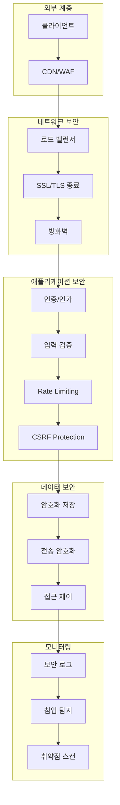

# 보안 가이드

애플리케이션의 보안 설정과 모범 사례를 설명합니다.

## 보안 아키텍처



## 인증 및 인가

### 1. JWT 기반 인증

```typescript
// lib/auth/jwt.ts
import jwt from 'jsonwebtoken';
import { NextRequest } from 'next/server';

const JWT_SECRET = process.env.JWT_SECRET!;
const JWT_EXPIRES_IN = '7d';
const REFRESH_TOKEN_EXPIRES_IN = '30d';

export interface TokenPayload {
  userId: string;
  email: string;
  role: 'user' | 'admin' | 'moderator';
}

export class JWTService {
  // Access Token 생성
  generateAccessToken(payload: TokenPayload): string {
    return jwt.sign(payload, JWT_SECRET, {
      expiresIn: JWT_EXPIRES_IN,
      issuer: 'n8n-frontend',
      audience: 'n8n-api',
    });
  }

  // Refresh Token 생성
  generateRefreshToken(userId: string): string {
    return jwt.sign({ userId, type: 'refresh' }, JWT_SECRET, {
      expiresIn: REFRESH_TOKEN_EXPIRES_IN,
      issuer: 'n8n-frontend',
    });
  }

  // Token 검증
  verifyToken(token: string): TokenPayload {
    try {
      const decoded = jwt.verify(token, JWT_SECRET, {
        issuer: 'n8n-frontend',
      }) as TokenPayload;

      return decoded;
    } catch (error: any) {
      if (error.name === 'TokenExpiredError') {
        throw new Error('TOKEN_EXPIRED');
      } else if (error.name === 'JsonWebTokenError') {
        throw new Error('INVALID_TOKEN');
      }

      throw error;
    }
  }

  // Request에서 Token 추출
  extractToken(request: NextRequest): string | null {
    const authHeader = request.headers.get('authorization');

    if (!authHeader || !authHeader.startsWith('Bearer ')) {
      return null;
    }

    return authHeader.substring(7);
  }

  // Token 갱신
  async refreshAccessToken(refreshToken: string): Promise<string> {
    try {
      const decoded = jwt.verify(refreshToken, JWT_SECRET) as {
        userId: string;
        type: string;
      };

      if (decoded.type !== 'refresh') {
        throw new Error('INVALID_TOKEN_TYPE');
      }

      // 데이터베이스에서 사용자 정보 조회
      const user = await db.users.findOne({ _id: decoded.userId });

      if (!user) {
        throw new Error('USER_NOT_FOUND');
      }

      // 새 Access Token 생성
      return this.generateAccessToken({
        userId: user._id,
        email: user.email,
        role: user.role,
      });
    } catch (error: any) {
      throw new Error('REFRESH_TOKEN_INVALID');
    }
  }
}

export const jwtService = new JWTService();
```

### 2. 인증 미들웨어

```typescript
// middleware/auth.ts
import { NextRequest, NextResponse } from 'next/server';
import { jwtService } from '@/lib/auth/jwt';

export async function authMiddleware(
  request: NextRequest,
  handler: (request: NextRequest, user: TokenPayload) => Promise<NextResponse>
) {
  try {
    // Token 추출
    const token = jwtService.extractToken(request);

    if (!token) {
      return NextResponse.json({ error: 'Authentication required' }, { status: 401 });
    }

    // Token 검증
    const user = jwtService.verifyToken(token);

    // 사용자 정보를 request에 추가
    return await handler(request, user);
  } catch (error: any) {
    if (error.message === 'TOKEN_EXPIRED') {
      return NextResponse.json({ error: 'Token expired', code: 'TOKEN_EXPIRED' }, { status: 401 });
    }

    return NextResponse.json({ error: 'Invalid token', code: 'INVALID_TOKEN' }, { status: 401 });
  }
}

// 역할 기반 인가
export function requireRole(allowedRoles: string[]) {
  return async (request: NextRequest, user: TokenPayload, handler: () => Promise<NextResponse>) => {
    if (!allowedRoles.includes(user.role)) {
      return NextResponse.json({ error: 'Insufficient permissions' }, { status: 403 });
    }

    return await handler();
  };
}
```

### 3. API 엔드포인트 보호

```typescript
// app/api/workflows/route.ts
import { NextRequest, NextResponse } from 'next/server';
import { authMiddleware, requireRole } from '@/middleware/auth';

export async function GET(request: NextRequest) {
  return authMiddleware(request, async (req, user) => {
    // 인증된 사용자만 접근 가능
    const workflows = await db.workflows.find({ userId: user.userId }).toArray();

    return NextResponse.json(workflows);
  });
}

export async function DELETE(request: NextRequest) {
  return authMiddleware(request, async (req, user) => {
    // 관리자만 삭제 가능
    return requireRole(['admin'])(req, user, async () => {
      const { id } = await request.json();

      await db.workflows.deleteOne({ _id: id });

      return NextResponse.json({ success: true });
    });
  });
}
```

## 입력 검증 및 살균

### 1. Zod 스키마 검증

```typescript
// lib/validation/schemas.ts
import { z } from 'zod';

// 사용자 등록 스키마
export const registerSchema = z.object({
  email: z.string().email('Invalid email format'),
  password: z
    .string()
    .min(8, 'Password must be at least 8 characters')
    .regex(/[A-Z]/, 'Password must contain uppercase letter')
    .regex(/[a-z]/, 'Password must contain lowercase letter')
    .regex(/[0-9]/, 'Password must contain number')
    .regex(/[^A-Za-z0-9]/, 'Password must contain special character'),
  name: z.string().min(2, 'Name must be at least 2 characters').max(100, 'Name too long'),
});

// 워크플로우 생성 스키마
export const createWorkflowSchema = z.object({
  name: z.string().min(1).max(200),
  description: z.string().max(1000).optional(),
  nodes: z.array(
    z.object({
      id: z.string(),
      type: z.string(),
      parameters: z.record(z.any()),
    })
  ),
  connections: z.record(z.any()),
  active: z.boolean().default(false),
});

// 쿼리 파라미터 스키마
export const paginationSchema = z.object({
  page: z.coerce.number().int().positive().default(1),
  limit: z.coerce.number().int().min(1).max(100).default(20),
  sortBy: z.string().optional(),
  order: z.enum(['asc', 'desc']).default('desc'),
});
```

### 2. 검증 미들웨어

```typescript
// middleware/validation.ts
import { NextRequest, NextResponse } from 'next/server';
import { ZodSchema } from 'zod';

export function validateBody(schema: ZodSchema) {
  return async (
    request: NextRequest,
    handler: (request: NextRequest, validatedData: any) => Promise<NextResponse>
  ) => {
    try {
      const body = await request.json();
      const validatedData = schema.parse(body);

      return await handler(request, validatedData);
    } catch (error: any) {
      if (error.name === 'ZodError') {
        return NextResponse.json(
          {
            error: 'Validation failed',
            details: error.errors.map((err: any) => ({
              path: err.path.join('.'),
              message: err.message,
            })),
          },
          { status: 400 }
        );
      }

      return NextResponse.json({ error: 'Invalid request body' }, { status: 400 });
    }
  };
}

export function validateQuery(schema: ZodSchema) {
  return async (
    request: NextRequest,
    handler: (request: NextRequest, validatedData: any) => Promise<NextResponse>
  ) => {
    try {
      const url = new URL(request.url);
      const params = Object.fromEntries(url.searchParams);
      const validatedData = schema.parse(params);

      return await handler(request, validatedData);
    } catch (error: any) {
      if (error.name === 'ZodError') {
        return NextResponse.json(
          {
            error: 'Invalid query parameters',
            details: error.errors,
          },
          { status: 400 }
        );
      }

      return NextResponse.json({ error: 'Invalid query parameters' }, { status: 400 });
    }
  };
}
```

### 3. XSS 방지

```typescript
// lib/security/xss.ts
import DOMPurify from 'isomorphic-dompurify';

export class XSSProtection {
  // HTML 살균
  sanitizeHTML(html: string): string {
    return DOMPurify.sanitize(html, {
      ALLOWED_TAGS: ['b', 'i', 'em', 'strong', 'a', 'p', 'br'],
      ALLOWED_ATTR: ['href', 'title'],
    });
  }

  // 사용자 입력 살균
  sanitizeInput(input: string): string {
    return input
      .replace(/</g, '&lt;')
      .replace(/>/g, '&gt;')
      .replace(/"/g, '&quot;')
      .replace(/'/g, '&#x27;')
      .replace(/\//g, '&#x2F;');
  }

  // SQL Injection 방지 (NoSQL도 유사)
  sanitizeQuery(query: string): string {
    // MongoDB Injection 방지
    const dangerous = ['$where', '$ne', '$gt', '$lt', '$regex'];

    let sanitized = query;

    dangerous.forEach((keyword) => {
      sanitized = sanitized.replace(new RegExp(keyword, 'gi'), '');
    });

    return sanitized;
  }
}

export const xssProtection = new XSSProtection();
```

## CSRF 보호

### 1. CSRF Token 생성

```typescript
// lib/security/csrf.ts
import crypto from 'crypto';
import { NextRequest, NextResponse } from 'next/server';

export class CSRFProtection {
  private secret: string;

  constructor() {
    this.secret = process.env.CSRF_SECRET || crypto.randomBytes(32).toString('hex');
  }

  // Token 생성
  generateToken(sessionId: string): string {
    const timestamp = Date.now().toString();
    const data = `${sessionId}:${timestamp}`;

    const hmac = crypto.createHmac('sha256', this.secret);
    hmac.update(data);

    const hash = hmac.digest('hex');

    return `${timestamp}.${hash}`;
  }

  // Token 검증
  verifyToken(token: string, sessionId: string): boolean {
    try {
      const [timestamp, hash] = token.split('.');

      // 토큰 만료 확인 (1시간)
      const tokenAge = Date.now() - parseInt(timestamp);
      if (tokenAge > 60 * 60 * 1000) {
        return false;
      }

      // HMAC 검증
      const data = `${sessionId}:${timestamp}`;
      const hmac = crypto.createHmac('sha256', this.secret);
      hmac.update(data);

      const expectedHash = hmac.digest('hex');

      return crypto.timingSafeEqual(Buffer.from(hash), Buffer.from(expectedHash));
    } catch {
      return false;
    }
  }
}

export const csrfProtection = new CSRFProtection();

// CSRF 미들웨어
export async function csrfMiddleware(request: NextRequest, handler: () => Promise<NextResponse>) {
  // GET, HEAD, OPTIONS는 CSRF 검증 제외
  if (['GET', 'HEAD', 'OPTIONS'].includes(request.method)) {
    return await handler();
  }

  const csrfToken = request.headers.get('X-CSRF-Token');
  const sessionId = request.cookies.get('sessionId')?.value;

  if (!csrfToken || !sessionId) {
    return NextResponse.json({ error: 'CSRF token missing' }, { status: 403 });
  }

  if (!csrfProtection.verifyToken(csrfToken, sessionId)) {
    return NextResponse.json({ error: 'Invalid CSRF token' }, { status: 403 });
  }

  return await handler();
}
```

## Rate Limiting

### 1. Redis 기반 Rate Limiter

```typescript
// lib/security/rate-limiter.ts
import Redis from 'ioredis';

const redis = new Redis(process.env.REDIS_URL!);

export interface RateLimitConfig {
  windowMs: number; // 시간 윈도우 (밀리초)
  max: number; // 최대 요청 수
  keyPrefix?: string;
}

export class RateLimiter {
  private config: RateLimitConfig;

  constructor(config: RateLimitConfig) {
    this.config = {
      keyPrefix: 'ratelimit',
      ...config,
    };
  }

  async check(identifier: string): Promise<{
    success: boolean;
    remaining: number;
    resetAt: Date;
  }> {
    const key = `${this.config.keyPrefix}:${identifier}`;
    const now = Date.now();
    const windowStart = now - this.config.windowMs;

    // Sliding Window 알고리즘
    const pipeline = redis.pipeline();

    // 오래된 요청 제거
    pipeline.zremrangebyscore(key, '-inf', windowStart);

    // 현재 요청 추가
    pipeline.zadd(key, now, `${now}`);

    // 현재 윈도우 내 요청 수 카운트
    pipeline.zcount(key, windowStart, '+inf');

    // 키 만료 시간 설정
    pipeline.expire(key, Math.ceil(this.config.windowMs / 1000));

    const results = await pipeline.exec();

    const count = results?.[2]?.[1] as number;

    const remaining = Math.max(0, this.config.max - count);
    const resetAt = new Date(now + this.config.windowMs);

    return {
      success: count <= this.config.max,
      remaining,
      resetAt,
    };
  }
}

// IP 기반 Rate Limiter
export const ipRateLimiter = new RateLimiter({
  windowMs: 60 * 1000, // 1분
  max: 60, // 분당 60회
  keyPrefix: 'ratelimit:ip',
});

// API 키 기반 Rate Limiter
export const apiKeyRateLimiter = new RateLimiter({
  windowMs: 60 * 1000, // 1분
  max: 300, // 분당 300회
  keyPrefix: 'ratelimit:apikey',
});

// 로그인 시도 Rate Limiter
export const loginRateLimiter = new RateLimiter({
  windowMs: 15 * 60 * 1000, // 15분
  max: 5, // 15분에 5회
  keyPrefix: 'ratelimit:login',
});
```

### 2. Rate Limiting 미들웨어

```typescript
// middleware/rate-limit.ts
import { NextRequest, NextResponse } from 'next/server';
import { ipRateLimiter } from '@/lib/security/rate-limiter';

export async function rateLimitMiddleware(
  request: NextRequest,
  handler: () => Promise<NextResponse>
) {
  // 클라이언트 IP 추출
  const ip =
    request.headers.get('x-forwarded-for') || request.headers.get('x-real-ip') || 'unknown';

  const result = await ipRateLimiter.check(ip);

  if (!result.success) {
    return NextResponse.json(
      {
        error: 'Too many requests',
        retryAfter: result.resetAt.toISOString(),
      },
      {
        status: 429,
        headers: {
          'X-RateLimit-Limit': ipRateLimiter.config.max.toString(),
          'X-RateLimit-Remaining': result.remaining.toString(),
          'X-RateLimit-Reset': result.resetAt.toISOString(),
          'Retry-After': Math.ceil((result.resetAt.getTime() - Date.now()) / 1000).toString(),
        },
      }
    );
  }

  const response = await handler();

  // Rate limit 헤더 추가
  response.headers.set('X-RateLimit-Limit', ipRateLimiter.config.max.toString());
  response.headers.set('X-RateLimit-Remaining', result.remaining.toString());
  response.headers.set('X-RateLimit-Reset', result.resetAt.toISOString());

  return response;
}
```

## 데이터 암호화

### 1. 암호화 서비스

```typescript
// lib/security/encryption.ts
import crypto from 'crypto';

const ENCRYPTION_KEY = process.env.ENCRYPTION_KEY!; // 32 bytes
const ALGORITHM = 'aes-256-gcm';

export class EncryptionService {
  // 데이터 암호화
  encrypt(text: string): string {
    const iv = crypto.randomBytes(16);
    const key = Buffer.from(ENCRYPTION_KEY, 'hex');

    const cipher = crypto.createCipheriv(ALGORITHM, key, iv);

    let encrypted = cipher.update(text, 'utf8', 'hex');
    encrypted += cipher.final('hex');

    const authTag = cipher.getAuthTag();

    // IV + AuthTag + 암호문
    return `${iv.toString('hex')}:${authTag.toString('hex')}:${encrypted}`;
  }

  // 데이터 복호화
  decrypt(encryptedData: string): string {
    const [ivHex, authTagHex, encrypted] = encryptedData.split(':');

    const iv = Buffer.from(ivHex, 'hex');
    const authTag = Buffer.from(authTagHex, 'hex');
    const key = Buffer.from(ENCRYPTION_KEY, 'hex');

    const decipher = crypto.createDecipheriv(ALGORITHM, key, iv);
    decipher.setAuthTag(authTag);

    let decrypted = decipher.update(encrypted, 'hex', 'utf8');
    decrypted += decipher.final('utf8');

    return decrypted;
  }

  // 비밀번호 해싱 (bcrypt 사용)
  async hashPassword(password: string): Promise<string> {
    const bcrypt = await import('bcrypt');
    return bcrypt.hash(password, 12);
  }

  // 비밀번호 검증
  async verifyPassword(password: string, hash: string): Promise<boolean> {
    const bcrypt = await import('bcrypt');
    return bcrypt.compare(password, hash);
  }

  // HMAC 서명 생성
  createSignature(data: string, secret: string): string {
    const hmac = crypto.createHmac('sha256', secret);
    hmac.update(data);
    return hmac.digest('hex');
  }

  // HMAC 서명 검증
  verifySignature(data: string, signature: string, secret: string): boolean {
    const expectedSignature = this.createSignature(data, secret);

    return crypto.timingSafeEqual(Buffer.from(signature), Buffer.from(expectedSignature));
  }
}

export const encryption = new EncryptionService();
```

### 2. 민감 데이터 보호

```typescript
// lib/security/sensitive-data.ts
import { encryption } from './encryption';

export class SensitiveDataProtection {
  // 크레덴셜 저장
  async storeCredential(
    userId: string,
    data: {
      name: string;
      type: string;
      data: Record<string, any>;
    }
  ) {
    // 민감한 데이터 암호화
    const encryptedData = encryption.encrypt(JSON.stringify(data.data));

    await db.credentials.insertOne({
      userId,
      name: data.name,
      type: data.type,
      data: encryptedData,
      createdAt: new Date(),
    });
  }

  // 크레덴셜 조회
  async getCredential(credentialId: string, userId: string) {
    const credential = await db.credentials.findOne({
      _id: credentialId,
      userId,
    });

    if (!credential) {
      throw new Error('Credential not found');
    }

    // 복호화
    const decryptedData = encryption.decrypt(credential.data);

    return {
      ...credential,
      data: JSON.parse(decryptedData),
    };
  }

  // PII 마스킹
  maskEmail(email: string): string {
    const [local, domain] = email.split('@');
    const maskedLocal = local.charAt(0) + '***' + local.charAt(local.length - 1);
    return `${maskedLocal}@${domain}`;
  }

  maskPhoneNumber(phone: string): string {
    return phone.replace(/(\d{3})\d{4}(\d{4})/, '$1****$2');
  }

  maskCreditCard(cardNumber: string): string {
    return cardNumber.replace(/\d{12}(\d{4})/, '************$1');
  }
}

export const sensitiveData = new SensitiveDataProtection();
```

## 보안 헤더

### 1. Next.js 보안 헤더 설정

```typescript
// next.config.js
module.exports = {
  async headers() {
    return [
      {
        source: '/(.*)',
        headers: [
          // XSS 보호
          {
            key: 'X-XSS-Protection',
            value: '1; mode=block',
          },
          // Clickjacking 방지
          {
            key: 'X-Frame-Options',
            value: 'DENY',
          },
          // MIME 타입 스니핑 방지
          {
            key: 'X-Content-Type-Options',
            value: 'nosniff',
          },
          // Referrer 정책
          {
            key: 'Referrer-Policy',
            value: 'strict-origin-when-cross-origin',
          },
          // HSTS (HTTPS 강제)
          {
            key: 'Strict-Transport-Security',
            value: 'max-age=31536000; includeSubDomains; preload',
          },
          // CSP (Content Security Policy)
          {
            key: 'Content-Security-Policy',
            value: [
              "default-src 'self'",
              "script-src 'self' 'unsafe-inline' 'unsafe-eval'",
              "style-src 'self' 'unsafe-inline'",
              "img-src 'self' data: https:",
              "font-src 'self' data:",
              "connect-src 'self' https://n8n.example.com",
              "frame-ancestors 'none'",
            ].join('; '),
          },
          // Permissions Policy
          {
            key: 'Permissions-Policy',
            value: 'camera=(), microphone=(), geolocation=()',
          },
        ],
      },
    ];
  },
};
```

### 2. CORS 설정

```typescript
// middleware/cors.ts
import { NextRequest, NextResponse } from 'next/server';

const ALLOWED_ORIGINS = process.env.ALLOWED_ORIGINS?.split(',') || [
  'http://localhost:3000',
  'https://app.example.com',
];

export async function corsMiddleware(request: NextRequest, handler: () => Promise<NextResponse>) {
  const origin = request.headers.get('origin');

  // Preflight 요청 처리
  if (request.method === 'OPTIONS') {
    return new NextResponse(null, {
      status: 204,
      headers: {
        'Access-Control-Allow-Origin':
          origin && ALLOWED_ORIGINS.includes(origin) ? origin : ALLOWED_ORIGINS[0],
        'Access-Control-Allow-Methods': 'GET, POST, PUT, DELETE, OPTIONS',
        'Access-Control-Allow-Headers': 'Content-Type, Authorization, X-CSRF-Token',
        'Access-Control-Max-Age': '86400',
        'Access-Control-Allow-Credentials': 'true',
      },
    });
  }

  const response = await handler();

  // CORS 헤더 추가
  if (origin && ALLOWED_ORIGINS.includes(origin)) {
    response.headers.set('Access-Control-Allow-Origin', origin);
    response.headers.set('Access-Control-Allow-Credentials', 'true');
  }

  return response;
}
```

## 감사 로깅

### 1. 감사 로그 시스템

```typescript
// lib/security/audit-log.ts
import { db } from '@/lib/db';

export interface AuditLogEntry {
  userId?: string;
  action: string;
  resource: string;
  resourceId?: string;
  changes?: Record<string, any>;
  ipAddress?: string;
  userAgent?: string;
  timestamp: Date;
  status: 'success' | 'failure';
  errorMessage?: string;
}

export class AuditLogger {
  async log(entry: Omit<AuditLogEntry, 'timestamp'>) {
    await db.auditLogs.insertOne({
      ...entry,
      timestamp: new Date(),
    });
  }

  // 사용자 활동 로그
  async logUserAction(
    userId: string,
    action: string,
    resource: string,
    metadata?: Record<string, any>
  ) {
    await this.log({
      userId,
      action,
      resource,
      status: 'success',
      ...metadata,
    });
  }

  // 보안 이벤트 로그
  async logSecurityEvent(
    event: string,
    details: Record<string, any>,
    severity: 'low' | 'medium' | 'high' | 'critical'
  ) {
    await this.log({
      action: 'security_event',
      resource: event,
      changes: details,
      status: 'success',
    });

    // Critical 이벤트는 즉시 알림
    if (severity === 'critical') {
      await this.sendSecurityAlert(event, details);
    }
  }

  // 감사 로그 조회
  async getAuditLogs(filters: {
    userId?: string;
    action?: string;
    startDate?: Date;
    endDate?: Date;
    limit?: number;
  }) {
    const query: any = {};

    if (filters.userId) query.userId = filters.userId;
    if (filters.action) query.action = filters.action;

    if (filters.startDate || filters.endDate) {
      query.timestamp = {};
      if (filters.startDate) query.timestamp.$gte = filters.startDate;
      if (filters.endDate) query.timestamp.$lte = filters.endDate;
    }

    return db.auditLogs
      .find(query)
      .sort({ timestamp: -1 })
      .limit(filters.limit || 100)
      .toArray();
  }

  private async sendSecurityAlert(event: string, details: Record<string, any>) {
    // Slack, Email 등으로 알림 전송
    console.error('🚨 CRITICAL SECURITY EVENT:', event, details);
  }
}

export const auditLogger = new AuditLogger();
```

### 2. 감사 미들웨어

```typescript
// middleware/audit.ts
import { NextRequest, NextResponse } from 'next/server';
import { auditLogger } from '@/lib/security/audit-log';

export async function auditMiddleware(
  request: NextRequest,
  user: TokenPayload,
  action: string,
  resource: string,
  handler: () => Promise<NextResponse>
) {
  const startTime = Date.now();

  try {
    const response = await handler();

    // 성공 로그
    await auditLogger.logUserAction(user.userId, action, resource, {
      ipAddress: request.headers.get('x-forwarded-for'),
      userAgent: request.headers.get('user-agent'),
      duration: Date.now() - startTime,
      statusCode: response.status,
    });

    return response;
  } catch (error: any) {
    // 실패 로그
    await auditLogger.log({
      userId: user.userId,
      action,
      resource,
      status: 'failure',
      errorMessage: error.message,
      ipAddress: request.headers.get('x-forwarded-for'),
      userAgent: request.headers.get('user-agent'),
    });

    throw error;
  }
}
```

## 취약점 스캔

### 1. 의존성 스캔

```bash
# npm audit
npm audit

# 취약점 자동 수정
npm audit fix

# 상세 보고서
npm audit --json > audit-report.json

# Snyk 사용
npx snyk test
npx snyk monitor
```

### 2. SAST (Static Application Security Testing)

```bash
# ESLint Security 플러그인
npm install --save-dev eslint-plugin-security

# .eslintrc.js
module.exports = {
  plugins: ['security'],
  extends: ['plugin:security/recommended'],
  rules: {
    'security/detect-object-injection': 'error',
    'security/detect-non-literal-regexp': 'warn',
    'security/detect-unsafe-regex': 'error',
  },
};

# SonarQube
docker run -d --name sonarqube -p 9000:9000 sonarqube:latest
npx sonar-scanner
```

### 3. DAST (Dynamic Application Security Testing)

```bash
# OWASP ZAP
docker run -t owasp/zap2docker-stable zap-baseline.py \
  -t https://app.example.com \
  -r zap-report.html

# Burp Suite
# GUI 기반 수동 테스트
```

## 보안 체크리스트

### 배포 전 체크리스트

- [ ] 모든 환경 변수를 `.env`에서 관리
- [ ] 프로덕션에서 `console.log` 제거
- [ ] API 키가 코드에 하드코딩되지 않았는지 확인
- [ ] SSL/TLS 인증서 설정
- [ ] HTTPS 강제 리디렉션 설정
- [ ] 보안 헤더 모두 설정
- [ ] CORS 설정 검증
- [ ] Rate limiting 활성화
- [ ] 입력 검증 모든 엔드포인트에 적용
- [ ] CSRF 보호 활성화

### 인증/인가

- [ ] 강력한 비밀번호 정책
- [ ] JWT 만료 시간 설정
- [ ] Refresh token 구현
- [ ] 다단계 인증 (MFA) 고려
- [ ] 세션 타임아웃 설정
- [ ] 비활성 계정 자동 로그아웃

### 데이터 보호

- [ ] 민감한 데이터 암호화
- [ ] 데이터베이스 연결 암호화
- [ ] 백업 데이터 암호화
- [ ] PII 마스킹 적용
- [ ] 로그에 민감 정보 제외

### 모니터링

- [ ] 감사 로그 활성화
- [ ] 보안 이벤트 알림 설정
- [ ] 취약점 스캔 자동화
- [ ] 침입 탐지 시스템 구축
- [ ] 정기적 보안 검토

## 보안 사고 대응

### 1. 사고 대응 절차

```markdown
## 보안 사고 대응 프로세스

### Phase 1: 탐지 및 분석 (0-30분)

1. 보안 이벤트 확인
2. 영향 범위 파악
3. 사고 심각도 평가
4. 관련 팀에 알림

### Phase 2: 격리 (30-60분)

1. 영향받은 시스템 격리
2. 악의적 트래픽 차단
3. 계정 잠금/비활성화
4. 추가 피해 방지

### Phase 3: 제거 (1-4시간)

1. 악성 코드 제거
2. 취약점 패치
3. 시스템 복구
4. 보안 강화

### Phase 4: 복구 (4-24시간)

1. 시스템 재시작
2. 서비스 복원
3. 모니터링 강화
4. 사용자 통지

### Phase 5: 사후 분석

1. 근본 원인 분석
2. 대응 절차 검토
3. 보안 개선 계획
4. 문서화 및 공유
```

### 2. 비상 연락망

```typescript
export const securityContacts = {
  ciso: {
    name: 'Chief Information Security Officer',
    email: 'ciso@example.com',
    phone: '+82-10-XXXX-XXXX',
  },

  securityTeam: {
    email: 'security@example.com',
    slack: '#security-incidents',
    oncall: 'https://example.pagerduty.com/security',
  },

  external: {
    certKr: {
      name: 'KR-CERT',
      phone: '118',
      email: 'cert@krcert.or.kr',
    },
  },
};
```

## 다음 단계

1. [모니터링](./monitoring) - 보안 모니터링
2. [백업 및 복구](./backup-recovery) - 데이터 보호
3. [트러블슈팅](./troubleshooting) - 보안 문제 해결

## 참고 자료

- [OWASP Top 10](https://owasp.org/www-project-top-ten/)
- [OWASP API Security](https://owasp.org/www-project-api-security/)
- [Next.js Security](https://nextjs.org/docs/advanced-features/security-headers)
- [MongoDB Security](https://docs.mongodb.com/manual/security/)
- [Node.js Security Best Practices](https://nodejs.org/en/docs/guides/security/)
