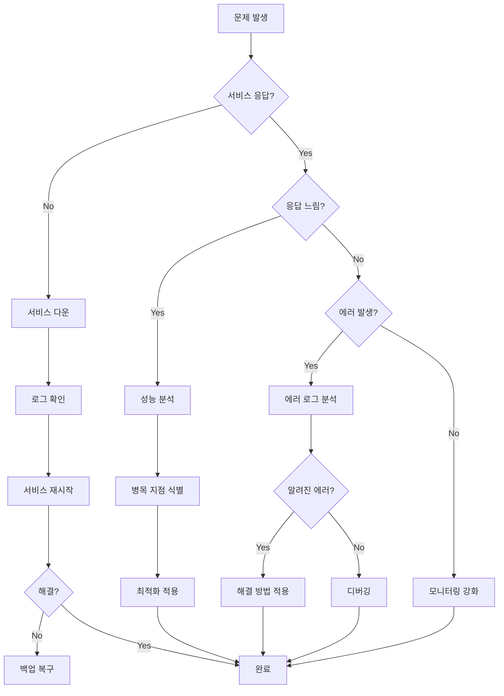

# 트러블슈팅 가이드

일반적인 문제와 해결 방법을 설명합니다.

## 진단 도구

### 1. 헬스체크 스크립트

```bash
#!/bin/bash
# scripts/health-check.sh

echo "=== System Health Check ==="
echo ""

# 1. 서비스 상태 확인
echo "1. Checking Services..."
services=("mongodb" "redis" "n8n")

for service in "${services[@]}"; do
  if systemctl is-active --quiet $service; then
    echo "✅ $service is running"
  else
    echo "❌ $service is not running"
  fi
done
echo ""

# 2. 포트 확인
echo "2. Checking Ports..."
ports=(3000 27017 6379 5678)

for port in "${ports[@]}"; do
  if lsof -Pi :$port -sTCP:LISTEN -t >/dev/null; then
    echo "✅ Port $port is open"
  else
    echo "❌ Port $port is not listening"
  fi
done
echo ""

# 3. 디스크 공간 확인
echo "3. Checking Disk Space..."
df -h | grep -E '^Filesystem|/$'
echo ""

# 4. 메모리 사용량 확인
echo "4. Checking Memory..."
free -h
echo ""

# 5. CPU 부하 확인
echo "5. Checking CPU Load..."
uptime
echo ""

# 6. 네트워크 연결 확인
echo "6. Checking Network..."
if ping -c 1 google.com &> /dev/null; then
  echo "✅ Internet connection OK"
else
  echo "❌ No internet connection"
fi
echo ""

# 7. 애플리케이션 헬스체크
echo "7. Checking Application Health..."
response=$(curl -s -o /dev/null -w "%{http_code}" http://localhost:3000/api/health)

if [ "$response" = "200" ]; then
  echo "✅ Application is healthy"
else
  echo "❌ Application health check failed (HTTP $response)"
fi
```

### 2. 로그 분석 스크립트

```bash
#!/bin/bash
# scripts/analyze-logs.sh

LOG_FILE="${1:-/var/log/app/combined.log}"
TIME_RANGE="${2:-1h}"

echo "=== Log Analysis for last $TIME_RANGE ==="
echo ""

# 에러 카운트
echo "1. Error Count:"
grep -i "error" "$LOG_FILE" | wc -l
echo ""

# 가장 많은 에러 타입
echo "2. Top Error Types:"
grep -i "error" "$LOG_FILE" | \
  grep -oP '"error_code":"[^"]*"' | \
  sort | uniq -c | sort -rn | head -10
echo ""

# 느린 쿼리
echo "3. Slow Queries (>1000ms):"
grep "duration" "$LOG_FILE" | \
  awk '$0 ~ /duration":[0-9]+/ {
    match($0, /duration":([0-9]+)/, arr);
    if (arr[1] > 1000) print
  }' | head -10
echo ""

# HTTP 상태 코드 분포
echo "4. HTTP Status Code Distribution:"
grep "statusCode" "$LOG_FILE" | \
  grep -oP '"statusCode":[0-9]+' | \
  sort | uniq -c | sort -rn
echo ""

# 가장 많이 호출된 엔드포인트
echo "5. Most Called Endpoints:"
grep "url" "$LOG_FILE" | \
  grep -oP '"url":"[^"]*"' | \
  sort | uniq -c | sort -rn | head -10
```

## 일반적인 문제

### 1. 애플리케이션이 시작되지 않음

#### 증상
```bash
$ npm start
Error: Cannot find module 'next'
```

#### 원인
- 의존성 패키지가 설치되지 않음
- node_modules 손상

#### 해결 방법

```bash
# 1. node_modules 삭제
rm -rf node_modules

# 2. package-lock.json 삭제 (선택사항)
rm package-lock.json

# 3. 의존성 재설치
npm install

# 4. 캐시 정리
npm cache clean --force

# 5. 재시작
npm start
```

### 2. 포트가 이미 사용 중

#### 증상
```
Error: listen EADDRINUSE: address already in use :::3000
```

#### 해결 방법

```bash
# 1. 포트를 사용하는 프로세스 찾기
lsof -i :3000

# 2. 프로세스 종료
kill -9 <PID>

# 또는 자동으로 찾아서 종료
lsof -ti:3000 | xargs kill -9

# 3. 다른 포트 사용
PORT=3001 npm start
```

### 3. MongoDB 연결 실패

#### 증상
```typescript
MongoServerError: bad auth : Authentication failed
```

#### 진단

```typescript
// scripts/diagnose-mongodb.ts
import { MongoClient } from 'mongodb';

async function diagnoseMongoConnection() {
  const uri = process.env.MONGODB_URI!;

  console.log('Testing MongoDB connection...');
  console.log('URI:', uri.replace(/\/\/([^:]+):([^@]+)@/, '//$1:****@'));

  try {
    const client = new MongoClient(uri, {
      serverSelectionTimeoutMS: 5000,
    });

    await client.connect();

    console.log('✅ Connection successful');

    // 데이터베이스 목록
    const adminDb = client.db().admin();
    const dbs = await adminDb.listDatabases();

    console.log('\nAvailable databases:');
    dbs.databases.forEach((db) => {
      console.log(`  - ${db.name}`);
    });

    // 연결 정보
    const serverStatus = await adminDb.serverStatus();
    console.log('\nServer info:');
    console.log(`  Version: ${serverStatus.version}`);
    console.log(`  Uptime: ${serverStatus.uptime}s`);

    await client.close();
  } catch (error: any) {
    console.error('❌ Connection failed');
    console.error('Error:', error.message);

    // 일반적인 원인 제안
    console.log('\n💡 Possible causes:');

    if (error.message.includes('Authentication failed')) {
      console.log('  - Incorrect username or password');
      console.log('  - User does not have required permissions');
      console.log('  - Wrong authentication database');
    } else if (error.message.includes('ECONNREFUSED')) {
      console.log('  - MongoDB is not running');
      console.log('  - Wrong host or port');
      console.log('  - Firewall blocking connection');
    } else if (error.message.includes('Server selection timed out')) {
      console.log('  - Network connectivity issues');
      console.log('  - MongoDB replica set not initialized');
      console.log('  - Wrong connection string format');
    }
  }
}

diagnoseMongoConnection();
```

#### 해결 방법

```bash
# 1. MongoDB 서비스 상태 확인
systemctl status mongodb

# 2. MongoDB 재시작
systemctl restart mongodb

# 3. MongoDB 로그 확인
tail -f /var/log/mongodb/mongod.log

# 4. 연결 문자열 검증
echo $MONGODB_URI

# 5. 방화벽 확인
sudo ufw status

# 6. 포트 확인
netstat -tulpn | grep 27017
```

### 4. Redis 연결 문제

#### 증상
```
Error: connect ECONNREFUSED 127.0.0.1:6379
```

#### 진단 스크립트

```typescript
// scripts/diagnose-redis.ts
import Redis from 'ioredis';

async function diagnoseRedisConnection() {
  const url = process.env.REDIS_URL || 'redis://localhost:6379';

  console.log('Testing Redis connection...');
  console.log('URL:', url);

  const redis = new Redis(url, {
    retryStrategy: (times) => {
      console.log(`Retry attempt ${times}`);
      if (times > 3) {
        return null; // 3번 시도 후 중단
      }
      return Math.min(times * 100, 3000);
    },
  });

  redis.on('connect', () => {
    console.log('✅ Connected to Redis');
  });

  redis.on('ready', async () => {
    console.log('✅ Redis is ready');

    // Redis 정보 조회
    const info = await redis.info();
    const lines = info.split('\r\n');

    console.log('\nRedis info:');
    lines.forEach((line) => {
      if (line.startsWith('redis_version:')) {
        console.log(`  Version: ${line.split(':')[1]}`);
      } else if (line.startsWith('uptime_in_seconds:')) {
        console.log(`  Uptime: ${line.split(':')[1]}s`);
      } else if (line.startsWith('connected_clients:')) {
        console.log(`  Connected clients: ${line.split(':')[1]}`);
      } else if (line.startsWith('used_memory_human:')) {
        console.log(`  Memory: ${line.split(':')[1]}`);
      }
    });

    // 연결 테스트
    await redis.set('test_key', 'test_value');
    const value = await redis.get('test_key');
    console.log(`\nTest write/read: ${value === 'test_value' ? '✅ OK' : '❌ Failed'}`);

    redis.disconnect();
  });

  redis.on('error', (error) => {
    console.error('❌ Redis connection error:', error.message);

    console.log('\n💡 Possible causes:');
    if (error.message.includes('ECONNREFUSED')) {
      console.log('  - Redis is not running');
      console.log('  - Wrong host or port');
    } else if (error.message.includes('NOAUTH')) {
      console.log('  - Redis requires authentication');
      console.log('  - Check REDIS_PASSWORD');
    } else if (error.message.includes('WRONGPASS')) {
      console.log('  - Incorrect Redis password');
    }
  });
}

diagnoseRedisConnection();
```

#### 해결 방법

```bash
# 1. Redis 서비스 확인
systemctl status redis

# 2. Redis 재시작
systemctl restart redis

# 3. Redis CLI로 연결 테스트
redis-cli ping
# 응답: PONG

# 4. Redis 로그 확인
tail -f /var/log/redis/redis-server.log

# 5. Redis 설정 확인
redis-cli config get bind
redis-cli config get requirepass
```

### 5. n8n 워크플로우 실행 실패

#### 증상
- 워크플로우가 "error" 상태로 종료
- 특정 노드에서 실패

#### 진단

```typescript
// scripts/diagnose-workflow.ts
import { n8nClient } from '@/lib/n8n/client';

async function diagnoseWorkflow(workflowId: string) {
  console.log(`Diagnosing workflow: ${workflowId}`);

  try {
    // 워크플로우 정보
    const workflow = await n8nClient.getWorkflow(workflowId);
    console.log(`\nWorkflow: ${workflow.name}`);
    console.log(`Status: ${workflow.active ? 'Active' : 'Inactive'}`);
    console.log(`Nodes: ${workflow.nodes.length}`);

    // 최근 실행 이력
    const executions = await n8nClient.getExecutions({
      workflowId,
      limit: 10,
    });

    console.log(`\nRecent executions: ${executions.length}`);

    const stats = {
      success: 0,
      error: 0,
      waiting: 0,
    };

    executions.forEach((ex) => {
      stats[ex.status as keyof typeof stats]++;
    });

    console.log(`  Success: ${stats.success}`);
    console.log(`  Error: ${stats.error}`);
    console.log(`  Waiting: ${stats.waiting}`);

    // 가장 최근 에러 분석
    const lastError = executions.find((ex) => ex.status === 'error');

    if (lastError) {
      console.log('\n❌ Last error execution:');
      console.log(`  ID: ${lastError.id}`);
      console.log(`  Started: ${lastError.startedAt}`);

      const errorDetails = await n8nClient.getExecution(lastError.id);

      // 실패한 노드 찾기
      const failedNode = errorDetails.data.resultData.runData
        ? Object.entries(errorDetails.data.resultData.runData).find(
            ([_, data]: any) => data[0]?.error
          )
        : null;

      if (failedNode) {
        const [nodeName, nodeData]: any = failedNode;
        console.log(`  Failed node: ${nodeName}`);
        console.log(`  Error: ${nodeData[0].error.message}`);
      }
    }

    // 워크플로우 검증
    console.log('\n🔍 Workflow validation:');

    // 필수 크레덴셜 확인
    const nodesWithCreds = workflow.nodes.filter(
      (node) => node.credentials && Object.keys(node.credentials).length > 0
    );

    console.log(`  Nodes with credentials: ${nodesWithCreds.length}`);

    // 연결 검증
    const connections = workflow.connections;
    const allNodes = workflow.nodes.map((n) => n.name);

    workflow.nodes.forEach((node) => {
      const hasOutput = connections[node.name]?.main?.[0]?.length > 0;
      const hasInput = Object.values(connections).some((conn: any) =>
        conn.main?.[0]?.some((c: any) => c.node === node.name)
      );

      if (node.type.includes('Trigger') && hasInput) {
        console.log(`  ⚠️  Trigger node "${node.name}" has input connection`);
      }

      if (!node.type.includes('Trigger') && !hasInput && !hasOutput) {
        console.log(`  ⚠️  Node "${node.name}" is isolated (no connections)`);
      }
    });
  } catch (error: any) {
    console.error('Failed to diagnose workflow:', error.message);
  }
}

// 사용
diagnoseWorkflow('workflow-id');
```

#### 해결 방법

```typescript
// 일반적인 워크플로우 에러 해결
export const workflowTroubleshooting = {
  'CREDENTIAL_NOT_FOUND': {
    cause: '워크플로우에 필요한 크레덴셜이 없음',
    solution: 'n8n UI에서 크레덴셜 추가 및 노드에 연결',
  },

  'NODE_EXECUTION_ERROR': {
    cause: '노드 실행 중 에러 발생',
    solution: [
      '노드 설정 검증',
      '입력 데이터 형식 확인',
      '외부 API 응답 확인',
      '재시도 로직 추가',
    ],
  },

  'WORKFLOW_ACTIVATION_ERROR': {
    cause: '워크플로우 활성화 실패',
    solution: [
      '트리거 노드 설정 확인',
      'Webhook URL 중복 확인',
      'n8n 서버 재시작',
    ],
  },

  'TIMEOUT_ERROR': {
    cause: '노드 실행 시간 초과',
    solution: [
      '타임아웃 설정 증가',
      '데이터 배치 크기 감소',
      '병렬 실행 제한',
    ],
  },
};
```

### 6. 메모리 부족 (Out of Memory)

#### 증상
```
FATAL ERROR: Reached heap limit Allocation failed - JavaScript heap out of memory
```

#### 진단

```bash
# 현재 메모리 사용량
node -e "console.log(v8.getHeapStatistics())"

# 프로세스 메모리 모니터링
ps aux | grep node

# 메모리 프로파일링 (개발 환경)
node --inspect --max-old-space-size=4096 server.js
```

#### 해결 방법

```bash
# 1. Node.js 힙 크기 증가
export NODE_OPTIONS="--max-old-space-size=4096"
npm start

# 2. package.json 수정
{
  "scripts": {
    "start": "NODE_OPTIONS='--max-old-space-size=4096' next start"
  }
}

# 3. PM2로 재시작 제한 설정
pm2 start npm --name "app" -- start --max-memory-restart 2G

# 4. Docker 메모리 제한 증가
docker run -m 4g your-image
```

#### 메모리 누수 탐지

```typescript
// scripts/detect-memory-leak.ts
import v8 from 'v8';
import { writeFileSync } from 'fs';

export class MemoryLeakDetector {
  private snapshots: any[] = [];

  takeSnapshot(label: string) {
    const heapSnapshot = v8.writeHeapSnapshot();

    this.snapshots.push({
      label,
      timestamp: new Date(),
      heapUsed: process.memoryUsage().heapUsed,
      snapshotFile: heapSnapshot,
    });

    console.log(`Snapshot taken: ${label}`);
    console.log(`Heap used: ${(process.memoryUsage().heapUsed / 1024 / 1024).toFixed(2)} MB`);
  }

  analyze() {
    if (this.snapshots.length < 2) {
      console.log('Need at least 2 snapshots to analyze');
      return;
    }

    console.log('\n=== Memory Leak Analysis ===');

    for (let i = 1; i < this.snapshots.length; i++) {
      const prev = this.snapshots[i - 1];
      const curr = this.snapshots[i];

      const diff = curr.heapUsed - prev.heapUsed;
      const diffMB = (diff / 1024 / 1024).toFixed(2);

      console.log(`\n${prev.label} → ${curr.label}`);
      console.log(`  Heap change: ${diffMB} MB`);

      if (diff > 10 * 1024 * 1024) {
        console.log('  ⚠️  Potential memory leak detected (>10MB increase)');
      }
    }
  }

  exportReport(filename: string) {
    const report = {
      snapshots: this.snapshots.map((s) => ({
        label: s.label,
        timestamp: s.timestamp,
        heapUsedMB: (s.heapUsed / 1024 / 1024).toFixed(2),
      })),
    };

    writeFileSync(filename, JSON.stringify(report, null, 2));
    console.log(`Report exported: ${filename}`);
  }
}

// 사용 예시
const detector = new MemoryLeakDetector();

// 작업 전 스냅샷
detector.takeSnapshot('Before operation');

// 작업 수행
await performHeavyOperation();

// 작업 후 스냅샷
detector.takeSnapshot('After operation');

// GC 강제 실행 (--expose-gc 플래그 필요)
if (global.gc) {
  global.gc();
  await new Promise((resolve) => setTimeout(resolve, 1000));
  detector.takeSnapshot('After GC');
}

// 분석
detector.analyze();
detector.exportReport('memory-report.json');
```

### 7. API 응답 느림

#### 진단

```typescript
// middleware/performance-monitor.ts
import { NextRequest, NextResponse } from 'next/server';
import { logger } from '@/lib/logging/logger';

export async function performanceMonitor(
  request: NextRequest,
  handler: () => Promise<NextResponse>
) {
  const start = performance.now();
  const url = request.nextUrl.pathname;

  try {
    const response = await handler();
    const duration = performance.now() - start;

    // 느린 요청 로깅 (500ms 이상)
    if (duration > 500) {
      logger.warn('Slow request detected', {
        url,
        method: request.method,
        duration: `${duration.toFixed(2)}ms`,
        userAgent: request.headers.get('user-agent'),
      });
    }

    // 응답 헤더에 처리 시간 추가
    response.headers.set('X-Response-Time', `${duration.toFixed(2)}ms`);

    return response;
  } catch (error) {
    const duration = performance.now() - start;

    logger.error('Request failed', {
      url,
      method: request.method,
      duration: `${duration.toFixed(2)}ms`,
      error,
    });

    throw error;
  }
}
```

#### 병목 지점 찾기

```typescript
// lib/performance/profiler.ts
import { performance, PerformanceObserver } from 'perf_hooks';

export class Profiler {
  private measurements: Map<string, number[]> = new Map();

  constructor() {
    // Performance Observer 설정
    const obs = new PerformanceObserver((items) => {
      items.getEntries().forEach((entry) => {
        if (entry.entryType === 'measure') {
          this.recordMeasurement(entry.name, entry.duration);
        }
      });
    });

    obs.observe({ entryTypes: ['measure'] });
  }

  start(label: string) {
    performance.mark(`${label}-start`);
  }

  end(label: string) {
    performance.mark(`${label}-end`);
    performance.measure(label, `${label}-start`, `${label}-end`);
  }

  private recordMeasurement(label: string, duration: number) {
    if (!this.measurements.has(label)) {
      this.measurements.set(label, []);
    }

    this.measurements.get(label)!.push(duration);
  }

  getStats(label: string) {
    const measurements = this.measurements.get(label);

    if (!measurements || measurements.length === 0) {
      return null;
    }

    const sorted = [...measurements].sort((a, b) => a - b);
    const sum = sorted.reduce((a, b) => a + b, 0);

    return {
      count: sorted.length,
      min: sorted[0],
      max: sorted[sorted.length - 1],
      avg: sum / sorted.length,
      p50: sorted[Math.floor(sorted.length * 0.5)],
      p95: sorted[Math.floor(sorted.length * 0.95)],
      p99: sorted[Math.floor(sorted.length * 0.99)],
    };
  }

  printReport() {
    console.log('\n=== Performance Report ===\n');

    this.measurements.forEach((_, label) => {
      const stats = this.getStats(label);

      if (stats) {
        console.log(`${label}:`);
        console.log(`  Count: ${stats.count}`);
        console.log(`  Min: ${stats.min.toFixed(2)}ms`);
        console.log(`  Max: ${stats.max.toFixed(2)}ms`);
        console.log(`  Avg: ${stats.avg.toFixed(2)}ms`);
        console.log(`  P50: ${stats.p50.toFixed(2)}ms`);
        console.log(`  P95: ${stats.p95.toFixed(2)}ms`);
        console.log(`  P99: ${stats.p99.toFixed(2)}ms`);
        console.log('');
      }
    });
  }
}

// 사용 예시
const profiler = new Profiler();

// API 핸들러에서 사용
export async function GET(request: NextRequest) {
  profiler.start('fetch-workflows');
  const workflows = await db.collection('workflows').find({}).toArray();
  profiler.end('fetch-workflows');

  profiler.start('transform-data');
  const transformed = workflows.map(transformWorkflow);
  profiler.end('transform-data');

  return NextResponse.json(transformed);
}

// 통계 출력
profiler.printReport();
```

### 8. 데이터베이스 쿼리 최적화

#### 느린 쿼리 탐지

```typescript
// scripts/slow-query-analyzer.ts
import { MongoClient } from 'mongodb';

async function analyzeSlowQueries() {
  const client = new MongoClient(process.env.MONGODB_URI!);

  try {
    await client.connect();
    const db = client.db();

    // 프로파일링 활성화
    await db.setProfilingLevel(1, { slowms: 100 }); // 100ms 이상

    console.log('Profiling enabled. Slow queries (>100ms) will be logged.');
    console.log('Press Ctrl+C to stop and view report.\n');

    // 10초 대기
    await new Promise((resolve) => setTimeout(resolve, 10000));

    // 프로파일링 데이터 조회
    const profileData = await db
      .collection('system.profile')
      .find({})
      .sort({ ts: -1 })
      .limit(20)
      .toArray();

    console.log('=== Slow Queries Report ===\n');

    profileData.forEach((query, index) => {
      console.log(`${index + 1}. ${query.op} on ${query.ns}`);
      console.log(`   Duration: ${query.millis}ms`);
      console.log(`   Query: ${JSON.stringify(query.command, null, 2)}`);
      console.log('');
    });

    // 인덱스 권장 사항
    console.log('\n=== Index Recommendations ===\n');

    const collections = await db.listCollections().toArray();

    for (const coll of collections) {
      const collName = coll.name;

      if (collName.startsWith('system.')) continue;

      const indexes = await db.collection(collName).indexes();
      const stats = await db.collection(collName).stats();

      console.log(`Collection: ${collName}`);
      console.log(`  Documents: ${stats.count}`);
      console.log(`  Indexes: ${indexes.length}`);

      indexes.forEach((idx) => {
        console.log(`    - ${JSON.stringify(idx.key)}`);
      });

      console.log('');
    }
  } finally {
    await client.close();
  }
}

analyzeSlowQueries();
```

## 에러 코드별 해결 방법

### HTTP 에러 코드

```typescript
export const httpErrorSolutions = {
  400: {
    title: 'Bad Request',
    causes: ['잘못된 요청 형식', '필수 파라미터 누락', '유효성 검증 실패'],
    solutions: [
      'API 문서에서 요청 형식 확인',
      '필수 필드 모두 포함했는지 확인',
      '데이터 타입 확인 (string, number, boolean 등)',
    ],
  },

  401: {
    title: 'Unauthorized',
    causes: ['인증 토큰 없음', '만료된 토큰', '잘못된 크레덴셜'],
    solutions: [
      '로그인 다시 시도',
      'API 키 확인',
      '환경 변수에 올바른 토큰 설정',
    ],
  },

  403: {
    title: 'Forbidden',
    causes: ['권한 부족', 'IP 차단', '리소스 접근 제한'],
    solutions: [
      '사용자 권한 확인',
      'IP 화이트리스트 확인',
      '관리자에게 권한 요청',
    ],
  },

  404: {
    title: 'Not Found',
    causes: ['리소스가 존재하지 않음', '잘못된 URL', '삭제된 리소스'],
    solutions: [
      'URL 경로 확인',
      '리소스 ID 확인',
      '리소스가 삭제되었는지 확인',
    ],
  },

  429: {
    title: 'Too Many Requests',
    causes: ['Rate limit 초과', '너무 많은 요청'],
    solutions: [
      '요청 빈도 줄이기',
      '재시도 로직에 백오프 추가',
      'Rate limit 증가 요청',
    ],
  },

  500: {
    title: 'Internal Server Error',
    causes: ['서버 내부 오류', '처리되지 않은 예외', '설정 오류'],
    solutions: [
      '서버 로그 확인',
      '에러 스택 트레이스 분석',
      '서버 재시작',
      '개발팀에 보고',
    ],
  },

  502: {
    title: 'Bad Gateway',
    causes: ['업스트림 서버 응답 없음', '게이트웨이 오류'],
    solutions: [
      '업스트림 서버 상태 확인',
      '로드 밸런서 설정 확인',
      '타임아웃 설정 증가',
    ],
  },

  503: {
    title: 'Service Unavailable',
    causes: ['서버 과부하', '유지보수 중', '서비스 중단'],
    solutions: [
      '잠시 후 재시도',
      '서버 리소스 확인',
      '스케일링 고려',
    ],
  },
};
```

## 복구 절차

### 1. 긴급 복구 체크리스트

```markdown
## 긴급 복구 절차

### Phase 1: 평가 (0-5분)
- [ ] 장애 범위 확인 (전체/부분)
- [ ] 영향받은 사용자 수 파악
- [ ] 에러 로그 수집
- [ ] 모니터링 대시보드 확인

### Phase 2: 격리 (5-10분)
- [ ] 문제 서비스 격리
- [ ] 트래픽 우회 (유지보수 페이지)
- [ ] 관련 팀에 알림
- [ ] 사용자 공지

### Phase 3: 복구 시도 (10-30분)
- [ ] 서비스 재시작
- [ ] 설정 롤백
- [ ] 데이터베이스 복구
- [ ] 캐시 클리어

### Phase 4: 검증 (30-45분)
- [ ] 헬스체크 통과 확인
- [ ] 핵심 기능 테스트
- [ ] 모니터링 지표 정상화 확인
- [ ] 단계적 트래픽 복구

### Phase 5: 사후 조치 (45분-)
- [ ] 근본 원인 분석
- [ ] 재발 방지 대책 수립
- [ ] 문서 업데이트
- [ ] 팀 공유
```

### 2. 롤백 절차

```bash
#!/bin/bash
# scripts/rollback.sh

set -e

ENVIRONMENT=${1:-production}
VERSION=${2}

echo "=== Rollback to version $VERSION in $ENVIRONMENT ==="

# 1. 백업 생성
echo "Creating backup..."
./scripts/backup/create-backup.sh

# 2. 이전 버전으로 전환
echo "Switching to version $VERSION..."

if [ "$ENVIRONMENT" = "docker" ]; then
  docker-compose down
  docker-compose pull app:$VERSION
  docker-compose up -d
elif [ "$ENVIRONMENT" = "k8s" ]; then
  kubectl set image deployment/app app=myregistry/app:$VERSION
  kubectl rollout status deployment/app
else
  echo "Unknown environment: $ENVIRONMENT"
  exit 1
fi

# 3. 헬스체크
echo "Waiting for health check..."
sleep 30

for i in {1..10}; do
  if curl -f http://localhost:3000/api/health > /dev/null 2>&1; then
    echo "✅ Health check passed"
    break
  fi

  if [ $i -eq 10 ]; then
    echo "❌ Health check failed after 10 attempts"
    exit 1
  fi

  echo "Retry $i/10..."
  sleep 10
done

# 4. 검증
echo "Running smoke tests..."
npm run test:smoke

echo "✅ Rollback completed successfully"
```

## 문제 해결 플로우차트



## 지원 연락처

```typescript
export const supportContacts = {
  emergency: {
    phone: '+82-10-XXXX-XXXX',
    email: 'emergency@example.com',
    slack: '#incidents',
  },

  technical: {
    email: 'support@example.com',
    slack: '#tech-support',
    ticketing: 'https://support.example.com',
  },

  oncall: {
    pagerduty: 'https://example.pagerduty.com',
    schedule: 'https://example.pagerduty.com/schedules',
  },
};
```

## 다음 단계

1. [보안](./security) - 보안 설정
2. [모니터링](./monitoring) - 성능 모니터링
3. [백업 및 복구](./backup-recovery) - 데이터 보호

## 참고 자료

- [Node.js Debugging Guide](https://nodejs.org/en/docs/guides/debugging-getting-started/)
- [MongoDB Troubleshooting](https://docs.mongodb.com/manual/reference/troubleshooting/)
- [Redis Troubleshooting](https://redis.io/topics/problems)
- [Next.js Debugging](https://nextjs.org/docs/advanced-features/debugging)
