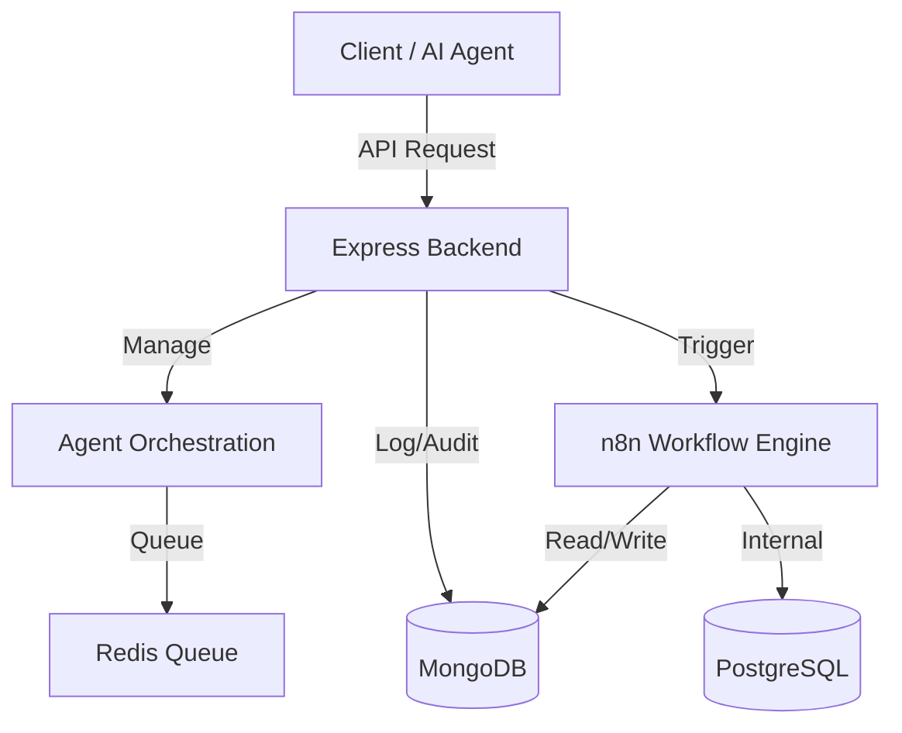

# 아키텍처 (Architecture)

gonsai2의 시스템 구조와 설계 원칙에 대한 설명입니다.

## 시스템 개요

gonsai2는 **Express 백엔드**, **n8n 워크플로우 엔진**, **MongoDB 데이터베이스**로 구성된 모듈식 아키텍처를 따릅니다.

## 디렉토리 구조

프로젝트는 기능별로 명확하게 분리된 구조를 가집니다.

- **`apps/`**: 실행 가능한 애플리케이션 (현재는 `backend` 서버)
- **`features/`**: 핵심 비즈니스 로직 모듈
  - `n8n-integration`: n8n API 연동
  - `agent-orchestration`: AI Agent 작업 관리
  - `error-healing`: 오류 자동 진단 및 복구
- **`infrastructure/`**: 데이터베이스 및 외부 서비스 설정
- **`docs/`**: 프로젝트 문서

## 주요 모듈 설명

### 1. n8n Integration (`features/n8n-integration`)

n8n REST API와 통신하여 워크플로우를 관리하고 실행합니다. 타입 안정성을 보장하며, 웹훅 처리를 담당합니다.

### 2. Agent Orchestration (`features/agent-orchestration`)

AI Agent들의 작업을 큐(Queue) 기반으로 관리합니다. 작업의 우선순위를 지정하고, 실행 결과를 비동기적으로 처리합니다.

### 3. Error Healing (`features/error-healing`)

워크플로우 실행 중 발생하는 오류를 분석하고, 알려진 패턴(`error-patterns.json`)에 매칭될 경우 자동으로 복구를 시도하거나 해결책을 제안합니다.

## 기술 스택

| 구분           | 기술         | 용도               |
| -------------- | ------------ | ------------------ |
| **Runtime**    | Node.js v18+ | 서버 런타임        |
| **Language**   | TypeScript   | 정적 타입 언어     |
| **Automation** | n8n          | 워크플로우 엔진    |
| **Database**   | MongoDB 7.0  | 메인 데이터 저장소 |
| **Queue**      | Redis 7      | 작업 큐 (Bull)     |
| **Container**  | Docker       | 서비스 컨테이너화  |

## AI 협업 원칙 (Augmented Coding)

이 프로젝트는 Kent Beck의 Augmented Coding 원칙을 따릅니다.

1. **명확한 의도 (Clear Intent)**: 코드와 변수명은 그 자체로 의도를 설명해야 합니다.
2. **작은 단계 (Small Steps)**: 복잡한 로직은 AI가 이해하기 쉬운 작은 단위로 분해합니다.
3. **풍부한 컨텍스트 (Rich Context)**: `.ai/` 디렉토리에 AI를 위한 별도의 컨텍스트 정보를 제공합니다.
